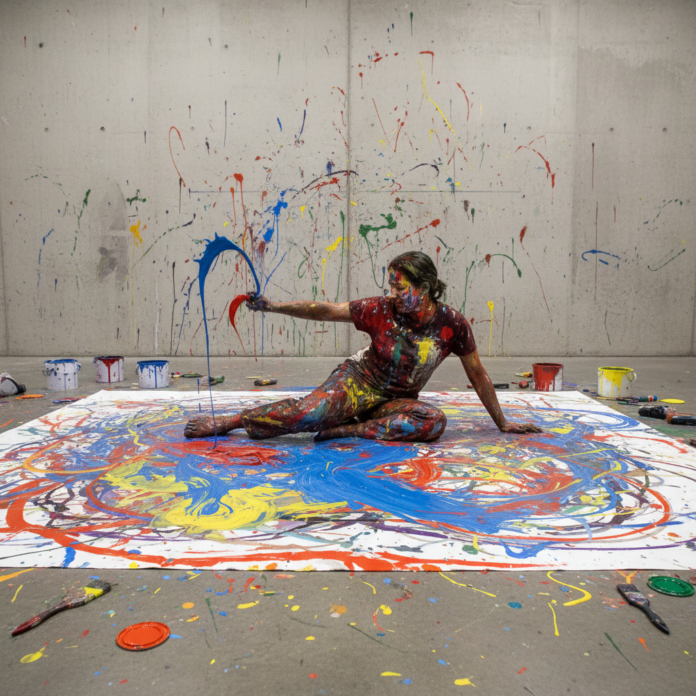

# Performance Art Painting 行为艺术绘画

> **时期：** 1960年代–至今  
> **关键词：** 身体为媒介、现场性、时间性、阿布拉莫维奇、去商品化

## 概述

Performance Art（行为艺术）是1960年代兴起的以艺术家身体和行动为媒介的艺术形式——它拒绝被收藏、被买卖、被复制，只存在于发生的那个瞬间。伊夫·克莱因的人体画笔、阿布拉莫维奇的极限耐力、博伊斯的社会雕塑——行为艺术将艺术从画框中解放出来，让生活本身成为创作的画布。

## 风格特征

- **身体媒介**：艺术家的身体即材料
- **现场性**：只存在于表演的瞬间
- **时间性**：持续时间是作品的维度
- **去商品化**：拒绝被收藏和交易
- **观众参与**：打破创作者与观者的界限

## 代表人物与作品

- 玛丽娜·阿布拉莫维奇《艺术家在场》
- 伊夫·克莱因 人体测量
- 约瑟夫·博伊斯 社会雕塑
- 草间弥生 无限镜屋

## 概念图

