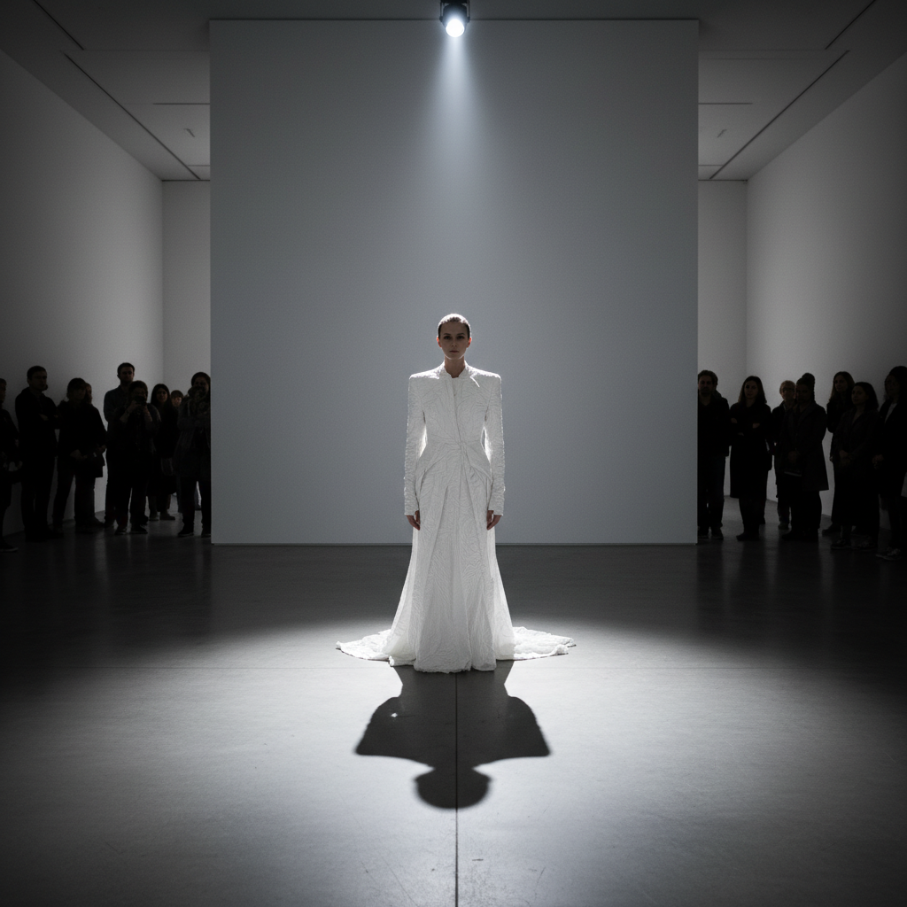

# Performance Art 行为艺术



> **"身体是画布，时间是颜料，观众是共谋者——艺术发生在此刻。"**

## 概述

| 维度 | 描述 |
|------|------|
| 时期 | 1960s–至今 |
| 别名 | Performance Art, 行为艺术, Live Art, 现场艺术 |
| 核心色彩 | 无固定——身体、空间、时间本身 |
| 关键元素 | 身体在场、时间性、观众关系、不可重复、极限 |
| 代表人物 | Marina Abramović, Yoko Ono, Joseph Beuys, Vito Acconci, 谢德庆 |
| 关联风格 | Fluxus, Dadaism, Body Art, Happenings, Conceptual Art |

---

## 历史脉络

| 年份 | 事件 |
|------|------|
| 1916 | Dada在苏黎世Cabaret Voltaire——行为艺术前史 |
| 1952 | John Cage《4'33"》——沉默作为表演 |
| 1960s | Happenings、Fluxus Events |
| 1974 | Marina Abramović《Rhythm 0》——极限行为 |
| 1978 | 谢德庆开始"一年行为"系列 |
| 2010 | Abramović "The Artist is Present"——MoMA 736小时 |
| 2020s | 直播时代的行为艺术 |

### 核心哲学

行为艺术的精神是**"艺术不是物品——是行动、是在场、是此刻"**：
- "身体是最诚实的媒介——它不能撒谎"
- "行为艺术没有排练——每一次都是第一次也是最后一次"
- "痛苦是真实的——疲惫是真实的——这就是为什么它是艺术"
- "观众不是旁观者——他们的存在改变了一切"
- "当行为结束——只剩下记忆和文献——这就够了"

---

## 视觉语法

### 身体系统

```
身体状态：
  静止 — 持续、耐力、冥想
  重复 — 仪式、强迫、时间
  极限 — 痛苦、危险、突破
  日常 — 行走、呼吸、存在

时间结构：
  瞬间 — 一个动作、一个姿态
  持续 — 小时、天、月、年
  循环 — 重复直到崩溃
  开放 — 观众决定何时结束

空间：
  画廊 — 白盒子中的身体
  公共 — 街头、广场、自然
  私密 — 工作室、家、身体内部
  虚拟 — 直播、网络、屏幕

规则：
  - 身体必须在场（或其缺席被感知）
  - 时间是核心维度
  - 不可完全重复
  - 文献不等于作品
```

### 标志性元素

| 类别 | 元素 |
|------|------|
| 身体 | 裸体、伤痕、疲惫、静止、极限 |
| 时间 | 持续、耐力、重复、实时 |
| 关系 | 艺术家-观众、亲密、对抗、信任 |
| 空间 | 画廊、街头、自然、网络 |
| 文献 | 照片、视频、文字、记忆 |
| 态度 | 真实、极限、政治、精神性 |

---

## 与千禧怀旧/当代的关系

### 直播时代的行为艺术
- 直播 = 实时+身体+观众互动 = 行为艺术的结构
- "每个主播都是行为艺术家？——边界在哪里？"
- 网络行为艺术 = 新的可能性

### Abramović效应
- "The Artist is Present" = 行为艺术进入大众文化
- 名人效应 + 社交媒体 = 行为艺术的民主化
- "排队8小时看Abramović——这本身就是行为艺术"

---

## 设计应用

| 场景 | 应用方式 |
|------|----------|
| 品牌 | 体验式营销+现场事件 |
| 展览 | 现场表演+观众参与 |
| 教育 | 身体意识+创意表达 |
| 数字 | 直播+互动+实时生成 |

---

## 相关风格

← [Fluxus 激浪派](fluxus.md) | [Installation Art 装置艺术](installation-art.md) →

↑ [返回千禧怀旧目录](README.md) | [返回总目录](../README.md)
