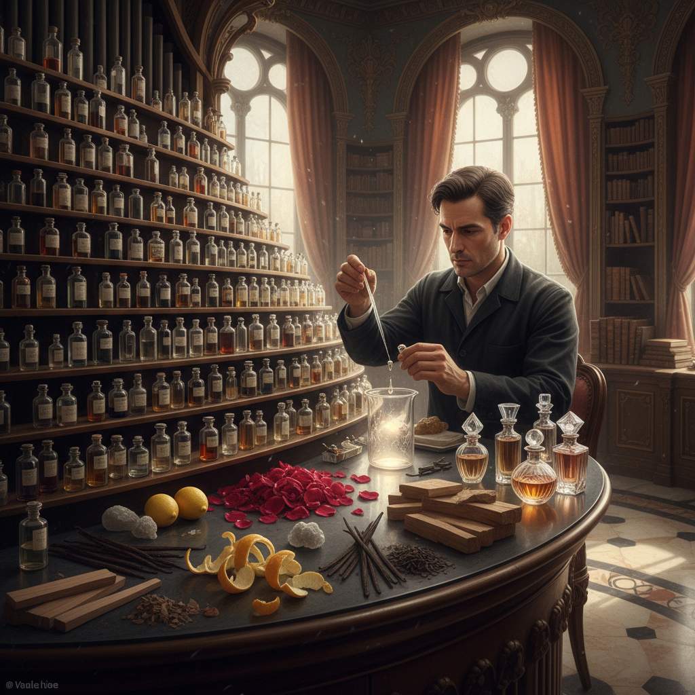

# Perfumery 调香

> "Perfumery is composing with molecules — the perfumer orchestrates volatile essences into invisible symphonies that unfold across time on living skin." — Unknown

## 概述

调香（Perfumery）是选择、混合和平衡芳香原料以创造香水和香氛产品的艺术与科学。调香师（perfumer，也称"鼻子"）使用数千种天然和合成芳香分子，按照"前调-中调-基调"（top-heart-base）的金字塔结构构建香水——前调是最先闻到的清新气息，中调是香水的核心性格，基调是持久的深沉底蕴。调香既是科学（需要理解化学、挥发性和分子结构），也是艺术（需要创造力、记忆力和审美判断）。从古埃及的神庙熏香到当代的小众香水，调香是人类最古老的感官艺术之一。

调香的哲学在于：看不见的艺术——创造一种无形的、随时间变化的、与佩戴者身体互动的艺术作品。

## 核心特征

| 特征 | 描述 |
|------|------|
| 嗅觉 | 以嗅觉为媒介 |
| 分子 | 芳香分子的组合 |
| 时间 | 随时间展开变化 |
| 金字塔 | 前中基调结构 |
| 记忆 | 与记忆和情感相连 |
| 无形 | 看不见的艺术 |

## 视觉特征

- **瓶身**：精美的香水瓶设计
- **原料**：天然芳香原料的美感
- **色彩**：香液的色彩
- **实验室**：调香实验室的美学
- **花田**：原料产地的风景
- **优雅**：整体的优雅氛围

## 代表作品

| 作品 | 艺术家 | 年代 | 意义 |
|------|--------|------|------|
| *Chanel No. 5* | Ernest Beaux | 1921 | 现代香水的标志 |
| *Shalimar* | Jacques Guerlain | 1925 | 东方调的经典 |
| *Eau Sauvage* | Edmond Roudnitska | 1966 | 男香的革命 |
| *CK One* | Alberto Morillas | 1994 | 中性香的开创 |
| *Niche perfumery* | Various | 2000s+ | 小众香水运动 |

## 历史时间线

| 时期 | 事件 |
|------|------|
| 古埃及 | 神庙熏香和香膏 |
| 中世纪 | 阿拉伯蒸馏技术 |
| 17世纪 | 法国格拉斯成为香水之都 |
| 19世纪 | 合成芳香分子的发明 |
| 20世纪 | 现代香水工业 |
| 当代 | 小众香水和独立调香师 |

## 中国语境

中国有悠久的香文化传统——从先秦的佩兰、汉代的博山炉到宋代的"四般闲事"（焚香、点茶、挂画、插花），香在中国文化中有极高的地位。中国传统的"合香"（将多种香料按配方混合）与西方调香有相似的原理。当代中国的香水市场快速增长，本土香水品牌（如观夏、闻献等）将中国传统香料（沉香、檀香、桂花、白茶）融入现代香水设计。中国的调香教育也在发展，一些机构提供专业的调香师培训课程。

## AI生成概念图

## 与其他风格的关系

- **Chemistry** → 化学
- **Aromatherapy** → 芳香疗法
- **Incense** → 制香
- **Candle Making** → 蜡烛制作
- **Soap Making** → 皂艺
- **Sensory Art** → 感官艺术

---

*浮光艺志 | Chronicle of Artistry*
