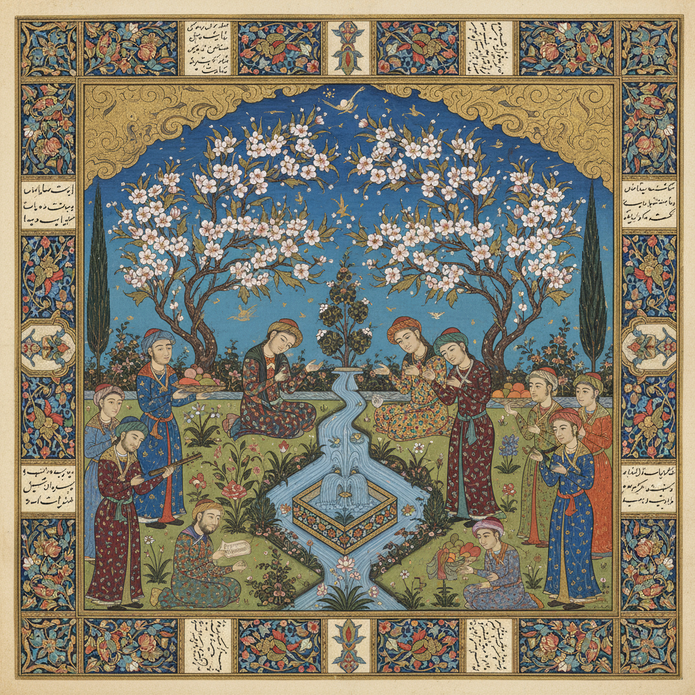

# 波斯细密画 · Persian Miniature Art

> "在一粒沙中见世界，在一幅细密画中见天堂。" —— 鲁米

## 概述

波斯细密画（Persian Miniature Art / نگارگری ایرانی）是伊朗视觉艺术中最精致的传统，起源于13世纪蒙古伊尔汗国时期，在帖木儿王朝和萨法维王朝达到巅峰。细密画以极小的尺幅承载极丰富的叙事，用矿物颜料和金箔在手抄本页面上描绘史诗、爱情故事和宫廷生活。其独特的平面化空间、鸟瞰式构图和宝石般的色彩，构成了伊斯兰世界最具辨识度的视觉语言。

## 核心特征

| 特征 | 描述 |
|------|------|
| 时期 | 13世纪–18世纪（延续至今） |
| 地域 | 伊朗（大不里士、赫拉特、伊斯法罕、设拉子） |
| 媒介 | 矿物颜料、金箔、手抄本纸张 |
| 核心理念 | 以微观精密表达宏大叙事与精神世界 |
| 色彩 | 群青蓝、朱砂红、金色、翠绿、紫罗兰 |

## 视觉特征

- **平面化空间**：无西方透视法，采用多层叠加的鸟瞰式构图
- **精密线描**：极细的毛笔勾勒人物和装饰细节
- **装饰性边框**：精美的花卉和几何纹样边饰
- **高视点俯瞰**：观者如从天空俯视场景
- **金色天空与岩石**：以金箔表现天空或以程式化岩石表现地形

## 代表作品

| 作品 | 艺术家/工坊 | 年代 | 类型 |
|------|-------------|------|------|
| 《列王纪》大不里士抄本 | 大不里士宫廷工坊 | 1330s | 史诗插图 |
| 《列王纪》贝桑格尔抄本 | 赫拉特工坊 | 1430 | 史诗插图 |
| 《五卷诗》插图 | 贝赫扎德 | 1490s | 文学插图 |
| 《塔赫马斯普列王纪》 | 苏丹·穆罕默德等 | 1520-1540 | 史诗插图 |
| 《两个恋人》 | 礼萨·阿巴西 | 1630 | 单页画 |

## 发展时间线

| 时期 | 事件 |
|------|------|
| 1256-1335 | 伊尔汗国时期，中国绘画影响传入 |
| 1370-1507 | 帖木儿王朝，赫拉特画派达到巅峰 |
| 1490s | 贝赫扎德成为波斯细密画最伟大的大师 |
| 1501-1736 | 萨法维王朝，大不里士和伊斯法罕画派繁荣 |
| 1520-1540 | 塔赫马斯普时期，宫廷细密画最后的辉煌 |
| 17世纪 | 礼萨·阿巴西发展单页画和肖像画 |
| 18-19世纪 | 细密画传统衰落，西方影响增强 |
| 当代 | 细密画作为文化遗产被复兴和当代化 |

## 中国语境

波斯细密画与中国绘画有深厚的历史渊源。蒙古帝国时期（13-14世纪），中国画家和画风通过丝绸之路传入波斯，波斯细密画中的云纹、龙凤图案和某些构图方式直接源自中国。反过来，明代宫廷也收藏波斯细密画，郎世宁等传教士画家的工笔技法与波斯细密画的精密传统有异曲同工之妙。当代中国工笔画与波斯细密画在"精密"美学上形成跨文化对话。

## AI 概念图

*AI 生成概念图：波斯细密画风格*

## 关联词条

- [[mughal-miniature-art]] - 莫卧儿细密画
- [[ottoman-art]] - 奥斯曼艺术
- [[russian-icon-art]] - 俄罗斯圣像画

---

*浮光艺志 · Chronicle of Artistry*
