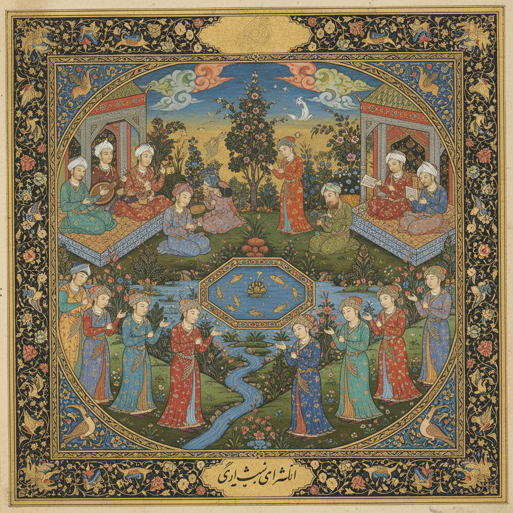

# Persian Miniature 波斯细密画 | نگارگری ایرانی

> **"在指甲大小的空间里容纳整个宇宙——波斯画师用单根毛笔绘制天堂。"**

## 概述

波斯细密画（Persian Miniature / نگارگری ایرانی / Negârgari-ye Irâni）是伊朗传统的精细绘画艺术，起源于13世纪蒙古伊尔汗国时期，在帖木儿王朝（15世纪赫拉特画派）和萨法维王朝（16-17世纪伊斯法罕画派）达到巅峰。细密画主要用于装饰手抄本——《列王纪》（Shahnameh）、《五卷诗》（Khamsa）等波斯文学经典。画师使用极细的猫毛或松鼠毛画笔，在纸上绘制精细到不可思议的人物、建筑、花园和战争场景。2020年被联合国教科文组织列入人类非物质文化遗产。

## 主要画派

| 画派 | 时期 | 特征 |
|------|------|------|
| 巴格达画派 | 13世纪 | 阿拉伯风格，平面化 |
| 大不里士画派 | 14世纪 | 蒙古/中国影响 |
| 赫拉特画派 | 15世纪 | 黄金时代，最精细 |
| 伊斯法罕画派 | 16-17世纪 | 萨法维宫廷，华丽 |
| 莫卧儿画派 | 16-19世纪 | 印度分支，写实化 |

## 核心特征

- **极精细**：用单根毛笔绘制微小细节
- **无透视**：多视点、平面化的空间
- **鸟瞰构图**：从上方俯瞰的花园和建筑
- **鲜艳色彩**：矿物颜料和金箔
- **文学叙事**：为诗歌和史诗配图
- **装饰边框**：精美的花卉边框装饰

## 常见题材

| 题材 | 来源 |
|------|------|
| 英雄战斗 | 《列王纪》 |
| 爱情故事 | 《五卷诗》 |
| 宫廷宴饮 | 宫廷生活 |
| 花园场景 | 天堂花园 |
| 狩猎 | 王室活动 |
| 先知故事 | 宗教文学 |

## 视觉特征

- 极精细的人物和建筑
- 鲜艳的矿物颜料色彩
- 金箔的华丽装饰
- 多视点的平面空间
- 精美的花卉边框
- 文字与图像的融合

## 与其他风格的关系

| 风格 | 关系 |
|------|------|
| 中国工笔画 | 蒙古时期互相影响 |
| 莫卧儿细密画 | 波斯细密画的印度分支 |
| 奥斯曼细密画 | 波斯细密画的土耳其分支 |
| 亚美尼亚手抄本 | 共享中东手抄本传统 |
| 当代伊朗艺术 | 细密画传统的现代转化 |

## 概念图

---

*浮光艺志 | Chronicle of Artistry*
