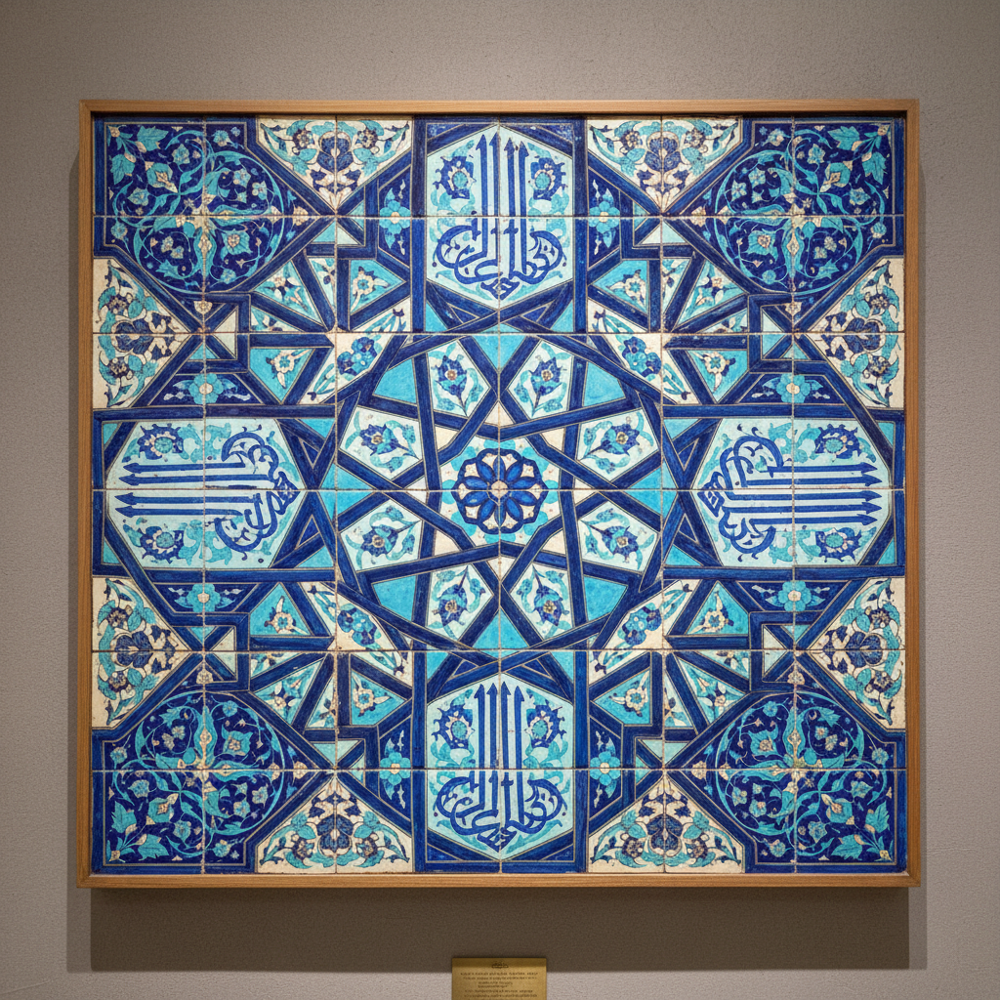

# Persian Tile Art 波斯瓷砖艺术

> "Persian tiles are poetry made permanent — walls of mosques and palaces covered in glazed ceramic that turns architecture into illuminated manuscripts, where calligraphy flows between arabesques and geometric stars multiply into infinity, cobalt blue and turquoise creating a vision of paradise on earth that has endured for a thousand years beneath the Iranian sun." — Unknown

## 概述

波斯瓷砖艺术（Persian Tile Art）是伊朗（波斯）自塞尔柱时期（11世纪）至今发展的一种辉煌的建筑陶瓷装饰艺术。波斯瓷砖以其精美的几何图案、阿拉伯书法和花卉纹饰著称——它们覆盖了清真寺、宫殿和陵墓的内外墙面，将建筑转化为色彩斑斓的艺术品。波斯瓷砖艺术是伊斯兰建筑装饰的核心——其蓝色和绿松石色的主调创造了"人间天堂"的视觉效果。

波斯瓷砖艺术的核心要素包括：1）建筑装饰——覆盖建筑表面；2）几何图案——复杂的几何纹样；3）书法艺术——阿拉伯书法装饰；4）蓝绿主调——钴蓝和绿松石色；5）马赛克技法——切割拼接的马赛克；6）釉面砖——各种釉面砖技法；7）宗教建筑——清真寺的主要装饰。

## 核心特征

| 特征 | 描述 |
|------|------|
| 建筑装饰 | 覆盖建筑表面 |
| 几何图案 | 复杂几何纹样 |
| 书法艺术 | 阿拉伯书法装饰 |
| 蓝绿主调 | 钴蓝和绿松石色 |
| 马赛克技法 | 切割拼接马赛克 |
| 宗教建筑 | 清真寺主要装饰 |

## 视觉特征

- **蓝色主调**：深邃的钴蓝色
- **绿松石色**：明亮的绿松石色
- **几何星纹**：复杂的几何星形
- **书法带**：流畅的书法装饰带
- **花卉藤蔓**：缠绕的花卉藤蔓
- **无限延伸**：图案的无限重复

## 代表作品

| 作品 | 艺术家/文化 | 年代 | 意义 |
|------|-------------|------|------|
| *伊斯法罕伊玛目清真寺* | 萨法维 | 1611-1629年 | 波斯瓷砖巅峰 |
| *撒马尔罕列吉斯坦* | 帖木儿 | 15世纪 | 中亚瓷砖艺术 |
| *设拉子粉红清真寺* | 卡扎尔 | 19世纪 | 彩色玻璃与瓷砖 |
| *卡尚星形砖* | 伊尔汗 | 13世纪 | 星形瓷砖 |
| *蓝色清真寺大不里士* | 黑羊 | 15世纪 | 蓝色瓷砖 |

## 历史时间线

| 时期 | 事件 |
|------|------|
| 11世纪 | 塞尔柱时期瓷砖的发展 |
| 13世纪 | 伊尔汗时期的繁荣 |
| 15世纪 | 帖木儿时期的辉煌 |
| 16-17世纪 | 萨法维时期的巅峰 |
| 当代 | 波斯瓷砖的传承和修复 |

## 中国语境

波斯瓷砖艺术与中国陶瓷通过丝绸之路有着千年的交流历史。波斯瓷砖使用的钴蓝颜料（苏麻离青）最初从波斯传入中国——元代青花瓷使用的进口钴料就来自波斯地区。同时，中国的陶瓷技术也通过丝绸之路传入波斯——影响了波斯陶瓷的烧造技术。波斯瓷砖的几何图案和阿拉伯纹饰与中国陶瓷的装饰传统截然不同——体现了伊斯兰文化对抽象美和无限性的追求。中国的建筑陶瓷（琉璃瓦、影壁等）虽然也有悠久的传统，但在规模和覆盖面上不及波斯瓷砖——波斯清真寺几乎整个建筑表面都覆盖着瓷砖，而中国建筑陶瓷主要用于屋顶和局部装饰。

## AI生成概念图

## 与其他风格的关系

- **Iznik** → 伊兹尼克
- **Islamic Geometry** → 伊斯兰几何
- **Arabic Calligraphy** → 阿拉伯书法
- **Architectural Ceramics** → 建筑陶瓷
- **Blue and White** → 青花
- **Mosaic Art** → 马赛克艺术

---

*浮光艺志 | Chronicle of Artistry*
