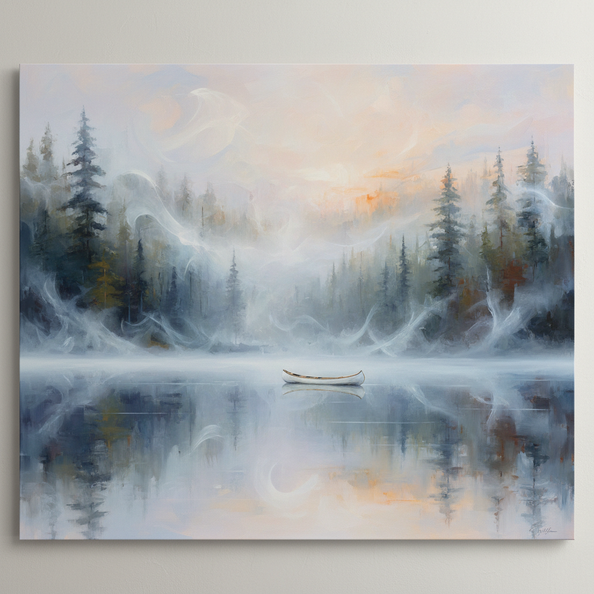

# Peter Doig 彼得·多伊格

> **流派**: 当代绘画 · 新浪漫主义  
> **时期**: 1959–至今 英国/特立尼达  
> **关键词**: 梦幻风景、照片转化、热带色彩、记忆与幻觉

## 概述

彼得·多伊格是当代最受推崇的风景画家之一。他从照片、电影剧照和个人记忆出发，创作出介于真实与幻觉之间的大尺幅风景画。他的画面常常笼罩在一层薄雾或水面反射中，让熟悉的场景变得陌生而神秘。从加拿大的雪景到特立尼达的热带丛林，他的风景总是带着一种不安的美。

## 视觉特征

- **薄雾笼罩**: 画面常有一层朦胧的大气效果
- **水面反射**: 湖泊、河流的镜面倒影
- **照片质感**: 基于照片但经过梦幻化处理
- **大尺幅**: 作品通常超过2×3米
- **丰富色层**: 多层透明颜料叠加的深度感

## 代表作品

- 《白色独木舟》(White Canoe, 1990–91)
- 《沼泽地》(Swamped, 1990)
- 《建筑师的家在峡谷中》(Architect's Home in the Ravine, 1991)
- 《大白》(Grand Riviere, 2001–02)

## 历史影响

多伊格证明了风景画在当代仍然可以是最前沿的艺术形式。他将摄影、电影和绘画记忆融为一体，创造了一种属于21世纪的浪漫主义——不是对自然的崇拜，而是对记忆和感知的探索。

## 相关风格

- [Landscape Painting 风景画](landscape-painting.md)
- [Neo-Romanticism 新浪漫主义](neo-romanticism.md)
- [Contemporary Painting 当代绘画](contemporary-painting.md)
