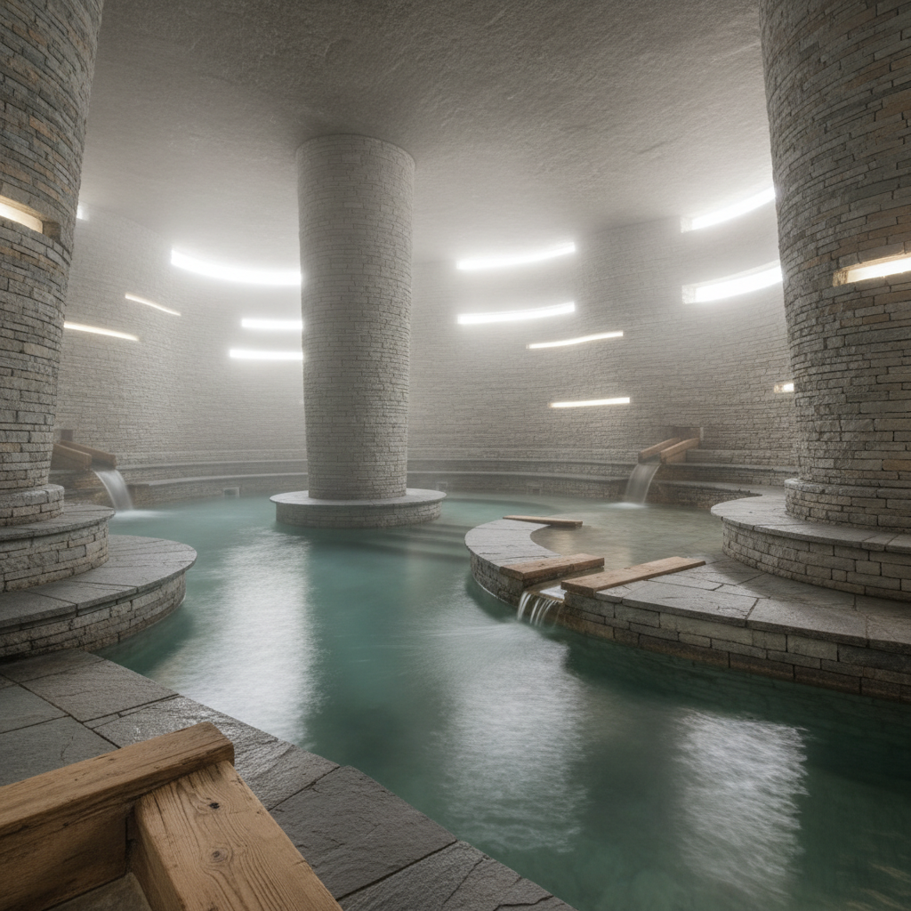

# Peter Zumthor 彼得·卒姆托

> **时期：** 1943–至今  
> **关键词：** 氛围建筑、材料真实、感官体验、瑞士精确

## 概述

Peter Zumthor 是瑞士建筑师，以对"氛围"的极致追求闻名。他的建筑数量极少但每一座都是杰作——温泉浴场中石头的触感和蒸汽的温度、教堂中光线的重量和沉默的质地——他设计的不是形式而是体验本身。

## 风格特征

- **氛围优先**：设计从感官体验出发而非形式
- **材料真实**：石头是石头、木头是木头，不伪装
- **手工精确**：瑞士钟表般的施工精度
- **感官丰富**：温度、湿度、声音、气味都被设计
- **缓慢与少量**：一生只建造少量建筑，每座耗时多年

## 代表作品

- *瓦尔斯温泉浴场*（1996）
- *布鲁德·克劳斯田野教堂*（2007）
- *科伦巴艺术博物馆*（2007）
- *蛇形画廊临时展亭*（2011）

## 概念图

