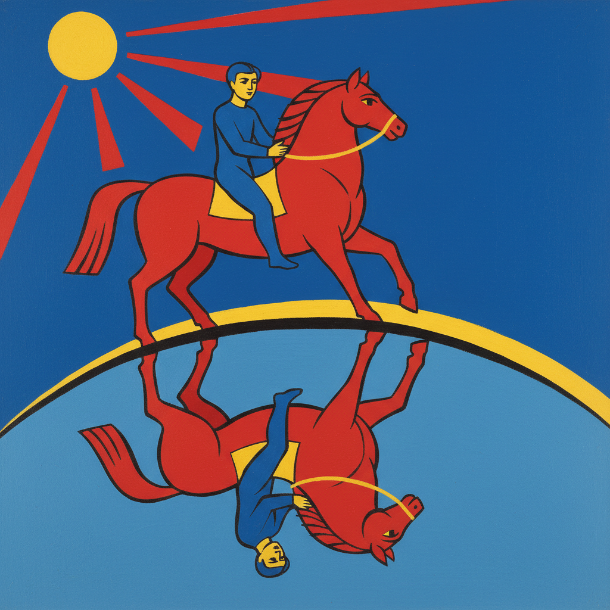

# Petrov-Vodkin Art 彼得罗夫-沃德金艺术

> "I want to understand the world, not just see it." — Kuzma Petrov-Vodkin

## 概述

彼得罗夫-沃德金艺术（Petrov-Vodkin Art）是20世纪初俄罗斯画家库兹马·谢尔盖耶维奇·彼得罗夫-沃德金（Kuzma Sergeyevich Petrov-Vodkin, 1878-1939）创立的象征主义-现代主义绑画风格。彼得罗夫-沃德金是俄罗斯从传统绑画向现代艺术过渡的关键人物——他将俄罗斯圣像画的传统与西方现代主义的形式探索相结合，创造了一种独特的"球面透视"理论和鲜明的色彩语言。

彼得罗夫-沃德金最著名的作品《沐浴红马》（1912）描绘了一个少年骑在一匹鲜红色的马上——红马的颜色来自俄罗斯圣像画传统，而构图的现代感则预示了新时代的到来。这幅画后来被解读为俄罗斯革命的预言——红色象征着即将到来的变革。他的"球面透视"理论——认为地球的曲率应该反映在绑画的空间构成中——是一种独特的空间观念。

彼得罗夫-沃德金艺术的核心要素包括：1）球面透视——独特的空间构成理论；2）三原色——红、蓝、黄的纯色运用；3）圣像传统——俄罗斯圣像画的现代转化；4）象征主义——深层的象征意义；5）形式探索——对绑画形式的理性探索；6）母性主题——母亲和孩子的永恒主题；7）革命精神——新时代的艺术表达。

## 核心特征

| 特征 | 描述 |
|------|------|
| 球面透视 | 独特空间构成理论 |
| 三原色 | 红蓝黄纯色运用 |
| 圣像传统 | 俄罗斯圣像画现代转化 |
| 象征主义 | 深层象征意义 |
| 形式探索 | 绑画形式理性探索 |
| 母性主题 | 母亲孩子永恒主题 |

## 视觉特征

- **纯色平涂**：大面积的纯色平涂
- **红色主导**：标志性的鲜红色
- **倾斜地平线**：球面透视造成的倾斜
- **圣像式构图**：正面性和对称性
- **简洁轮廓**：清晰简洁的轮廓线
- **蓝色背景**：深蓝色的天空和背景

## 代表作品

| 作品 | 年代 | 意义 |
|------|------|------|
| *沐浴红马* (Bathing of a Red Horse) | 1912 | 最著名的作品 |
| *彼得格勒的圣母* (Petrograd Madonna) | 1920 | 革命时期的母性 |
| *死亡* (Death) | 1915 | 战争的悲剧 |
| *早晨* (Morning) | 1917 | 新生活的象征 |
| *静物与丁香* (Still Life with Lilac) | 1928 | 球面透视静物 |
| *1918年在彼得格勒* (1918 in Petrograd) | 1920 | 革命叙事 |

## 历史时间线

| 时期 | 事件 |
|------|------|
| 1878年 | 出生于萨拉托夫省 |
| 1897-1905年 | 就读莫斯科绘画学校和慕尼黑 |
| 1905-1910年 | 游历欧洲和北非 |
| 1912年 | 创作《沐浴红马》 |
| 1918年 | 成为列宁格勒美术学院教授 |
| 1920-1930年代 | 教学和创作 |
| 1939年 | 在列宁格勒去世 |

## 中国语境

彼得罗夫-沃德金在中国美术界有着独特的学术价值。他的"球面透视"理论——对传统线性透视的挑战——与中国传统绑画中"散点透视"的空间观念有某种呼应，都拒绝将西方文艺复兴的单点透视视为唯一正确的空间表现方法。他将俄罗斯圣像画传统与现代形式探索相结合的方法，为中国画家提供了一种将本民族传统艺术现代化的参考路径——如何在保持民族特色的同时实现艺术语言的现代转化。《沐浴红马》中纯色平涂的方法与中国传统绑画的平面性有相通之处。彼得罗夫-沃德金证明了传统与现代不是对立的——民族艺术传统可以成为现代艺术创新的源泉。

## 概念图

## 与其他风格的关系

- **Icon Painting** → 圣像画传统
- **Symbolism** → 象征主义
- **Fauvism** → 野兽派（色彩）
- **Vrubel** → 弗鲁贝尔（俄罗斯现代先驱）
- **Matisse** → 马蒂斯（色彩平涂）
- **Socialist Realism** → 社会主义现实主义

---

*浮光艺志 | Chronicle of Artistry*
