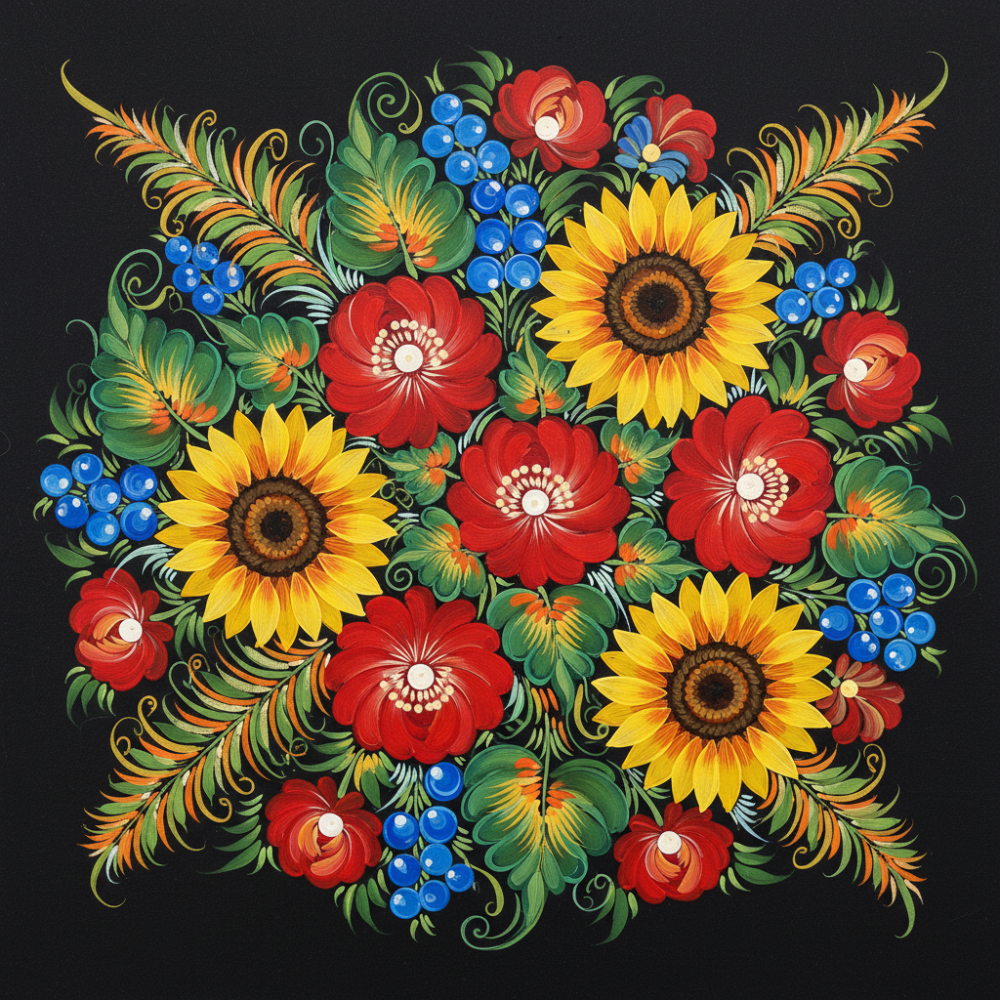

# Petrykivka 彼得里基夫卡彩绘 | Петриківський розпис

> **"花朵从指尖绽放——乌克兰村庄里每面墙都是一座花园。"**

## 概述

彼得里基夫卡彩绘（Petrykivka / Петриківський розпис）是乌克兰第聂伯罗彼得罗夫斯克州彼得里基夫卡村的传统装饰绘画艺术，2013年被联合国教科文组织列入人类非物质文化遗产代表作名录。这种绘画以其精美的花卉图案、鲜艳的色彩和独特的"一笔画"技法著称——艺术家用猫毛画笔蘸取颜料，一笔之间通过压力变化画出从粗到细的花瓣和叶片。传统上用于装饰房屋内外墙壁、家具、器皿和乐器。

## 核心特征

- **一笔画技法**：一笔之间通过压力变化画出渐变效果
- **猫毛画笔**：传统使用猫毛制成的软笔
- **花卉主题**：向日葵、大丽花、矢车菊、浆果
- **鲜艳色彩**：红、蓝、黄、绿的饱和色彩
- **黑色或白色底**：深色底更传统，白色底更现代
- **对称构图**：中心花束向两侧展开
- **幻想花卉**：不完全写实，带有想象成分

## 常见母题

| 母题 | 特征 |
|------|------|
| 花束 | 中心大花，周围小花和叶片 |
| 浆果串 | 红色圆点组成的浆果 |
| 鸟类 | 程式化的公鸡和夜莺 |
| 蕨类 | 精细的羽状叶片 |
| 向日葵 | 乌克兰的国花 |

## 视觉特征

- 精细流畅的一笔花瓣
- 鲜艳饱和的色彩
- 黑色底上的华丽花卉
- 对称的花束构图
- 精细的叶脉和花蕊细节
- 渐变色的花瓣效果

## 与其他风格的关系

| 风格 | 关系 |
|------|------|
| 俄罗斯Khokhloma | 共享东斯拉夫花卉装饰传统 |
| 波兰Wycinanki | 共享东欧民间花卉传统 |
| 挪威Rosemaling | 共享欧洲民间花卉绘画 |
| 荷兰花卉画 | 共享花卉主题但风格不同 |
| 当代乌克兰设计 | Petrykivka是乌克兰国家视觉身份 |

## 概念图

---

*浮光艺志 | Chronicle of Artistry*
