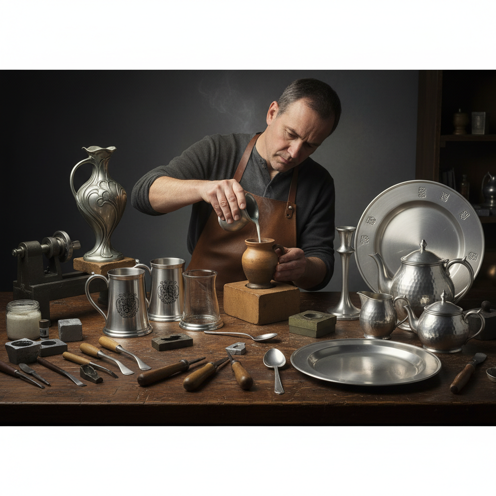

# Pewter Art 白锡合金艺术

> "Pewter is the quiet aristocrat of metals — softer than silver, warmer than steel, with a gentle luster that neither dazzles nor fades. It was the tableware of the middle class for centuries, the material of tankards raised in celebration, of plates that held daily bread, of measures that poured honest ale. A pewter piece carries the warmth of every hand that has held it, developing a soft patina that is the metal's memory of use." — Unknown

## 概述

白锡合金艺术（Pewter Art）是以白锡合金（锡为主要成分，加入少量铜、锑等）为材料，通过铸造、车削、锤打和雕刻等技法创造器物和艺术品的金属工艺——包括白锡器皿、白锡雕塑和白锡装饰品的制作。白锡合金是历史上最重要的日用金属之一。

白锡合金艺术的实践包括：1）白锡器皿——白锡制的杯、盘、壶等；2）白锡酒具——啤酒杯和酒壶；3）白锡烛台——白锡制的烛台；4）白锡雕塑——白锡制的小型雕塑；5）白锡首饰——白锡制的首饰；6）白锡徽章——白锡制的徽章和纪念品；7）当代白锡艺术——将白锡作为当代艺术媒介的创作。

## 核心特征

| 特征 | 描述 |
|------|------|
| 柔和 | 柔和的银灰色光泽 |
| 低熔 | 低熔点易于铸造 |
| 安全 | 食品安全的金属 |
| 温润 | 触感温润不冰冷 |
| 耐久 | 不易氧化变色 |
| 可塑 | 良好的可塑性 |

## 视觉特征

- **银灰**：柔和的银灰色调
- **光泽**：温润的金属光泽
- **铸纹**：铸造的细腻纹理
- **浮雕**：表面的浮雕装饰
- **圆润**：圆润的造型线条
- **古朴**：使用后的古朴质感

## 代表作品

| 作品 | 艺术家/文化 | 年代 | 意义 |
|------|-------------|------|------|
| *English pewter tankards* | 英国传统 | 16-18世纪 | 英国白锡酒杯 |
| *Royal Selangor pewter* | 马来西亚 | 1885至今 | 马来西亚白锡 |
| *Colonial American pewter* | 美国殖民地 | 17-18世纪 | 美国早期白锡 |
| *Art Nouveau pewter* | 欧洲 | 1890-1910 | 新艺术白锡 |
| *Scandinavian pewter* | 北欧 | 中世纪至今 | 北欧白锡传统 |

## 历史时间线

| 时期 | 事件 |
|------|------|
| 古代 | 白锡合金的发明 |
| 中世纪 | 白锡器成为主要日用金属器 |
| 16-18世纪 | 白锡器的黄金时代 |
| 19世纪 | 被陶瓷和玻璃取代 |
| 当代 | 白锡工艺的艺术复兴 |

## 中国语境

白锡合金艺术在中国有一定的传统和当代发展。中国古代虽然以青铜器和瓷器为主要器皿材料，但锡器（包括白锡合金）在某些地区也有使用——特别是在云南等锡矿丰富的地区。中国当代的白锡工艺主要受到马来西亚（Royal Selangor）和欧洲传统的影响——一些中国企业开始生产高品质的白锡工艺品。中国的一些旅游城市将白锡工艺品作为特色纪念品——如云南的锡制工艺品。中国的茶文化中，锡制茶叶罐因其优良的密封性而受到重视——这与白锡合金的特性密切相关。中国当代的一些金属工艺设计师也开始探索白锡合金的艺术可能性——将其与中国传统美学相结合。

## AI生成概念图

## 与其他风格的关系

- **Tinsmithing** → 锡器艺术
- **Silversmithing** → 银器艺术
- **Casting Art** → 铸造艺术
- **Tableware Design** → 餐具设计
- **Metal Art** → 金属艺术
- **Decorative Art** → 装饰艺术

---

*浮光艺志 | Chronicle of Artistry*
