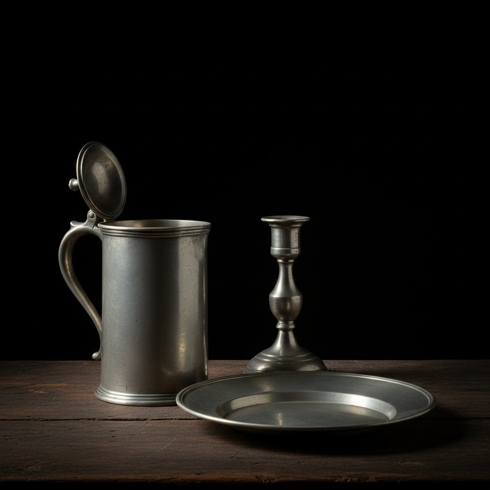

# Pewter Casting Art 锡器铸造艺术

> "Pewter is the democratic metal — softer than silver, warmer than steel, it melts at temperatures achievable in any workshop and can be cast, hammered, spun, and engraved with simple tools. For centuries it served as the common person's silver, gracing tables from tavern to manor house with vessels that caught the light with a gentle, living luster quite unlike the cold brilliance of harder metals." — Unknown

## 概述

锡器铸造艺术（Pewter Casting Art）是使用锡合金（主要成分为锡，含少量铜、锑或铋）通过铸造、锻打和旋压等技法制作器皿和装饰品的传统金属工艺。锡器因其低熔点、易加工和温润的银灰色光泽而成为历史上最普及的金属器皿材料之一——从中世纪到工业革命前，锡器是欧洲家庭最常见的餐具和日用器皿。

锡器铸造艺术的实践包括：1）模具铸造——将熔融锡合金注入模具；2）旋压成型——在车床上旋压锡板成型；3）锻打——用锤子锻打锡板成型；4）焊接——将各部件焊接组合；5）雕刻——在锡器表面雕刻装饰；6）抛光——打磨抛光至光亮；7）当代锡器——将传统技法与现代设计结合的创作。

## 核心特征

| 特征 | 描述 |
|------|------|
| 低熔点 | 易于熔化和铸造 |
| 温润 | 温润的银灰色光泽 |
| 柔软 | 相对柔软易加工 |
| 普及 | 历史上最普及的金属器 |
| 实用 | 高度实用的器皿 |
| 传统 | 数百年的工艺传统 |

## 视觉特征

- **光泽**：温润的银灰色光泽
- **柔和**：柔和的反光效果
- **厚重**：厚实沉稳的质感
- **古典**：古典优雅的造型
- **温暖**：比银更温暖的色调
- **岁月**：随时间产生的包浆

## 代表作品

| 作品 | 艺术家/文化 | 年代 | 意义 |
|------|-------------|------|------|
| *Medieval pewter ware* | 欧洲 | 中世纪 | 中世纪锡器 |
| *Tudor pewter* | 英国 | 16世纪 | 都铎时代锡器 |
| *Colonial American pewter* | 美国 | 17-18世纪 | 殖民地锡器 |
| *Art Nouveau pewter* | 欧洲 | 1900年代 | 新艺术锡器 |
| *Contemporary pewter* | 国际 | 当代 | 当代锡器设计 |

## 历史时间线

| 时期 | 事件 |
|------|------|
| 古代 | 锡的最早使用（青铜合金） |
| 中世纪 | 欧洲锡器行会的建立 |
| 16-18世纪 | 锡器的黄金时代 |
| 19世纪 | 被陶瓷和玻璃取代 |
| 当代 | 锡器的艺术化复兴 |

## 中国语境

锡器在中国有悠久的传统和重要的文化地位。中国云南个旧是世界著名的"锡都"——锡矿开采和锡器制作有数百年历史。中国传统的锡器制作是重要的民间工艺——从茶叶罐到祭祀器皿都使用锡器。中国的锡器以密封性好著称——特别是锡制茶叶罐被认为是保存茶叶的最佳容器。中国广东潮汕地区的锡器制作是国家级非物质文化遗产——以精湛的工艺和独特的造型著称。中国当代的锡器设计师将传统工艺与现代设计结合——创造出符合当代审美的锡器产品。中国的一些品牌将锡器定位为高端礼品——利用锡器的文化内涵和工艺价值。

## AI生成概念图

## 与其他风格的关系

- **Metalwork** → 金属工艺
- **Silver Smithing** → 银器工艺
- **Bronze Casting** → 青铜铸造
- **Tin Art** → 锡艺
- **Tableware Design** → 餐具设计
- **Lost-Wax Casting** → 失蜡铸造

---

*浮光艺志 | Chronicle of Artistry*
