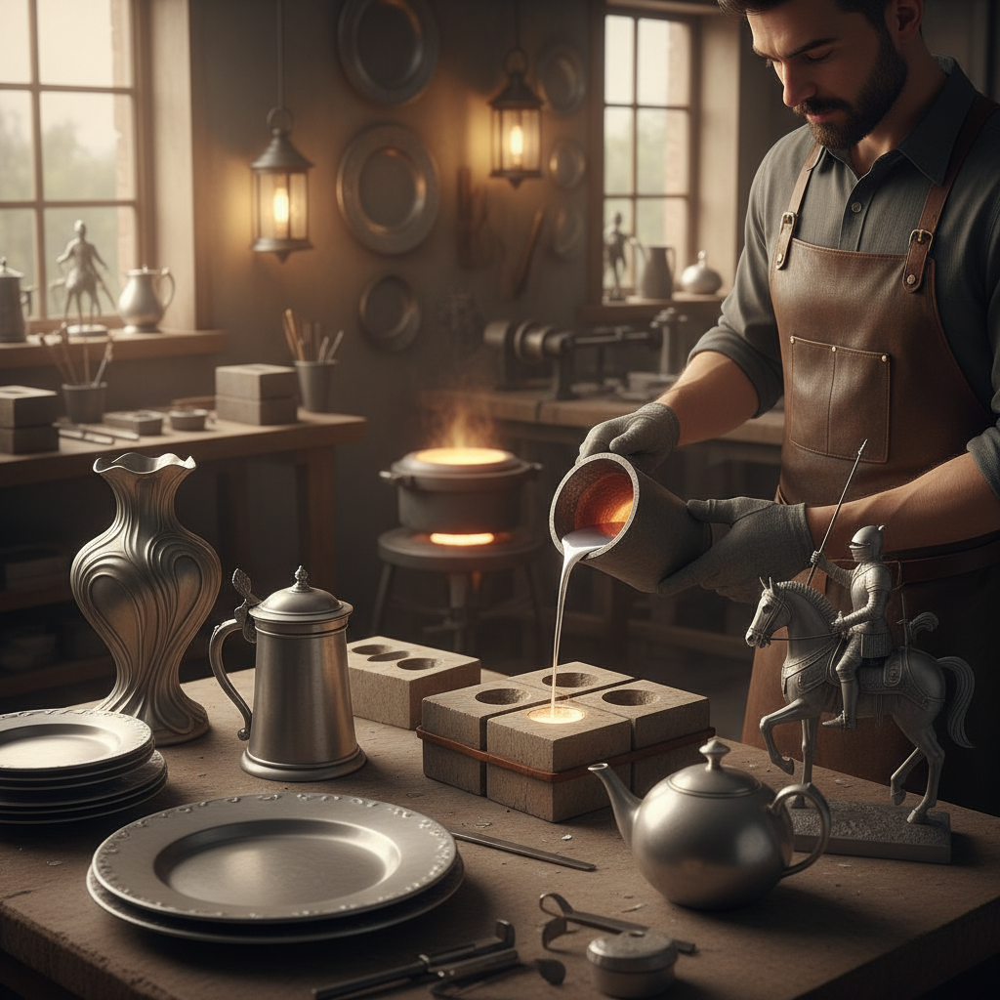

# Pewter Casting 锡铸造

> "Pewter casting is the most forgiving of metal arts — a low-melting alloy that flows like silver water into molds, cooling quickly into forms that can be polished to a soft lunar glow or left with the gentle grey patina of age, creating objects that feel substantial in the hand yet melt at temperatures a kitchen stove can reach, democratizing metalwork for centuries." — Unknown

## 概述

锡铸造（Pewter Casting）是一种使用锡合金（pewter，主要成分为锡，含少量铜、锑或铋）通过熔铸方式制作器物的金属工艺。Pewter的熔点较低（约170-230°C），使其成为最容易铸造的金属之一——不需要高温炉，普通的热源即可熔化。

Pewter在中世纪和近代欧洲是最常见的日用金属——在瓷器普及之前，pewter餐具（盘子、杯子、壶）是中产阶级家庭的标配。Pewter的历史可以追溯到青铜时代——古埃及和古罗马都有pewter器物。英国的Pewter传统特别发达——伦敦的Worshipful Company of Pewterers成立于1348年。当代pewter主要用于装饰品、奖杯、珠宝和艺术铸造。

## 核心特征

| 特征 | 描述 |
|------|------|
| 低熔点 | 熔点低易铸造 |
| 锡合金 | 以锡为主的合金 |
| 柔软 | 相对柔软的金属 |
| 银灰色 | 银灰色的光泽 |
| 日用 | 历史上的日用金属 |
| 易加工 | 容易加工成形 |

## 视觉特征

- **银灰**：柔和的银灰色
- **光泽**：可抛光至明亮
- **温润**：温润的金属质感
- **古朴**：可呈现古朴锈色
- **厚重**：有重量感的器物
- **流畅**：铸造的流畅线条

## 代表作品

| 作品 | 艺术家 | 年代 | 意义 |
|------|--------|------|------|
| *Medieval pewter tableware* | 中世纪工匠 | 13-16世纪 | 中世纪锡餐具 |
| *Art Nouveau pewter* | Liberty & Co | 19-20世纪 | 新艺术锡器 |
| *Kayserzinn pewter* | J.P. Kayser | 19-20世纪 | 德国新艺术锡器 |
| *Contemporary pewter sculpture* | Various | 当代 | 当代锡铸雕塑 |
| *Malaysian Royal Selangor* | Royal Selangor | 当代 | 马来西亚皇家雪兰莪锡器 |

## 历史时间线

| 时期 | 事件 |
|------|------|
| 青铜时代 | 锡合金的早期使用 |
| 古罗马 | 罗马锡器的发展 |
| 中世纪 | 欧洲锡器的普及 |
| 18-19世纪 | 锡器被瓷器取代 |
| 当代 | 锡铸造的艺术化复兴 |

## 中国语境

锡铸造在中国有悠久的传统——中国的锡器制作历史可以追溯到商周时期。中国的云南个旧是著名的"锡都"，有丰富的锡矿资源和锡器制作传统。中国传统的锡器包括茶叶罐、酒壶、香炉等。中国的锡器制作是一些地方的非物质文化遗产。当代中国的一些工艺美术师在传承和创新锡器制作。马来西亚的Royal Selangor锡器品牌与华人锡矿业有历史渊源。

## AI生成概念图

## 与其他风格的关系

- **Lost-Wax Casting** → 失蜡铸造
- **Sand Casting** → 砂型铸造
- **Silversmithing** → 银器工艺
- **Metalwork** → 金属工艺
- **Bronze Casting** → 青铜铸造
- **Jewelry** → 珠宝

---

*浮光艺志 | Chronicle of Artistry*
