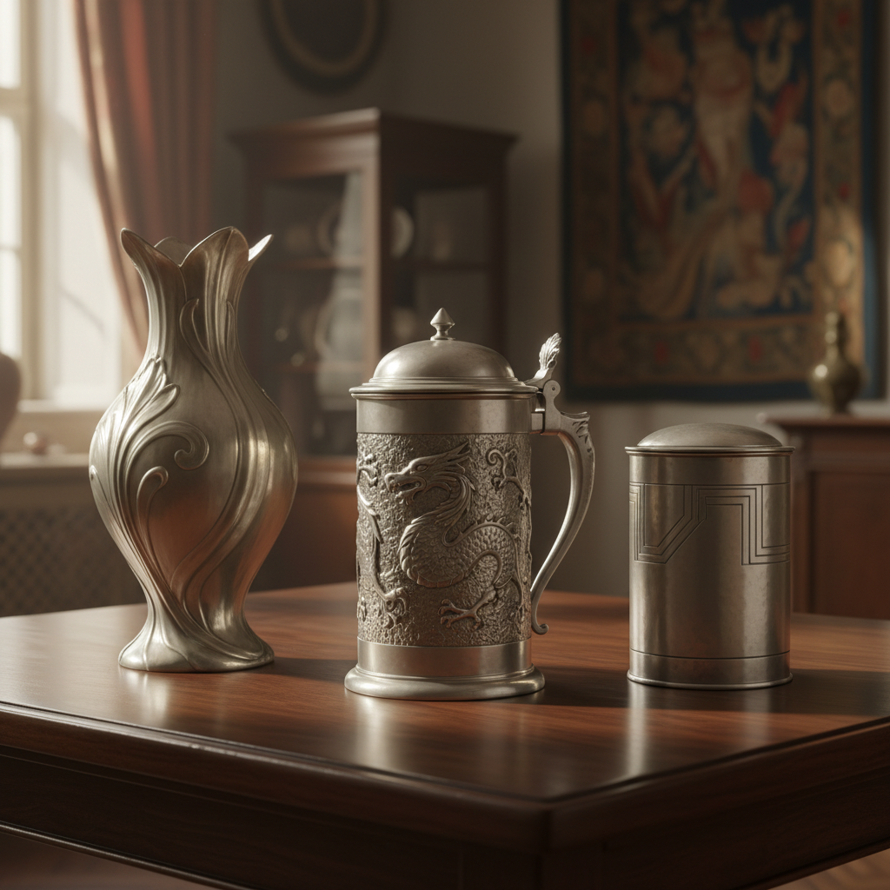

# Pewter 锡器工艺

> "Pewter is the people's silver — warm, soft, and democratic, it brought beauty to every table." — Unknown

## 概述

锡器工艺（Pewter）是以锡合金（锡为主，加少量铜、锑等）为材料的金属工艺。锡器因其低熔点、易加工、无毒和柔和的银灰色光泽，自罗马时代起就是欧洲最普及的金属日用品材料。从中世纪的酒杯到殖民地时代的餐具，从教堂的圣器到当代的装饰品，锡器是"平民的银器"——它将金属工艺的美带入了普通人的生活。

锡器的美学在于：温暖的银灰——不如银那样冷艳，不如金那样炫目，锡器有一种温暖、柔和、亲切的光泽。

## 核心特征

| 特征 | 描述 |
|------|------|
| 锡合金 | 以锡为主的合金 |
| 低熔点 | 容易熔化和铸造 |
| 柔软 | 材料柔软易加工 |
| 银灰 | 温暖的银灰色 |
| 无毒 | 食品安全 |
| 亲民 | 平民化的贵金属替代 |

## 视觉特征

- **银灰**：温暖的银灰色调
- **柔和**：柔和的金属光泽
- **温暖**：比银更温暖的色调
- **光滑**：光滑的铸造表面
- **氧化**：自然氧化的灰色
- **古典**：古典的器物形态

## 代表作品

| 作品 | 艺术家 | 年代 | 意义 |
|------|--------|------|------|
| *Roman pewter vessels* | 匿名 | 罗马时期 | 最早的锡器 |
| *Medieval tankards* | 匿名 | 中世纪 | 中世纪锡酒杯 |
| *Colonial American pewter* | Paul Revere等 | 18世纪 | 美国殖民地锡器 |
| *Art Nouveau pewter* | Liberty & Co | 1900s | 新艺术运动锡器 |
| *Royal Selangor* | Royal Selangor | 1885+ | 马来西亚锡器品牌 |

## 历史时间线

| 时期 | 事件 |
|------|------|
| 罗马时期 | 欧洲锡器的开始 |
| 中世纪 | 锡器行会的建立 |
| 16-18世纪 | 锡器的黄金时代 |
| 18世纪末 | 陶瓷和玻璃的竞争 |
| 1900s | Art Nouveau锡器复兴 |
| 当代 | 锡器作为工艺品和收藏品 |

## 中国语境

中国的锡器工艺有悠久历史——云南个旧是中国的"锡都"，锡矿开采和锡器制作有数百年传统。中国传统锡器包括茶叶罐、酒壶、香炉等，以其密封性好、不影响茶味而受到文人雅士的喜爱。云南锡器和广东潮汕锡器是中国锡器的两大传统。当代中国的锡器工艺在传承传统的同时也在探索现代设计。

## AI生成概念图

## 与其他风格的关系

- **Silversmithing** → 银器的平民替代
- **Casting** → 锡器多为铸造
- **Metalwork** → 金属工艺
- **Art Nouveau** → 新艺术运动锡器
- **Colonial Art** → 殖民地时代工艺
- **Tableware** → 餐具设计

---

*浮光艺志 | Chronicle of Artistry*
