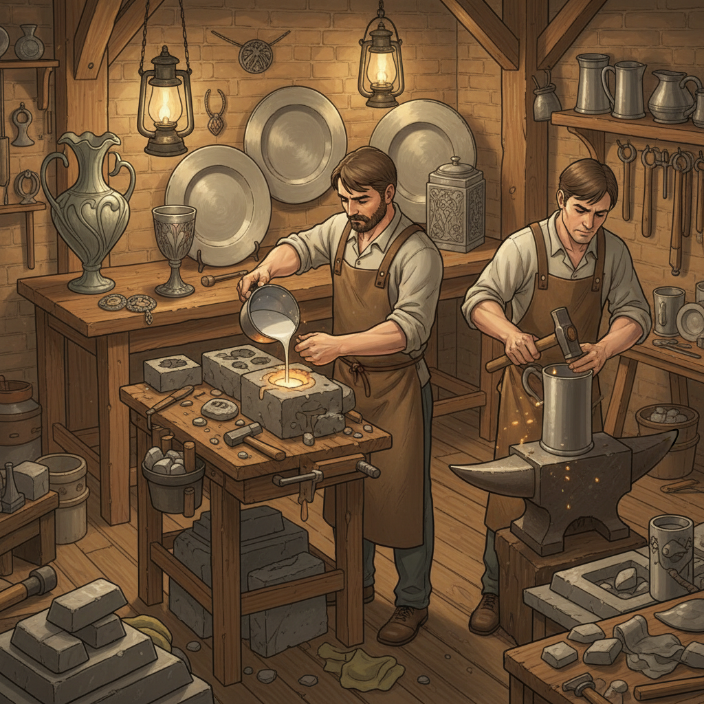

# Pewterwork 锡器工艺

> "Pewter is the democratic metal — softer than silver, warmer than steel, it yields to the craftsman's hammer and mold with a willingness that makes fine metalwork accessible to all." — Unknown

## 概述

锡器工艺（Pewterwork）是使用锡合金（pewter，主要成分为锡，加入少量铜、锑或铋以增加硬度）制作器物的金属工艺。锡器的特点是：熔点低（约230°C）、质地柔软、易于铸造和锤打、表面呈现温暖的银灰色光泽。历史上，锡器是普通人家的"银器"——在银器昂贵的年代，锡器提供了类似的美感和功能。

锡器的制作技法包括：铸造（casting，将熔化的锡倒入模具）、旋压（spinning，在车床上将锡片旋压成型）、锤打（hammering）、雕刻（engraving）和焊接（soldering）。锡器的应用范围广泛——从餐具、酒器、烛台到装饰品和首饰。

## 核心特征

| 特征 | 描述 |
|------|------|
| 锡合金 | 以锡为主的合金 |
| 低熔点 | 熔点低易加工 |
| 柔软 | 质地柔软 |
| 银灰 | 温暖的银灰色 |
| 多技 | 铸造、锤打、旋压 |
| 实用 | 实用性器物为主 |

## 视觉特征

- **银灰**：温暖的银灰色泽
- **光泽**：柔和的金属光泽
- **温暖**：比银更温暖的色调
- **锤痕**：锤打的质感
- **厚重**：有分量的质感
- **古典**：古典的气质

## 代表作品

| 作品 | 艺术家 | 年代 | 意义 |
|------|--------|------|------|
| *Roman pewter tableware* | 匿名 | 罗马时期 | 古代锡器 |
| *Medieval pewter* | 匿名 | 中世纪 | 中世纪锡器 |
| *Liberty & Co. pewter* | Archibald Knox | 1900s | 新艺术锡器 |
| *Colonial American pewter* | Paul Revere等 | 18世纪 | 美国殖民地锡器 |
| *Contemporary pewter* | Various | 当代 | 当代锡器艺术 |

## 历史时间线

| 时期 | 事件 |
|------|------|
| 青铜时代 | 最早的锡器 |
| 罗马时期 | 锡器的普及 |
| 中世纪 | 欧洲锡器行会的建立 |
| 17-18世纪 | 锡器的黄金时代 |
| 19世纪 | 锡器被瓷器和玻璃取代 |
| 当代 | 锡器工艺的复兴 |

## 中国语境

锡器在中国有着悠久的历史——中国是世界主要的锡产地之一（云南个旧被称为"锡都"）。中国传统的锡器包括：茶叶罐（锡罐密封性好，适合储茶）、酒壶、香炉、祭器等。云南的锡器工艺被列为非物质文化遗产。中国传统的锡器以铸造和锤打为主要技法，装饰上常有吉祥图案的浮雕。当代中国的一些设计师和工艺师正在复兴锡器工艺，将传统技法与现代设计结合。

## AI生成概念图

## 与其他风格的关系

- **Silversmithing** → 银器工艺
- **Coppersmithing** → 铜器工艺
- **Tinsmithing** → 马口铁工艺
- **Metal Casting** → 金属铸造
- **Repoussé** → 锤揲
- **Engraving** → 雕刻

---

*浮光艺志 | Chronicle of Artistry*
