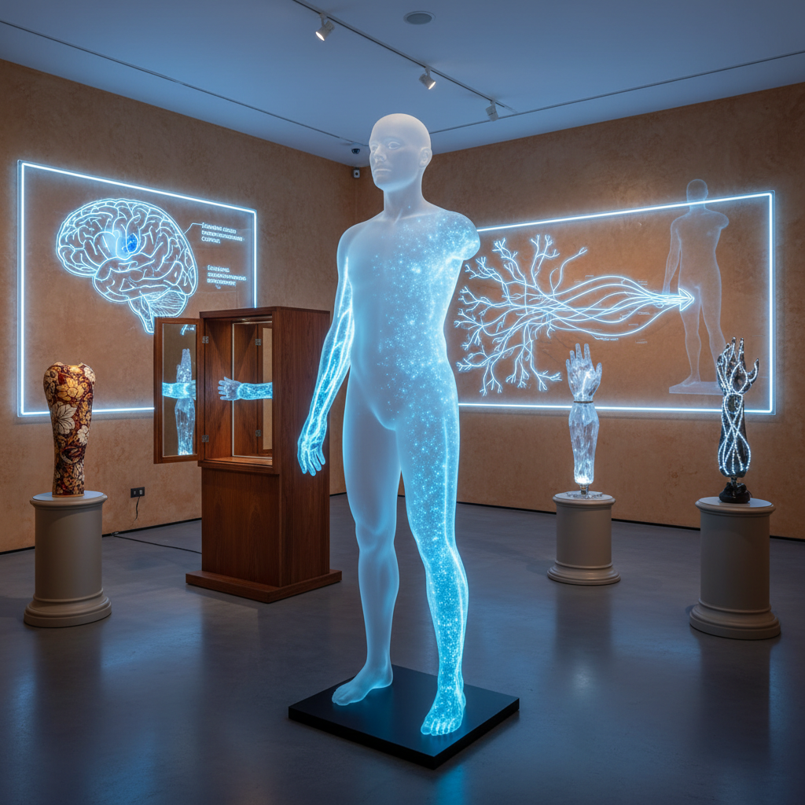

# Phantom Limb Art 幻肢艺术

> "Phantom limb art explores the body's capacity to feel what is not there — it reveals that our sense of self extends beyond our physical boundaries, that the brain constructs a body image that can persist even when the flesh is gone, and that absence can be as vivid and painful as presence, making the phantom limb a perfect metaphor for loss, memory, and the ghostly persistence of what once was." — V.S. Ramachandran

## 概述

幻肢艺术（Phantom Limb Art）是以"幻肢"现象——截肢者感觉失去的肢体仍然存在——为灵感和隐喻的艺术实践。幻肢现象揭示了身体意象（body image）的神经学基础：大脑中的身体地图不会因为肢体的丧失而消失，而是继续产生感觉，包括疼痛。

幻肢艺术的实践包括：1）缺失的可视化——将看不见但能感觉到的"幻肢"转化为可见的艺术形式；2）身体边界的探索——质疑身体在哪里结束、自我在哪里开始；3）假肢美学——将假肢和辅助设备视为美学对象和身份表达；4）神经可塑性艺术——探索大脑重新映射身体的能力；5）缺失与记忆——用幻肢作为隐喻来探索失去、记忆和持续的存在感。

## 核心特征

| 特征 | 描述 |
|------|------|
| 缺失 | 缺失的存在感 |
| 身体 | 身体意象 |
| 神经 | 神经可塑性 |
| 边界 | 身体边界 |
| 记忆 | 身体记忆 |
| 假肢 | 假肢美学 |

## 视觉特征

- **透明**：透明或半透明的肢体
- **轮廓**：身体的虚线轮廓
- **映射**：神经映射的可视化
- **假肢**：美学化的假肢
- **镜像**：镜像和对称
- **缺口**：身体的缺口和空白

## 代表作品

| 作品 | 艺术家 | 年代 | 意义 |
|------|--------|------|------|
| *Alternative Limb Project* | Sophie de Oliveira Barata | 2011至今 | 美学假肢 |
| *Phantom limb installations* | Various | 2010年代 | 幻肢装置 |
| *Body mapping art* | Various | 2010年代 | 身体映射艺术 |
| *Prosthetic fashion* | Various | 2010年代 | 假肢时尚 |
| *Neural art* | Various | 当代 | 神经艺术 |

## 历史时间线

| 时期 | 事件 |
|------|------|
| 1871 | Silas Weir Mitchell首次描述幻肢 |
| 1990年代 | V.S. Ramachandran的镜像疗法 |
| 2011 | Alternative Limb Project |
| 2010年代 | 假肢美学的兴起 |
| 当代 | 神经接口与艺术 |

## 中国语境

幻肢艺术在中国有独特的发展空间。中国传统医学中的"经络"概念——看不见但能感觉到的能量通道——与幻肢现象有某种结构上的相似性：两者都涉及身体中"存在但不可见"的维度。中国传统哲学中的"虚实"观念——虚（空）与实（有）的辩证关系——也为理解幻肢提供了哲学框架。中国当代的一些艺术家在探索身体边界和缺失的主题：将中国传统的身体观（气、经络、穴位）与当代神经科学结合，探索假肢和辅助技术的美学可能性，以及用"幻肢"作为隐喻来表达文化记忆中的"缺失"。

## AI生成概念图

## 与其他风格的关系

- **Body Art** → 身体艺术
- **Disability Art** → 残障艺术
- **Neuroscience Art** → 神经科学艺术
- **Prosthetic Art** → 假肢艺术
- **Conceptual Art** → 观念艺术
- **Medical Art** → 医学艺术

---

*浮光艺志 | Chronicle of Artistry*
