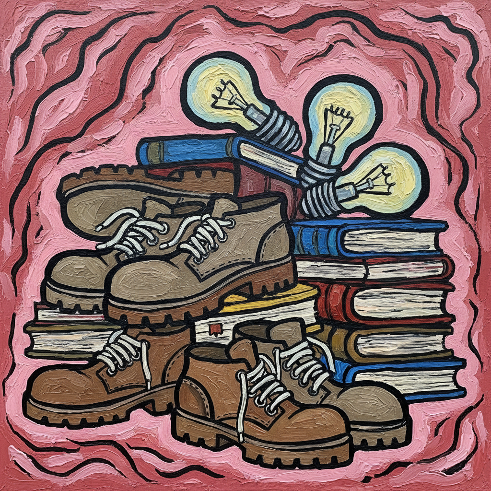

# Philip Guston 菲利普·加斯顿

> **时期：** 1913–1980  
> **关键词：** 晚期具象、卡通怪诞、粉色世界、抽象表现主义叛逃

## 概述

Philip Guston 是美国画家，早期是抽象表现主义的核心成员，1960年代末突然转向粗犷的具象绘画，用卡通般的形象描绘三K党头罩、鞋底、烟头和灯泡等日常物品。这一转变当时被视为背叛，如今被认为是20世纪最重要的艺术转折之一。

## 风格特征

- **卡通线条**：粗黑轮廓线包围简化的形态，如同地下漫画
- **粉色世界**：标志性的肉粉色背景和物体，营造出不安的甜腻感
- **日常物品**：反复描绘鞋底、灯泡、烟头、书本、时钟等简单物品
- **头罩形象**：三K党式的尖顶头罩人物反复出现，既是政治隐喻也是自画像
- **厚涂质感**：颜料厚重但笔触松弛，保持即兴的绘画性

## 代表作品

- *Painting, Smoking, Eating*（1973）
- *The Studio*（1969）
- *City Limits*（1969）
- *Flatlands*（1970）

## 历史意义

Guston 的晚期转变预言了1980年代新表现主义和"坏画"运动，他证明了一个艺术家可以在职业巅峰放弃成功的风格，追随内心的必要性。他对当代绘画的影响——从 Dana Schutz 到 Nicole Eisenman——是不可估量的。

## 概念图

