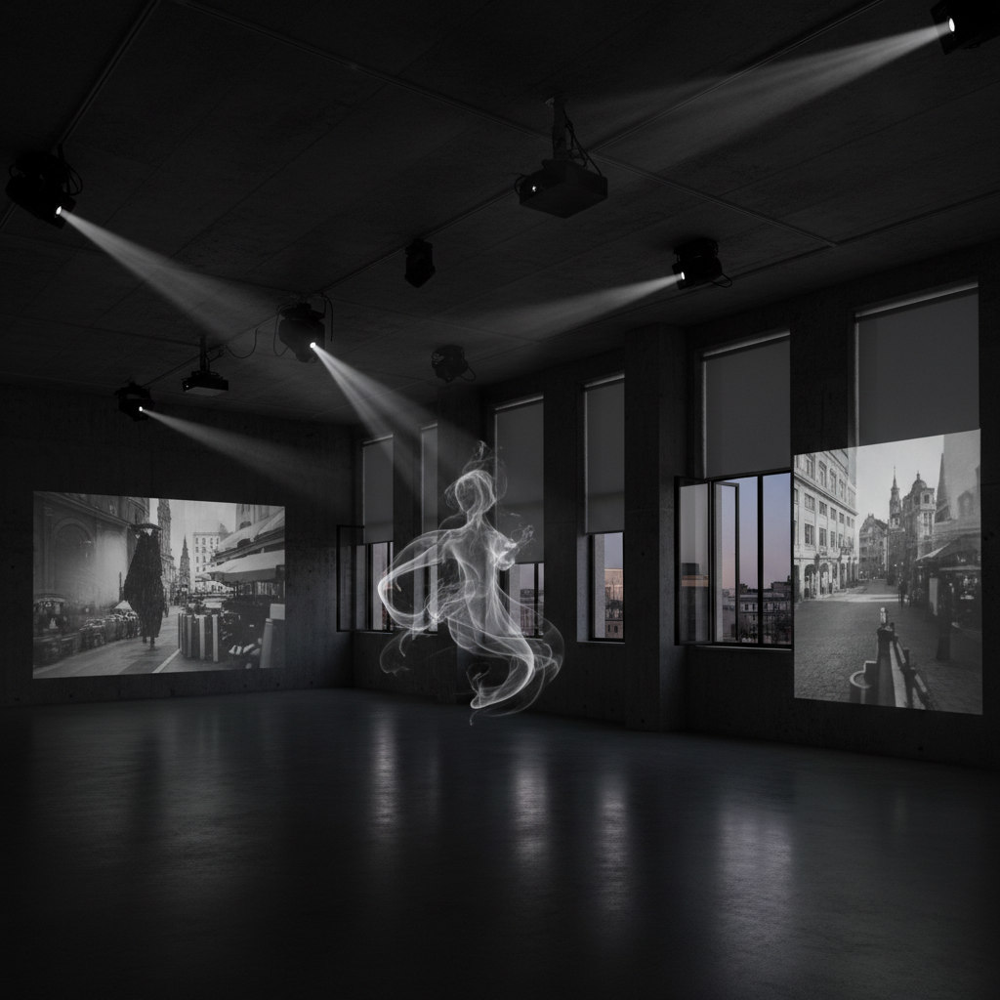

# Philippe Parreno 菲利普·帕雷诺

> **时期：** 1964–至今  
> **关键词：** 展览作为媒介、编排空间、自动化叙事、幽灵在场

## 概述

Philippe Parreno 是法国艺术家，以将整个展览空间转化为一个统一的、编排过的体验而闻名。他不展示单独的作品，而是将灯光、声音、影像、百叶窗的开合编排成一个自动运行的剧本，观众进入的是一个有自己时间逻辑的世界。

## 风格特征

- **展览即媒介**：整个空间是一件作品
- **自动化编排**：灯光、声音、机械按脚本运行
- **幽灵在场**：空间中暗示不在场的存在
- **时间操控**：观众的时间体验被重新设计
- **技术与诗意**：高科技手段服务于诗意效果

## 代表作品

- *Anywhere, Anywhere, Out of the World*（2013，东京宫）
- *Hypothesis*（2015，HangarBicocca）
- *Anywhen*（2016，泰特涡轮大厅）
- *Echo*（2019）

## 概念图

