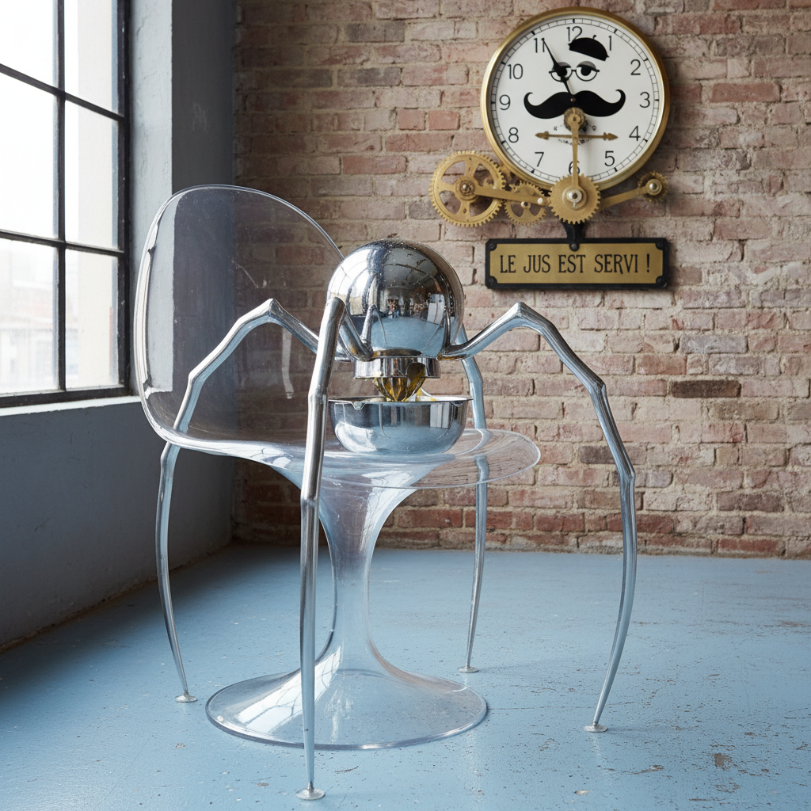

# Philippe Starck 菲利普·斯塔克

> **时期：** 1949–至今  
> **关键词：** 民主设计、有机形态、幽默感、跨界全才

## 概述

Philippe Starck 是法国设计师，以将高端设计民主化而闻名。从榨汁机到酒店、从牙刷到游艇，他的设计总是带着一丝幽默和诗意——有机的曲线、意想不到的材料组合和对日常物品的重新想象，让设计不再是精英的专属。

## 风格特征

- **有机曲线**：流动的、生物形态的轮廓
- **材料混搭**：透明塑料、抛光金属、木材的意外组合
- **幽默与诗意**：设计中隐藏的玩笑和隐喻
- **民主化**：让好设计人人可及（Target、宜家合作）
- **跨界**：从勺子到太空站，无所不设计

## 代表作品

- *Juicy Salif 榨汁机*（1990，Alessi）
- *Louis Ghost 椅*（2002，Kartell）
- *Mama Shelter 酒店*系列
- *小米 Mi MIX 手机*（2016）

## 概念图

