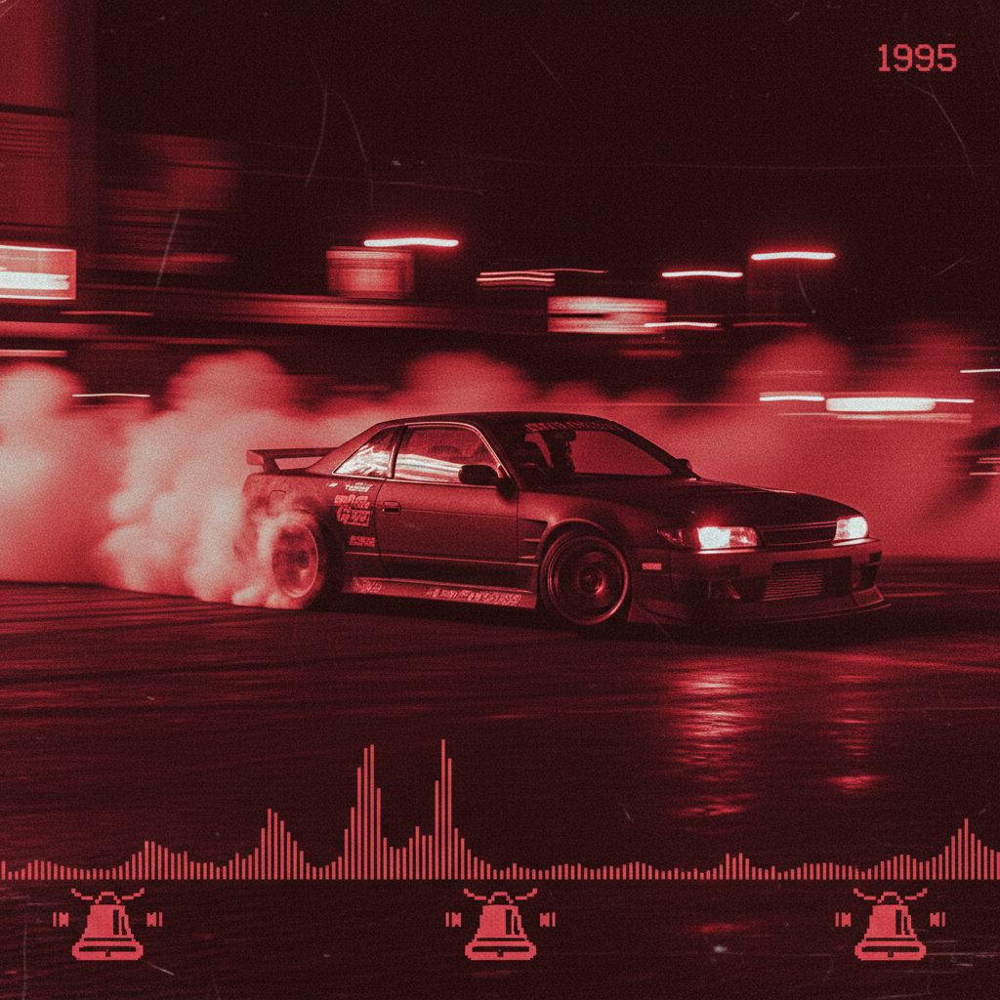

# Phonk 放克浪潮



> **"Memphis采样、漂移视频、暗红滤镜——地下说唱在TikTok上的复活。"**

## 概述

| 维度 | 描述 |
|------|------|
| 时期 | 2010s–至今（根源1990s Memphis Rap） |
| 别名 | Phonk, Drift Phonk, Brazilian Phonk |
| 核心色彩 | 暗红、黑色、紫色、橙色（日落） |
| 关键元素 | Memphis说唱采样、cowbell、漂移视频、暗色滤镜 |
| 代表人物 | DJ Smokey, Soudiere, Kordhell, DVRST |
| 关联风格 | Memphis Rap, Trap, Vaporwave, Drift Culture |

---

## 历史脉络

| 年份 | 事件 |
|------|------|
| 1990s | Memphis Rap (Three 6 Mafia, DJ Paul)——Phonk 的根源 |
| 2012 | SoundCloud 上的早期 Phonk 制作人 |
| 2015 | Phonk 社区在 SoundCloud 形成 |
| 2020 | TikTok + 漂移视频——Phonk 爆发 |
| 2022 | Brazilian Phonk——全球化变体 |
| 2023 | Phonk 成为最流行的互联网音乐类型之一 |

### 核心哲学

Phonk 的精神是**"90年代Memphis的鬼魂在2020年代的互联网上复活"**：
- 采样 = 考古（"从90s Memphis磁带里挖出灵魂"）
- 漂移 = 视觉（"Phonk 的MV就是漂移视频"）
- 暗黑 = 美学（"午夜、烟雾、红色"）
- cowbell = 签名（"没有cowbell不是Phonk"）
- "Phonk 是死去的Memphis说唱歌手的鬼魂在互联网上跳舞"

---

## 视觉语法

### 色彩系统

```
主色：
  暗红 (#8B0000) — 尾灯、血色
  黑色 (#000000) — 夜晚、阴影
  紫色 (#4B0082) — 午夜、神秘

辅色：
  橙色 (#FF4500) — 日落、火焰
  深蓝 (#000033) — 夜空
  白色 (#FFFFFF) — 烟雾、漂移烟

规则：
  - 暗色调为主
  - 红色/紫色滤镜
  - 运动模糊（漂移）
  - 90s VHS质感

质感：
  烟雾 — 漂移烟/轮胎烟
  VHS — 扫描线、噪点
  金属 — 汽车
  沥青 — 街道
```

### 标志性元素

| 类别 | 元素 |
|------|------|
| 视觉 | 漂移视频、暗红滤镜、日本JDM车 |
| 音乐 | Memphis采样、cowbell、808、chopped vocal |
| 汽车 | JDM (日本改装车)、漂移、夜间驾驶 |
| 平台 | TikTok、YouTube Shorts、SoundCloud |
| 文化 | 漂移文化、Initial D、夜间驾驶 |
| 态度 | 暗黑、速度、地下、互联网、复古 |

---

## 与千禧怀旧的关系

### 互联网时代的音乐考古
- Phonk = 用互联网工具复活90s Memphis地下说唱
- 与 Vaporwave 共享"采样+怀旧+互联网"
- "Phonk 对 Memphis Rap 就像 Vaporwave 对 80s Smooth Jazz"
- TikTok 让 Phonk 从地下走向全球

### 漂移文化的声音
- Phonk + 漂移视频 = 完美匹配
- Initial D 动画的影响
- JDM 文化 + Phonk = 2020s 互联网美学
- "如果你在YouTube上看漂移视频——背景音乐一定是Phonk"

---

## 中国语境

- Phonk 在中国短视频平台的爆发
- 中国漂移/改装车文化
- 抖音上的 Phonk 视频
- 与中国"暗黑电子"的交叉

---

## 设计应用

| 场景 | 应用方式 |
|------|----------|
| 视频 | 漂移+暗红滤镜+运动模糊+夜间 |
| 音乐 | Memphis采样+cowbell+暗色封面 |
| 汽车 | JDM+漂移+夜间+红色灯光 |
| 数字 | 暗红+VHS+运动模糊+短视频 |

---

## 相关风格

← [Hip-Hop Aesthetic 嘻哈美学](hip-hop-aesthetic.md) | [Vaporwave 蒸汽波](vaporwave.md) →

↑ [返回千禧怀旧目录](README.md) | [返回总目录](../README.md)
