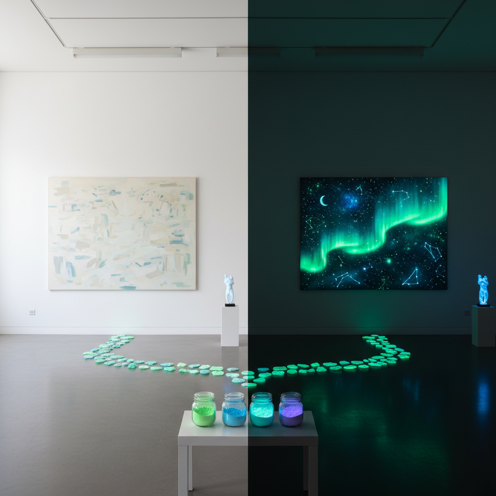

# Phosphorescent Art 磷光艺术

> "Phosphorescence is borrowed light — materials that absorb photons during the day and release them slowly through the night, glowing with an otherworldly green or blue radiance long after the lights go out. Unlike fluorescence, which stops the instant the light source is removed, phosphorescence persists: it is light with memory, energy stored and slowly surrendered, a material that remembers the sun." — Unknown

## 概述

磷光艺术（Phosphorescent Art）是利用磷光材料（蓄光材料）进行艺术创作的实践——使用能够吸收光能并在黑暗中持续发光的材料，创造出在关灯后才显现的隐藏图像和发光效果。磷光艺术探索了光的记忆、时间的流逝和可见与不可见之间的边界。

磷光艺术的实践包括：1）磷光壁画——在黑暗中显现的墙面画作；2）磷光雕塑——在黑暗中发光的三维造型；3）磷光装置——利用蓄光材料的空间装置；4）磷光街头艺术——在城市空间中的磷光涂鸦；5）磷光摄影——拍摄磷光效果的艺术摄影；6）磷光时装——使用蓄光材料的服装设计；7）磷光安全设计——将磷光材料用于功能性标识和安全设计。

## 核心特征

| 特征 | 描述 |
|------|------|
| 蓄光 | 吸收并储存光能 |
| 持续 | 持续数小时的发光 |
| 双重 | 明暗两种视觉状态 |
| 神秘 | 神秘的夜光效果 |
| 时间 | 随时间衰减的光 |
| 隐藏 | 隐藏的图像显现 |

## 视觉特征

- **绿色**：典型的黄绿色磷光
- **蓝色**：蓝色磷光变体
- **渐变**：从亮到暗的渐变
- **柔和**：柔和的自发光
- **对比**：明暗状态的强烈对比
- **神秘**：黑暗中的神秘感

## 代表作品

| 作品 | 艺术家 | 年代 | 意义 |
|------|--------|------|------|
| *Glow-in-dark murals* | Various | 当代 | 磷光壁画 |
| *Van Gogh Path* | Daan Roosegaarde | 2014 | 磷光自行车道 |
| *Phosphorescent installations* | Various | 当代 | 磷光装置 |
| *Glow street art* | Various | 当代 | 磷光街头艺术 |
| *Luminous fashion* | Various | 当代 | 磷光时装 |

## 历史时间线

| 时期 | 事件 |
|------|------|
| 1602 | 波洛尼亚石的发现（最早的磷光材料） |
| 19世纪 | 硫化锌磷光材料 |
| 1990年代 | 铝酸锶长效蓄光材料 |
| 2000年代 | 磷光材料进入艺术领域 |
| 当代 | 磷光艺术的多元化发展 |

## 中国语境

磷光艺术在中国近年来发展迅速。中国是世界上最大的蓄光材料生产国——这为磷光艺术提供了丰富的材料基础。中国的一些当代艺术家和设计师将磷光材料融入创作——用蓄光颜料创造在黑暗中显现的壁画、将磷光材料用于公共艺术装置、以及用磷光技术创造互动体验。中国的一些城市开始在公共空间中使用磷光材料——如磷光自行车道、磷光公园步道和磷光安全标识。中国的儿童教育和科普活动中，磷光材料是非常受欢迎的实验材料。中国传统文化中的"夜明珠"传说——能在黑暗中发光的宝石——与磷光现象有着有趣的文化联系。

## AI生成概念图

## 与其他风格的关系

- **Light Art** → 光艺术
- **Fluorescent Art** → 荧光艺术
- **Street Art** → 街头艺术
- **Installation Art** → 装置艺术
- **UV Art** → 紫外线艺术
- **Bioluminescence Art** → 生物发光艺术

---

*浮光艺志 | Chronicle of Artistry*
