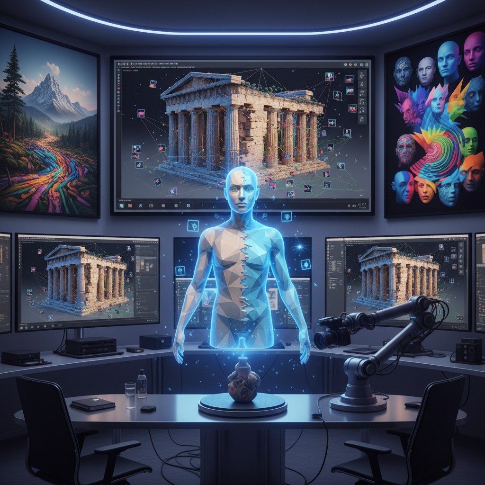

# Photogrammetry Art 摄影测量艺术

> "Photogrammetry art turns photographs into worlds — it takes the flat, frozen moments captured by cameras and reconstructs from them the full three-dimensional reality that existed before the lens. Every photograph contains depth information hidden in parallax, in perspective, in the subtle differences between two views of the same scene. The photogrammetry artist extracts this hidden dimension, building sculptures from snapshots, architectures from albums, and entire landscapes from drone flights." — Unknown

## 概述

摄影测量艺术（Photogrammetry Art）是利用摄影测量技术——从多张二维照片中重建三维模型——进行艺术创作的实践。摄影测量通过分析同一场景从不同角度拍摄的多张照片之间的视差关系，计算出每个点的三维坐标，从而重建完整的三维模型。

摄影测量艺术的实践包括：1）现实重建——将真实场所和物体重建为可交互的三维模型；2）记忆保存——用摄影测量保存即将消失的建筑、景观和文物；3）不完美美学——利用摄影测量的失败和瑕疵（孔洞、扭曲、纹理错误）作为美学元素；4）时间叠加——将不同时间拍摄的照片重建为同一空间的时间叠加；5）无人机测量艺术——用无人机航拍进行大规模地形重建；6）微观测量——对微小物体进行高精度摄影测量。

## 核心特征

| 特征 | 描述 |
|------|------|
| 重建 | 从2D到3D的重建 |
| 照片 | 基于照片 |
| 真实 | 真实世界的复制 |
| 瑕疵 | 技术瑕疵的美学 |
| 保存 | 数字保存 |
| 规模 | 从微观到宏观 |

## 视觉特征

- **网格**：三角网格的可见性
- **纹理**：照片纹理的映射
- **孔洞**：数据缺失的孔洞
- **点云**：稀疏点云的粒子感
- **扭曲**：重建错误的扭曲
- **真实**：照片级的真实感

## 代表作品

| 作品 | 艺术家 | 年代 | 意义 |
|------|--------|------|------|
| *Photogrammetry sculptures* | Various | 2010年代 | 摄影测量雕塑 |
| *Heritage preservation* | Various | 2000年代 | 文化遗产保存 |
| *Glitch photogrammetry* | Various | 2010年代 | 故障摄影测量 |
| *Drone landscape art* | Various | 2010年代 | 无人机地形艺术 |
| *Memory spaces* | Various | 2020年代 | 记忆空间重建 |

## 历史时间线

| 时期 | 事件 |
|------|------|
| 1849 | 摄影测量概念提出 |
| 1960年代 | 航空摄影测量成熟 |
| 2000年代 | 数字摄影测量软件 |
| 2010年代 | 消费级摄影测量工具 |
| 当代 | 摄影测量艺术的独立发展 |

## 中国语境

摄影测量艺术在中国有重要的文化遗产保护应用。中国拥有大量需要数字化保存的文化遗产——从敦煌莫高窟的壁画和雕塑到长城的各段遗址、从古建筑群到石窟造像。中国的数字文化遗产项目大量使用摄影测量技术——故宫的三维数字化、云冈石窟的高精度重建、中国传统村落的数字保存等。中国当代的一些艺术家在探索摄影测量艺术：将中国古建筑的摄影测量模型作为创作素材、利用摄影测量的"故障美学"重新诠释中国传统空间、以及用无人机摄影测量记录中国快速变化的城市景观。

## AI生成概念图

## 与其他风格的关系

- **3D Scanning Art** → 3D扫描艺术
- **Volumetric Art** → 体积艺术
- **Digital Sculpture** → 数字雕塑
- **Glitch Art** → 故障艺术
- **LiDAR Art** → 激光雷达艺术
- **Heritage Art** → 遗产艺术

---

*浮光艺志 | Chronicle of Artistry*
