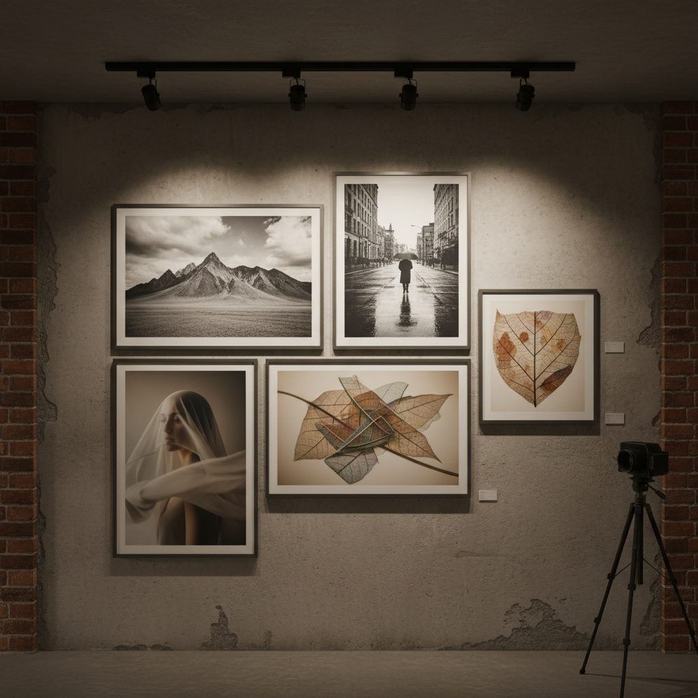

# Photography Art 摄影艺术

> "The camera is an instrument that teaches people how to see without a camera." — Dorothea Lange

## 概述

摄影艺术（Photography Art / Fine Art Photography）是将摄影作为艺术表达媒介的实践——不仅记录现实，更通过构图、光线、时机、后期处理和概念框架创造具有审美和思想深度的图像。从19世纪的画意摄影到当代的观念摄影，摄影艺术经历了从模仿绘画到确立自身独立语言的漫长历程。

摄影的独特性在于它与现实的索引关系——每张照片都是光线在特定时刻的物理痕迹，这赋予了摄影独特的真实感和时间性。

## 核心特征

| 特征 | 描述 |
|------|------|
| 光学记录 | 基于光学和化学/电子的图像记录 |
| 时间性 | 捕捉特定的瞬间 |
| 真实索引 | 与被摄对象有物理因果关系 |
| 可复制 | 可以无限复制 |
| 民主性 | 技术门槛相对较低 |
| 多元性 | 从纪实到抽象的广阔光谱 |

## 视觉特征

- **光线**：自然光或人工光的精确控制
- **构图**：画面元素的精心安排
- **焦点**：清晰与模糊的选择
- **色调**：黑白的层次或彩色的氛围
- **瞬间**：决定性瞬间的捕捉
- **尺度**：从微距到航拍的视角

## 代表作品

| 作品 | 艺术家 | 年代 | 意义 |
|------|--------|------|------|
| *Moonrise, Hernandez* | Ansel Adams | 1941 | 风景摄影的巅峰 |
| *Migrant Mother* | Dorothea Lange | 1936 | 纪实摄影的力量 |
| *Untitled Film Stills* | Cindy Sherman | 1977-80 | 观念摄影——身份与再现 |
| *Rhein II* | Andreas Gursky | 1999 | 当代摄影的最高拍卖价 |
| *Identical Twins* | Diane Arbus | 1967 | 边缘人群的肖像 |
| *99 Cent* | Andreas Gursky | 1999 | 消费社会的全景 |

## 历史时间线

| 时期 | 事件 |
|------|------|
| 1839 | 摄影术发明——Daguerre |
| 1850s-90s | 画意摄影——模仿绘画 |
| 1900s-10s | Photo-Secession——Stieglitz |
| 1920s-30s | 新客观主义——直接摄影 |
| 1930s-40s | FSA纪实摄影——社会关怀 |
| 1960s-70s | 观念摄影的兴起 |
| 1980s-90s | 杜塞尔多夫学派——大画幅 |
| 2000s-至今 | 数字摄影、手机摄影、AI |

## 中国语境

中国摄影艺术从郎静山的画意摄影到当代的观念摄影经历了丰富的发展。当代中国摄影艺术家如张晓、任航、陆元敏、刘铮等在国际上获得认可。中国的"纪实摄影"传统关注社会变迁，而年轻一代更多探索个人表达和观念实验。手机摄影和社交媒体正在重新定义中国的摄影文化。

## AI生成概念图

## 与其他风格的关系

- **Photorealism** → 照相写实主义以摄影为参照
- **Conceptual Art** → 观念艺术大量使用摄影
- **Documentary** → 纪实传统是摄影的核心
- **Digital Art** → 数字技术改变了摄影的本质
- **Pop Art** → 波普艺术挪用摄影图像
- **Surrealism** → 超现实摄影探索潜意识

---

*浮光艺志 | Chronicle of Artistry*
