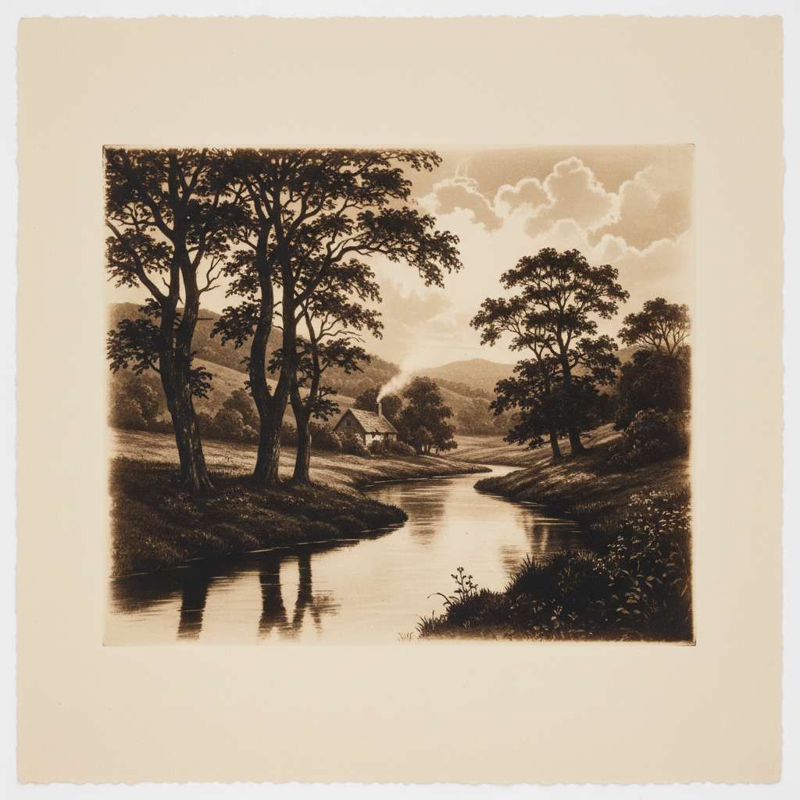

# Photogravure Art 照相凹版艺术

> "Photogravure is the marriage of photography and printmaking — a copper plate etched through a photographic resist produces prints with the continuous tone of a photograph and the ink-on-paper richness of an intaglio etching. The velvety blacks, luminous highlights, and subtle midtone gradations make photogravure the most beautiful method ever devised for reproducing a photographic image in printer's ink." — Unknown

## 概述

照相凹版艺术（Photogravure Art）是一种将摄影图像转移到铜版上进行凹版印刷的工艺——通过将感光明胶（碳素纸）曝光后转移到铜版上，然后用氯化铁腐蚀，创造出能够以凹版印刷方式复制摄影图像的铜版。照相凹版以其极其丰富的色调、天鹅绒般的黑色和精美的印刷品质著称。

照相凹版艺术的实践包括：1）碳素纸制备——制备感光明胶纸；2）曝光——通过底片和网屏曝光；3）转移——将明胶转移到铜版上；4）腐蚀——用氯化铁分级腐蚀；5）印刷——在凹版印刷机上印刷；6）手工擦墨——手工擦拭油墨的技巧；7）当代照相凹版——将传统工艺与现代创作结合。

## 核心特征

| 特征 | 描述 |
|------|------|
| 铜版 | 在铜版上制作 |
| 凹版 | 凹版印刷方式 |
| 连续 | 连续色调的再现 |
| 油墨 | 油墨印刷的质感 |
| 精美 | 极其精美的品质 |
| 复制 | 可以多次印刷 |

## 视觉特征

- **天鹅绒**：天鹅绒般的深黑
- **连续**：连续的色调过渡
- **油墨**：油墨的丰富质感
- **精细**：极其精细的细节
- **温暖**：温暖的色调倾向
- **深度**：极深的色调深度

## 代表作品

| 作品 | 艺术家/文化 | 年代 | 意义 |
|------|-------------|------|------|
| *Alfred Stieglitz gravures* | 美国 | 1890-1910年代 | 斯蒂格利茨的照相凹版 |
| *Camera Work magazine* | 美国 | 1903-1917年 | 《摄影作品》杂志 |
| *Peter Henry Emerson* | 英国 | 1880-90年代 | 爱默生的自然主义摄影 |
| *Karl Blossfeldt plants* | 德国 | 1920年代 | 布洛斯费尔特的植物 |
| *Contemporary photogravure* | 国际 | 当代 | 当代照相凹版 |

## 历史时间线

| 时期 | 事件 |
|------|------|
| 1879年 | Karel Klíč发明照相凹版 |
| 1890-1910年代 | 画意摄影中的广泛使用 |
| 1903-1917年 | Camera Work杂志的黄金时代 |
| 20世纪中 | 商业轮转凹版的发展 |
| 当代 | 手工照相凹版的艺术复兴 |

## 中国语境

照相凹版在中国的版画和摄影界有一定的认知。中国的版画教育中，照相凹版作为凹版印刷的重要技法——在高等院校的版画专业中教授。中国的摄影艺术家对照相凹版的精美品质有所关注——作为最高品质的摄影复制方式。中国当代的版画艺术家将照相凹版与传统铜版画技法结合——创造出融合摄影和版画的作品。中国的艺术出版中，照相凹版作为高品质的图像复制方式——在限量版画册中使用。中国的一些版画工作室开始提供照相凹版工作坊——推广这一精美的传统工艺。

## AI生成概念图

## 与其他风格的关系

- **Etching** → 蚀刻版画
- **Platinum Print** → 铂金印相
- **Intaglio** → 凹版印刷
- **Pictorialism** → 画意摄影
- **Fine Art Print** → 艺术版画
- **Heliogravure** → 日光凹版

---

*浮光艺志 | Chronicle of Artistry*
