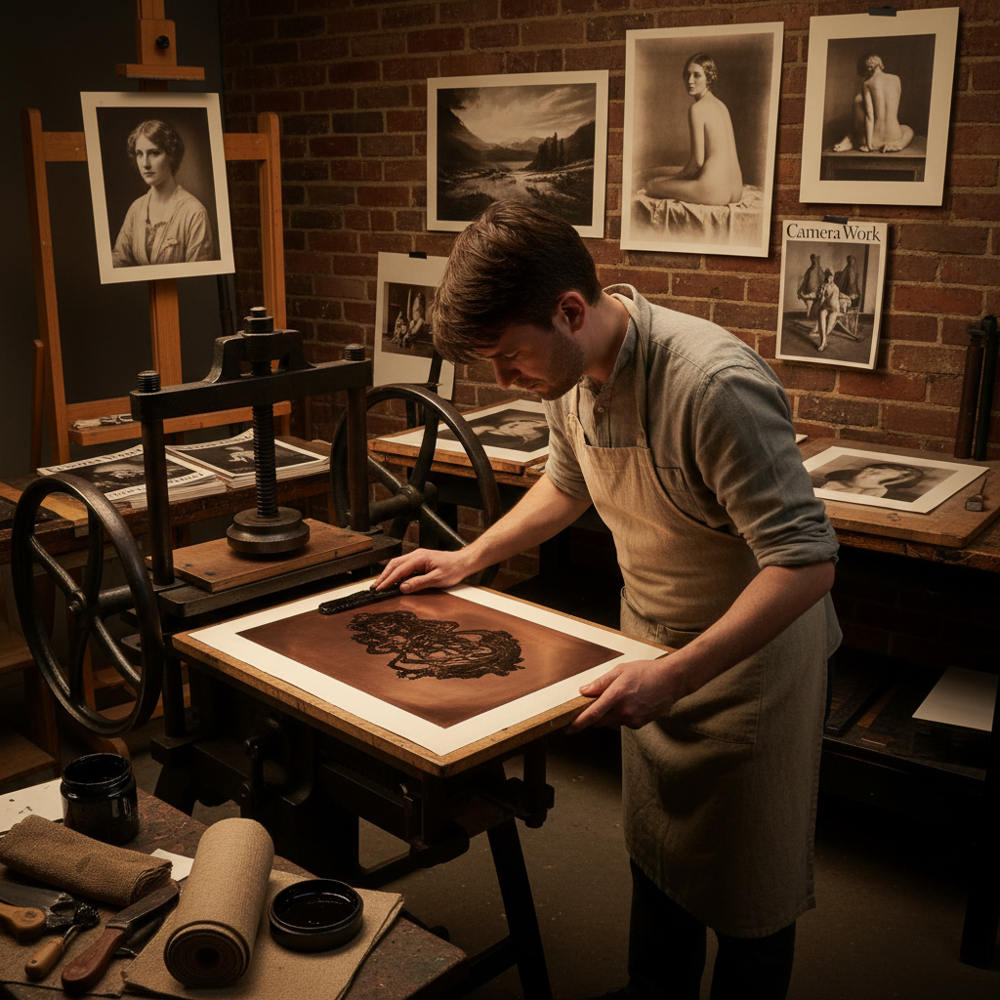

# Photogravure 照相凹版

> "Photogravure is the noblest of all photographic printing processes — etching light itself into copper, then pressing that light onto paper with the richness of ink, producing prints that breathe with a tonal depth no silver gelatin could ever match." — Unknown

## 概述

照相凹版（Photogravure）是一种将摄影影像通过化学蚀刻转移到铜版上，再用凹版印刷机印刷的工艺。其结果是具有极其丰富影调层次的印刷品——从最深的黑色到最细腻的高光，过渡平滑自然。照相凹版结合了摄影的精确性和版画的物质美感，被认为是再现摄影影像的最高品质印刷方式。

照相凹版的过程：将摄影正片通过明胶碳素纸（carbon tissue）转移到铜版上，然后用氯化铁溶液蚀刻——曝光程度不同的区域蚀刻深度不同，形成能容纳不同量油墨的凹槽。印刷时，油墨填入凹槽，擦去表面多余油墨，通过印刷机的压力将油墨转移到湿润的纸张上。照相凹版在19世纪末至20世纪初被广泛用于高品质摄影画册和艺术复制品的印刷。

## 核心特征

| 特征 | 描述 |
|------|------|
| 铜版 | 蚀刻铜版印刷 |
| 影调 | 极其丰富的影调 |
| 品质 | 最高品质的印刷 |
| 油墨 | 使用凹版油墨 |
| 深度 | 深邃的暗部 |
| 精细 | 精细的细节 |

## 视觉特征

- **影调**：连续的影调层次
- **深度**：深邃的暗部
- **质感**：油墨的物质感
- **温暖**：温暖的色调
- **精细**：极其精细的细节
- **压痕**：版画的压痕边缘

## 代表作品

| 作品 | 艺术家 | 年代 | 意义 |
|------|--------|------|------|
| *Camera Work gravures* | Alfred Stieglitz | 1903-17 | 摄影艺术杂志 |
| *The North American Indian* | Edward Curtis | 1907-30 | 美洲原住民记录 |
| *Photogravure portfolios* | Peter Henry Emerson | 1880s | 自然主义摄影 |
| *Contemporary photogravures* | Various | 当代 | 当代照相凹版 |
| *Artist editions* | Various | 当代 | 艺术家限量版 |

## 历史时间线

| 时期 | 事件 |
|------|------|
| 1879 | Karel Klíč完善照相凹版工艺 |
| 1880s-90s | 照相凹版在艺术出版中的应用 |
| 1903-17 | Stieglitz的Camera Work杂志 |
| 20世纪初 | 照相凹版的商业黄金时代 |
| 1930s后 | 胶印逐渐取代照相凹版 |
| 当代 | 照相凹版作为艺术媒介的复兴 |

## 中国语境

照相凹版在中国的印刷史和版画教育中有重要地位。中国的早期高品质印刷品中有使用照相凹版工艺的。中国的版画教育中，照相凹版作为一种高级凹版技法被介绍。中国的一些当代版画家和摄影艺术家使用照相凹版创作限量版艺术品。中国的印刷博物馆中有照相凹版工艺的展示和介绍。

## AI生成概念图

## 与其他风格的关系

- **Heliogravure** → 日光凹版
- **Intaglio** → 凹版画
- **Etching** → 蚀刻版画
- **Photography** → 摄影
- **Fine Art Printing** → 艺术印刷
- **Alternative Process** → 替代工艺

---

*浮光艺志 | Chronicle of Artistry*
