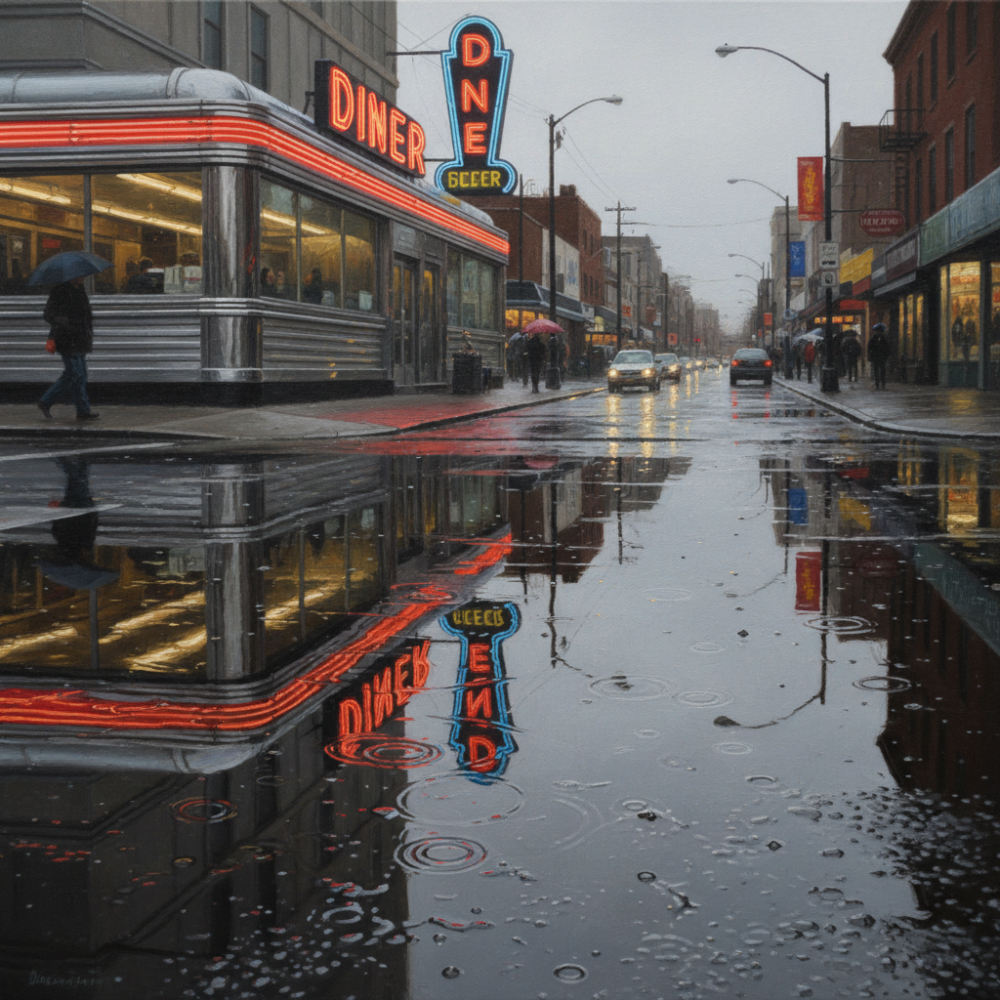

# Photorealism Painting 照相写实主义绘画

> **时期：** 1960年代末–至今  
> **关键词：** 照片精确、机械复制、美国日常、消费景观、技术炫技

## 概述

Photorealism（照相写实主义）是1960年代末在美国兴起的绘画运动——画家以照片为蓝本，用画笔和颜料精确复制相机所见的一切，包括焦点模糊、镜头畸变和光学反射。查克·克洛斯的巨幅肖像、理查德·埃斯蒂斯的城市橱窗——他们不是在画现实，而是在画照片本身，质疑我们对"真实"的定义。

## 风格特征

- **照片精确**：复制相机的光学特征
- **大尺幅**：放大照片的每个细节
- **机械感**：隐藏笔触，消除手工痕迹
- **日常主题**：汽车、橱窗、街道、食物
- **反射与透明**：玻璃、金属、水面的极致表现

## 代表人物与作品

- 查克·克洛斯 巨幅肖像
- 理查德·埃斯蒂斯 城市反射
- 拉尔夫·戈因斯 美国餐车
- 奥德丽·弗拉克 静物虚空

## 概念图

