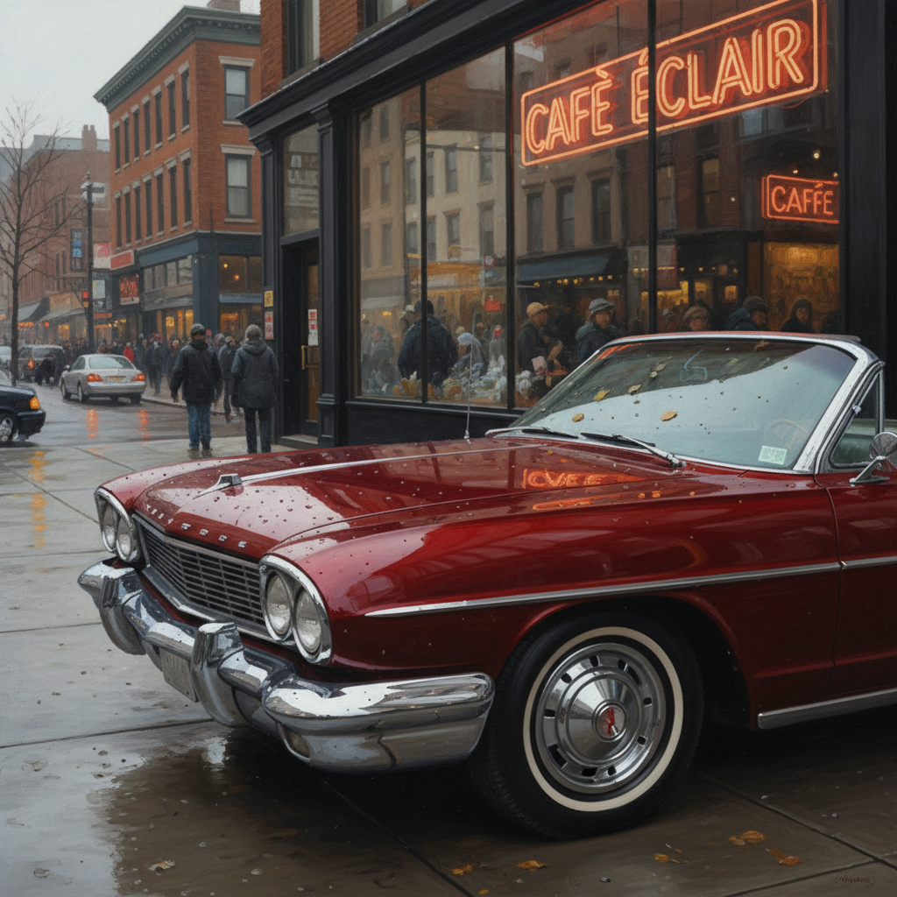

# Photorealism 照相写实主义



> **"比照片更像照片——当绘画挑战摄影的极限。"**

## 概述

| 维度 | 描述 |
|------|------|
| 时期 | 1960s–至今 |
| 别名 | Photorealism, Hyperrealism, Super Realism, 照相写实主义, 超级写实主义 |
| 核心色彩 | 完全写实——与照片一致的色彩 |
| 关键元素 | 极致细节、照片级精度、日常场景、反射与光泽 |
| 代表人物 | Chuck Close, Richard Estes, Ralph Goings, Audrey Flack |
| 关联风格 | Pop Art, Minimalism, Conceptual Art, Digital Art |

---

## 历史脉络

| 年份 | 事件 |
|------|------|
| 1960s | 照相写实主义在美国兴起——对抽象的反动 |
| 1968 | Chuck Close第一幅巨型肖像 |
| 1970 | Richard Estes的城市反射系列 |
| 1972 | Documenta 5展出照相写实主义 |
| 1990s | 数字工具辅助——Hyperrealism出现 |
| 2000s | 当代超写实主义在全球流行 |

### 核心哲学

照相写实主义的精神是**"手工能做到机器做的一切——而且更多"**：
- "我不是在复制照片——我是在质疑'看见'的本质"
- "当你花200小时画一个水滴——你对现实的理解比任何人都深"
- "照相写实不是没有观点——选择画什么就是观点"
- "在抽象统治的时代——写实是最激进的反叛"
- "每一个细节都是一个决定——这就是艺术"

---

## 视觉语法

### 技法系统

```
核心技法：
  网格法 — 将照片分格放大
  喷枪 — 无笔触的平滑过渡
  多层薄涂 — 建立深度和光泽
  投影仪 — 精确轮廓转移

标志性主题：
  城市反射 — 玻璃橱窗、汽车漆面
  食物 — 快餐、糖果、水果
  肖像 — 巨幅面部特写
  日常物品 — 弹珠、水滴、金属

规则：
  - 必须基于照片（不是写生）
  - 细节精度超越肉眼
  - 无可见笔触
  - 尺寸通常巨大（放大效果）
```

### 标志性元素

| 类别 | 元素 |
|------|------|
| 反射 | 玻璃、水面、金属、汽车漆面 |
| 细节 | 水滴、毛孔、纹理、光泽 |
| 主题 | 城市街景、肖像、静物、汽车 |
| 尺寸 | 巨幅——让细节震撼 |
| 态度 | 冷静、客观、技术极致 |

---

## 与当代的关系

### 数字时代的照相写实
- 3D渲染 = 数字照相写实
- "当AI能生成照片级图像——手工照相写实的价值更高了"
- 超写实雕塑（Ron Mueck）= 三维的照相写实
- 数字绘画中的照相写实技法

---

## 设计应用

| 场景 | 应用方式 |
|------|----------|
| 产品 | 超写实产品渲染+包装 |
| 游戏 | 写实风格+材质渲染 |
| 广告 | 食物摄影级插画 |
| 艺术 | 当代超写实绘画+雕塑 |

---

## 相关风格

← [Pop Art 波普艺术](pop-art.md) | [Digital Art 数字艺术](digital-art.md) →

↑ [返回千禧怀旧目录](README.md) | [返回总目录](../README.md)
