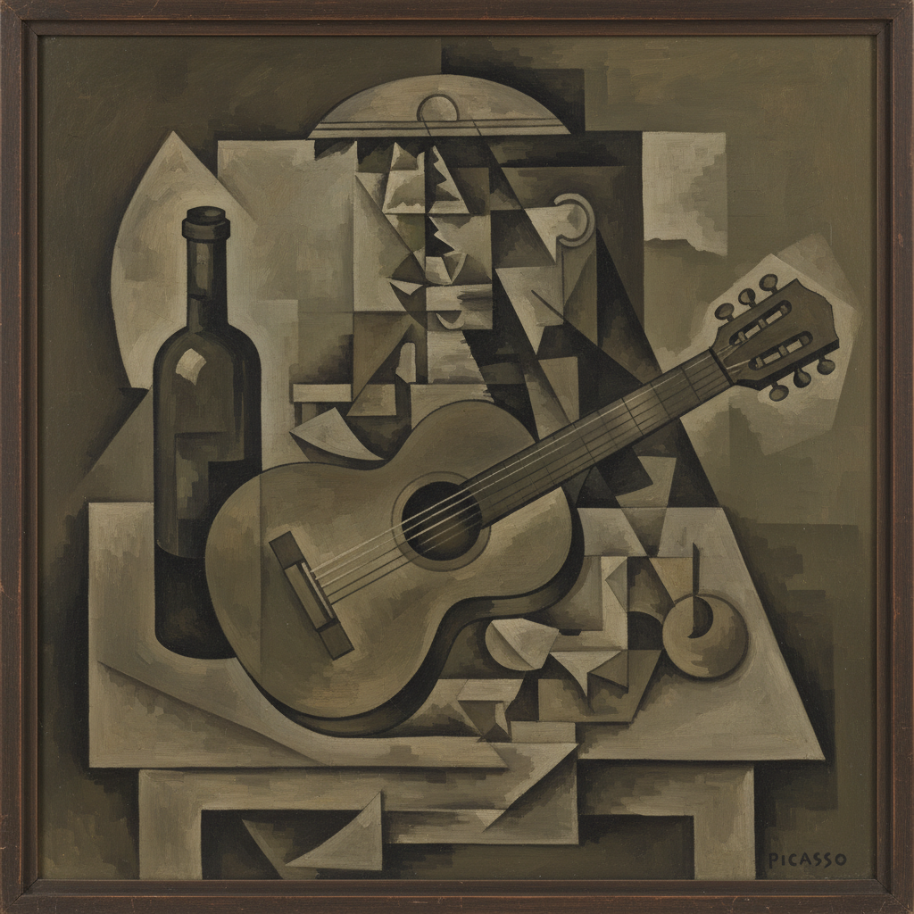

# Pablo Picasso 毕加索

> "Every child is an artist. The problem is how to remain an artist once we grow up." — Pablo Picasso

## 概述

巴勃罗·毕加索（Pablo Ruiz Picasso，1881–1973）是20世纪最具影响力的艺术家，也是西方艺术史上最多产的创作者之一。他一生创作了约50000件作品，经历了蓝色时期、玫瑰时期、非洲时期、分析立体主义、综合立体主义、新古典主义、超现实主义等多个风格阶段——每一次转变都重新定义了现代艺术的可能性。

1907年的《亚维农少女》被视为20世纪艺术的开端——它打碎了文艺复兴以来500年的透视传统，开创了立体主义，从此改变了人类观看世界的方式。

## 核心特征

| 特征 | 描述 |
|------|------|
| 多视角 | 同时展示物体的多个角度 |
| 形体解构 | 将三维物体分解为几何平面 |
| 风格多变 | 一生经历多次彻底的风格转变 |
| 线条力量 | 极简而有力的线条——一笔画出公牛 |
| 情感极端 | 从温柔到暴力的极端情感表达 |
| 不断革新 | "我不搜索，我发现" |

## 视觉特征

- **形体**：几何化的、多视角的形体
- **线条**：粗犷有力的黑色轮廓
- **色彩**：从蓝色时期的忧郁到晚期的狂放
- **空间**：打碎的、重组的空间
- **面孔**：正面和侧面同时呈现的面孔
- **构图**：动态的、不稳定的构图

## 风格阶段

| 时期 | 年代 | 特点 |
|------|------|------|
| 蓝色时期 | 1901-04 | 忧郁的蓝色调，贫困和孤独 |
| 玫瑰时期 | 1904-06 | 温暖的粉色调，马戏团和丑角 |
| 非洲时期 | 1907-09 | 受非洲面具影响，《亚维农少女》 |
| 分析立体主义 | 1909-12 | 形体分解为几何碎片 |
| 综合立体主义 | 1912-19 | 拼贴、文字、色彩回归 |
| 新古典主义 | 1918-25 | 回归古典人体和线条 |
| 超现实时期 | 1925-37 | 变形的人体，《格尔尼卡》 |
| 晚期 | 1946-73 | 自由狂放，向大师致敬 |

## 代表作品

| 作品 | 年代 | 意义 |
|------|------|------|
| *Les Demoiselles d'Avignon* | 1907 | 20世纪艺术的开端——立体主义的诞生 |
| *Guernica* | 1937 | 20世纪最伟大的反战画作 |
| *The Old Guitarist* | 1903-04 | 蓝色时期的代表 |
| *Girl Before a Mirror* | 1932 | 多视角的女性形象 |
| *Bull (lithograph series)* | 1945 | 从写实到极简的11步简化 |

## AI生成概念图

## 与其他风格的关系

- **Cubism** → 立体主义的共同创始人（与布拉克）
- **African Art** → 非洲雕塑的直接影响
- **Surrealism** → 超现实主义的重要参与者
- **Expressionism** → 情感表达的极端
- **Collage** → 拼贴艺术的发明者之一
- **Neo-Classicism** → 1920年代的古典回归

---

*浮光艺志 | Chronicle of Artistry*
