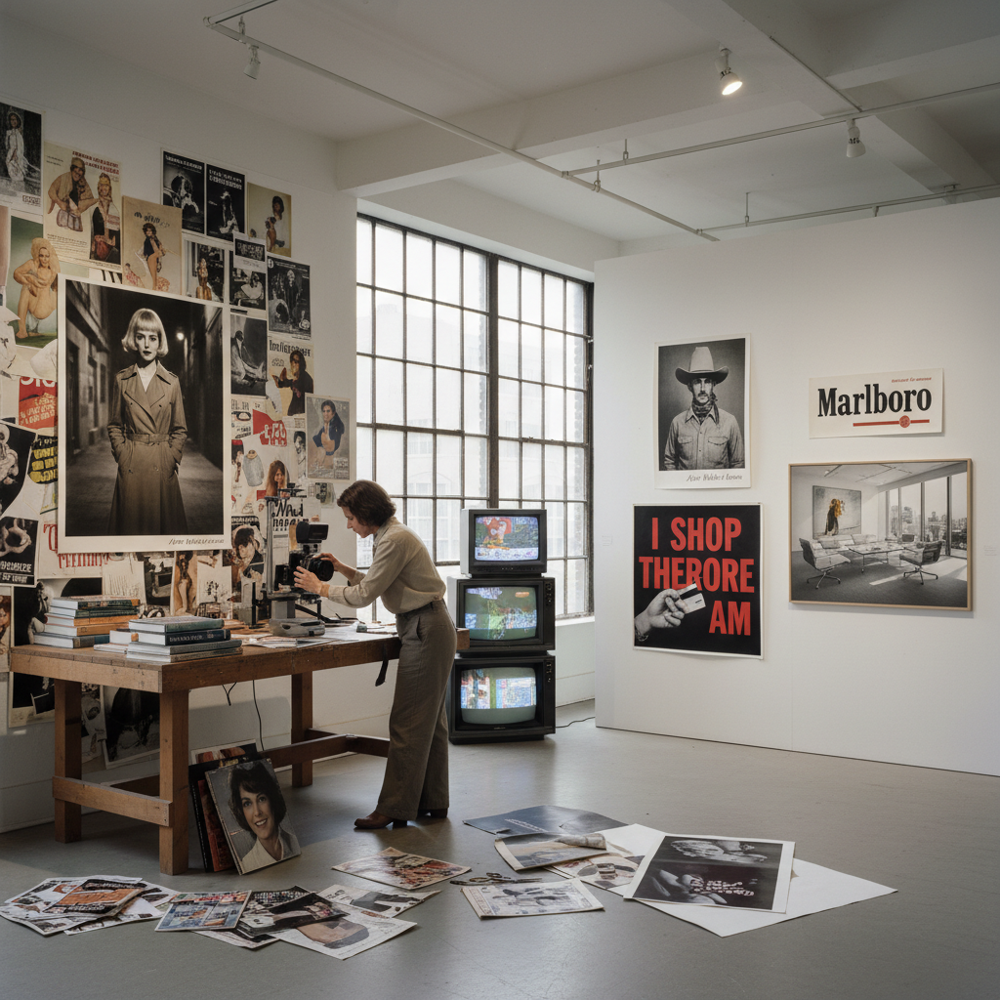

# Pictures Generation Art 图像一代艺术

> "The Pictures Generation understood that in a world saturated with images, originality was no longer about making new pictures but about understanding how existing pictures make us — appropriating, rephotographing, and reframing the endless flow of media imagery to reveal the codes and conventions that shape desire, identity, and belief, turning the camera back on the camera and the copy into critique." — Unknown

## 概述

图像一代（Pictures Generation）是指1970年代末至1980年代活跃于纽约的一群艺术家，他们以"挪用"（appropriation）、"再摄影"（rephotography）和对大众媒体图像的批判性分析为核心方法。这个名称来自1977年由道格拉斯·克林普（Douglas Crimp）在纽约Artists Space策划的展览"Pictures"。

图像一代的核心艺术家包括：雪莉·莱文（Sherrie Levine，重新拍摄经典摄影作品）、辛迪·舍曼（Cindy Sherman，扮演电影剧照中的女性角色）、理查德·普林斯（Richard Prince，重新拍摄广告图像）、芭芭拉·克鲁格（Barbara Kruger，将广告语言用于政治批判）、路易丝·劳勒（Louise Lawler，拍摄艺术品在收藏和展示中的状态）。他们的共同关注点是：在一个被大众媒体图像饱和的世界中，图像如何建构意义、欲望和身份。

## 核心特征

| 特征 | 描述 |
|------|------|
| 挪用 | 挪用现有图像 |
| 批判 | 对媒体的批判 |
| 再现 | 质疑再现的本质 |
| 身份 | 身份的建构性 |
| 消费 | 消费文化批判 |
| 后现代 | 后现代主义理论 |

## 视觉特征

- **摄影**：摄影为主要媒介
- **挪用**：对现有图像的挪用
- **文字**：文字与图像的结合
- **广告**：广告语言的借用
- **电影**：电影剧照的模仿
- **冷静**：冷静分析的态度

## 代表作品

| 作品 | 艺术家 | 年代 | 意义 |
|------|--------|------|------|
| *Untitled Film Stills* | Cindy Sherman | 1977-80 | 舍曼的无题电影剧照 |
| *After Walker Evans* | Sherrie Levine | 1981 | 莱文的再摄影 |
| *Untitled (Cowboy)* | Richard Prince | 1989 | 普林斯的牛仔 |
| *Your body is a battleground* | Barbara Kruger | 1989 | 克鲁格的身体战场 |
| *Arranged by Donald Marron* | Louise Lawler | 1982 | 劳勒的收藏记录 |

## 历史时间线

| 时期 | 事件 |
|------|------|
| 1977 | "Pictures"展览 |
| 1977-80 | 舍曼的《无题电影剧照》 |
| 1981 | 莱文的"After Walker Evans" |
| 1980年代 | 图像一代的鼎盛期 |
| 当代 | 图像一代的持续影响 |

## 中国语境

图像一代对中国当代艺术有重要影响。中国的"政治波普"（如王广义的《大批判》系列）和"玩世现实主义"都运用了类似的图像挪用策略——将社会主义宣传画、毛泽东肖像等政治图像进行再语境化。中国当代摄影中也有许多"再摄影"和"挪用"的实践。在中国的语境中，图像一代的方法被用于批判性地审视中国特有的视觉文化——从革命宣传到消费广告的图像转型。中国的年轻一代艺术家也在网络图像时代继续发展图像批判的方法。

## AI生成概念图

## 与其他风格的关系

- **Appropriation Art** → 挪用艺术
- **Conceptual Art** → 概念艺术
- **Pop Art** → 波普艺术
- **Postmodernism** → 后现代主义
- **Feminist Art** → 女性主义艺术
- **Institutional Critique** → 体制批判

---

*浮光艺志 | Chronicle of Artistry*
