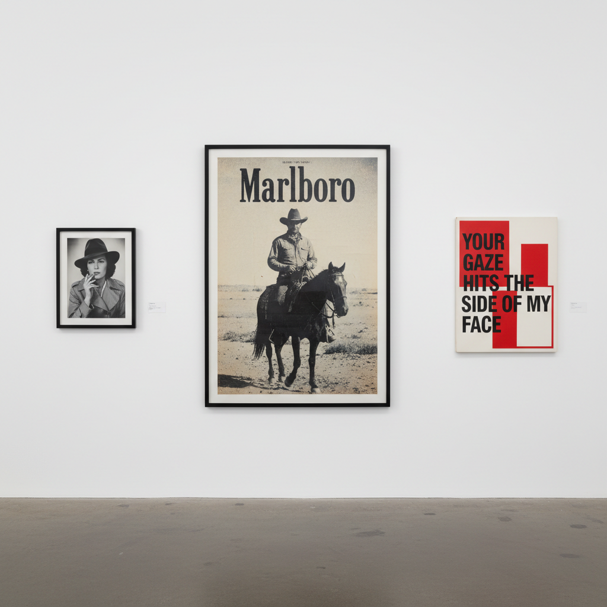

# Pictures Generation 图像一代

> "We are surrounded by images. The question is not how to make new ones, but how to deal with the ones that already exist." — Sherrie Levine

## 概述

图像一代（Pictures Generation）是1970年代末至1980年代在纽约兴起的艺术运动，以挪用（appropriation）、再摄影、媒体批判为核心策略。这一代艺术家——Sherrie Levine、Richard Prince、Cindy Sherman、Barbara Kruger、Louise Lawler——不再创造"原创"图像，而是重新使用、复制、重新语境化已有的图像，质疑原创性、作者身份和图像权力。

名称来自Douglas Crimp 1977年在Artists Space策划的展览"Pictures"。

## 核心特征

| 特征 | 描述 |
|------|------|
| 挪用 | 直接使用或复制已有图像 |
| 再摄影 | 拍摄已有照片的照片 |
| 媒体批判 | 解构广告、电影、杂志的图像权力 |
| 反原创 | 质疑"原创性"的神话 |
| 后结构主义 | 受Barthes、Baudrillard理论影响 |
| 身份建构 | 揭示身份是图像和表演的产物 |

## 视觉特征

- **摄影**：摄影是主要媒介——但是"关于摄影的摄影"
- **文字**：Kruger——粗体文字叠加在图像上
- **电影感**：Sherman——电影剧照式的自拍
- **广告美学**：借用商业摄影的光滑表面
- **复制**：Levine——对经典作品的精确复制
- **去作者**：Prince——翻拍广告照片

## 代表作品

| 作品 | 艺术家 | 年代 | 意义 |
|------|--------|------|------|
| *Untitled Film Stills* | Cindy Sherman | 1977-80 | 虚构的电影剧照——身份的建构 |
| *After Walker Evans* | Sherrie Levine | 1981 | 翻拍经典照片——挪用的极致 |
| *Cowboys* | Richard Prince | 1980-92 | 翻拍万宝路广告——男性气质的解构 |
| *Untitled (Your body is a battleground)* | Barbara Kruger | 1989 | 文字+图像的政治宣言 |
| *Adjusted to Fit* | Louise Lawler | 1998+ | 拍摄艺术品在收藏中的状态 |
| *We Don't Need Another Hero* | Barbara Kruger | 1987 | 对英雄叙事的女性主义批判 |

## 历史时间线

| 时期 | 事件 |
|------|------|
| 1977 | Douglas Crimp策划"Pictures"展览 |
| 1977-80 | Sherman的*Untitled Film Stills* |
| 1979 | Crimp发表"Pictures"文章——理论化 |
| 1980 | Prince开始翻拍广告 |
| 1981 | Levine的*After Walker Evans*——挪用的宣言 |
| 1980s | Kruger的文字-图像作品成为标志 |
| 1990s | 图像一代进入主流美术馆和市场 |
| 2009 | Met的"The Pictures Generation"大型回顾展 |
| 2010s-至今 | 社交媒体时代——图像一代的预言成真 |

## 子类型

| 子类型 | 特征 |
|--------|------|
| 再摄影 | Levine、Prince——拍摄已有照片 |
| 身份表演 | Sherman——通过装扮建构身份 |
| 文字-图像 | Kruger——文字作为图像的武器 |
| 制度摄影 | Lawler——拍摄艺术体制本身 |
| 商品批判 | Haim Steinbach——商品的展示 |

## 中国语境

图像一代的策略在中国当代艺术中有广泛回响。中国的"政治波普"（王广义）挪用文革图像和商业标志；岳敏君的标志性笑脸是对集体形象的挪用；当代中国艺术家对网络图像、表情包、短视频的再创作都延续了图像一代的方法论。在中国的"图像过剩"时代——短视频、直播、AI生图——图像一代的批判视角比以往更加相关。

## 争议与遗产

- **争议**：复制别人的照片算艺术吗？这是否只是"偷窃"？
- **法律问题**：Prince翻拍的照片引发版权诉讼
- **市场悖论**：反商品的艺术本身成为昂贵商品
- **遗产**：永久改变了我们对原创性、作者身份和图像权力的理解
- **当代回响**：meme文化、AI生成图像、deepfake、社交媒体的图像循环

## AI生成概念图

## 与其他风格的关系

- **Pop Art** → 波普艺术对大众图像的使用是直接先驱
- **Conceptual Art** → 概念艺术的去物质化为挪用提供理论基础
- **Appropriation Art** → 挪用艺术是图像一代的核心策略
- **Feminist Art** → Sherman和Kruger的女性主义视角
- **Institutional Critique** → Lawler对艺术体制的摄影批判
- **Post-Modernism** → 图像一代是后现代主义的视觉核心

---

*浮光艺志 | Chronicle of Artistry*
