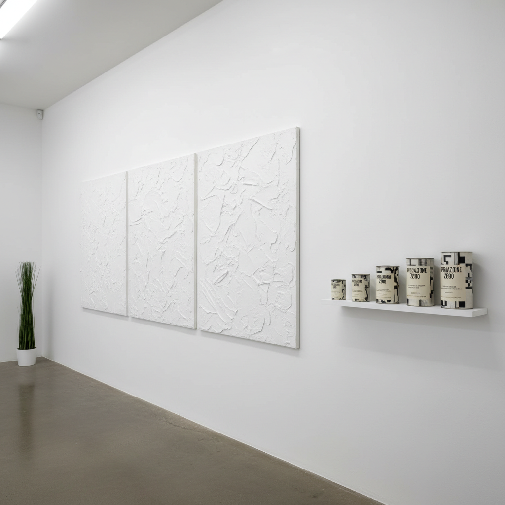

# Piero Manzoni 皮耶罗·曼佐尼

> **流派**: 新前卫 · 观念艺术 · 零派  
> **时期**: 1933–1963 意大利  
> **关键词**: 艺术家的身体、无色、签名即艺术、反讽

## 概述

皮耶罗·曼佐尼是意大利战后最激进的观念艺术家。他在短短29年的生命中创作了一系列挑衅性极强的作品：将自己的粪便装罐出售（标价等同于等重黄金）、用自己的呼吸充气球、在鸡蛋上按指纹后邀请观众吃掉、为活人签名使其成为"艺术品"。他的"无色"(Achrome)系列白色画作则是对绘画物质性的极端探索。

## 视觉特征

- **纯白无色**: Achrome系列——白色高岭土、棉花、面包覆盖画布
- **工业包装**: 罐头、密封容器作为艺术载体
- **身体痕迹**: 指纹、呼吸、排泄物作为创作材料
- **签名行为**: 在人体或物品上签名使其"成为艺术"
- **极简物质**: 关注材料本身而非再现

## 代表作品

- 《艺术家的粪便》(Merda d'artista, 1961)
- 《无色》(Achrome) 系列 (1957–1963)
- 《艺术家的呼吸》(Fiato d'artista, 1960)
- 《世界底座》(Socle du Monde, 1961)
- 《活体雕塑》(Living Sculptures) — 签名人体

## 历史影响

曼佐尼将杜尚的现成品逻辑推向极端——如果艺术家的签名能让任何东西成为艺术，那么艺术家的身体本身（包括其排泄物）也是艺术。他的作品至今仍是讨论艺术价值、艺术市场和艺术家神话的核心案例。

## 相关风格

- [Yves Klein 伊夫·克莱因](yves-klein.md)
- [Conceptual Art 观念艺术](conceptual-art.md)
- [Arte Povera 贫穷艺术](arte-povera.md)
