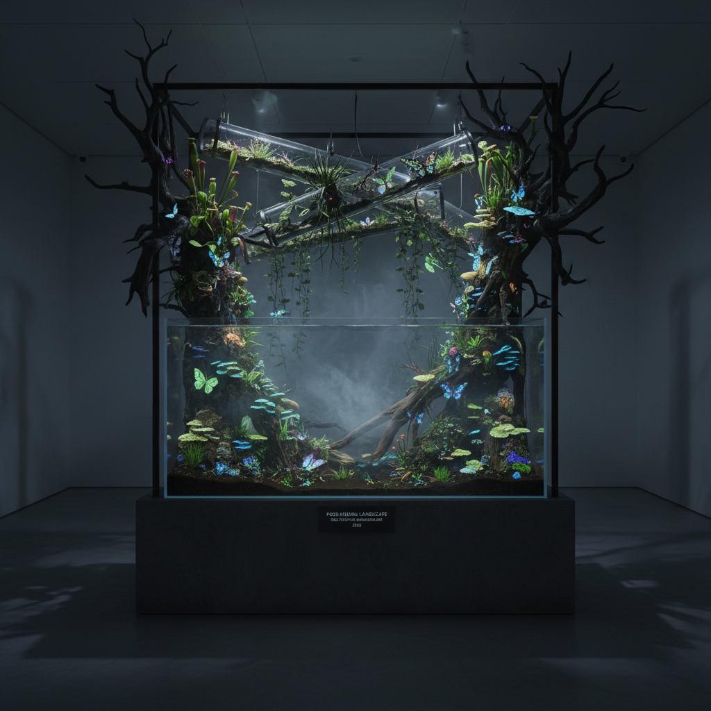

# Pierre Huyghe 皮埃尔·于热

> **时期：** 1962–至今  
> **关键词：** 生态系统装置、活体艺术、时间与虚构、后人类景观

## 概述

Pierre Huyghe 是法国艺术家，以创造自我演化的生态系统装置而闻名。他的作品不是静态的展品，而是活的系统——蜜蜂、狗、水族箱、冰冻土壤、生长的植物——它们在展览期间自行发展，超越艺术家的控制。

## 风格特征

- **活体系统**：真实的动物、植物、微生物参与作品
- **时间性**：作品随时间变化，每次观看都不同
- **虚构与现实交织**：电影叙事与真实空间融合
- **后人类景观**：人类退场后的自然接管
- **感知实验**：黑暗、雾气、温度变化等感官操控

## 代表作品

- *Untitled (Human Mask)*（2014）
- *After ALife Ahead*（2017，明斯特雕塑展）
- *UUmwelt*（2018）
- *Offspring*（2018）

## 概念图

