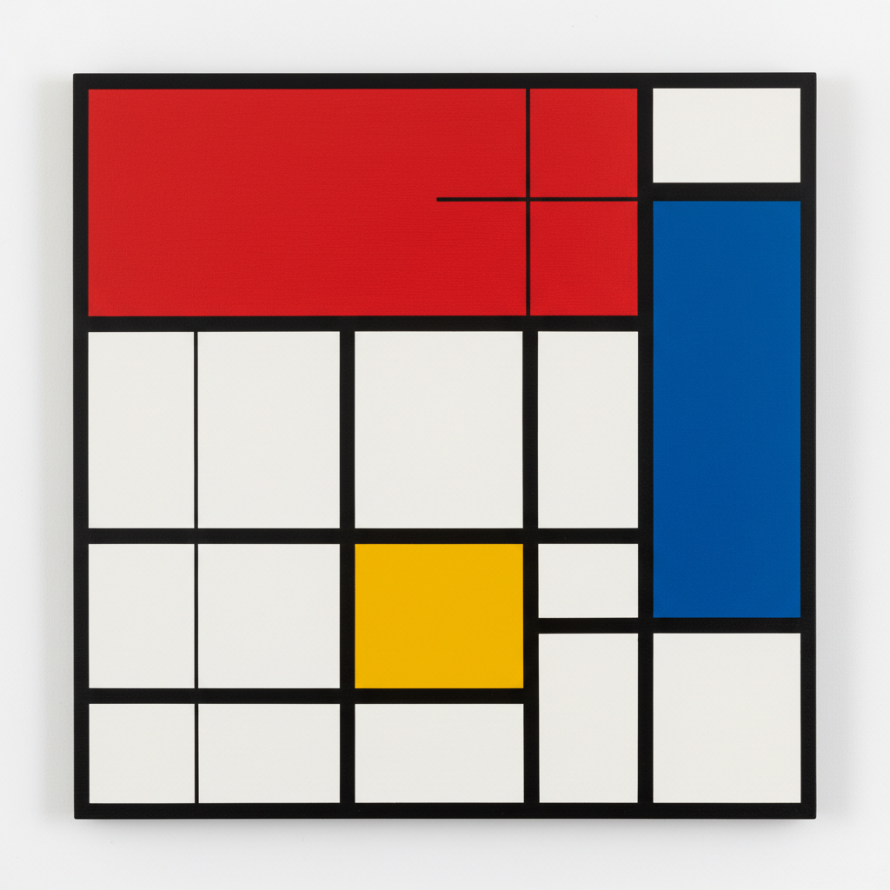

# Piet Mondrian 皮特·蒙德里安

> **流派**: 新造型主义 · 风格派 (De Stijl)  
> **时期**: 1872–1944 荷兰/美国  
> **关键词**: 直线网格、三原色、纯粹抽象、宇宙和谐

## 概述

蒙德里安是几何抽象艺术的奠基人之一。他将绘画简化为最基本的元素——水平线、垂直线、三原色加黑白灰——试图通过纯粹的视觉关系表达宇宙的内在和谐与秩序。

## 视觉特征

- **黑色网格**: 粗细一致的黑色直线将画面分割为矩形
- **三原色**: 仅使用红、黄、蓝三种纯色填充部分格子
- **不对称平衡**: 看似简单的构图实则经过精密的比例推敲
- **白色主导**: 大面积留白创造呼吸感和空间感
- **无曲线**: 彻底排除曲线和对角线（晚期除外）

## 代表作品

- 《红黄蓝的构成》(1930)
- 《百老汇爵士乐》(1942–43)
- 《灰色的树》(1911) — 从具象到抽象的过渡
- 《胜利之舞》(1944，未完成)

## 历史影响

蒙德里安的网格美学深刻影响了现代建筑、平面设计、时装（YSL蒙德里安裙）和数字界面设计。他证明了最少的元素可以创造最丰富的视觉体验。

## 相关风格

- [Minimalism 极简主义](minimalism.md)
- [Josef Albers 约瑟夫·阿尔伯斯](josef-albers.md)
- [Bauhaus 包豪斯](bauhaus.md)
