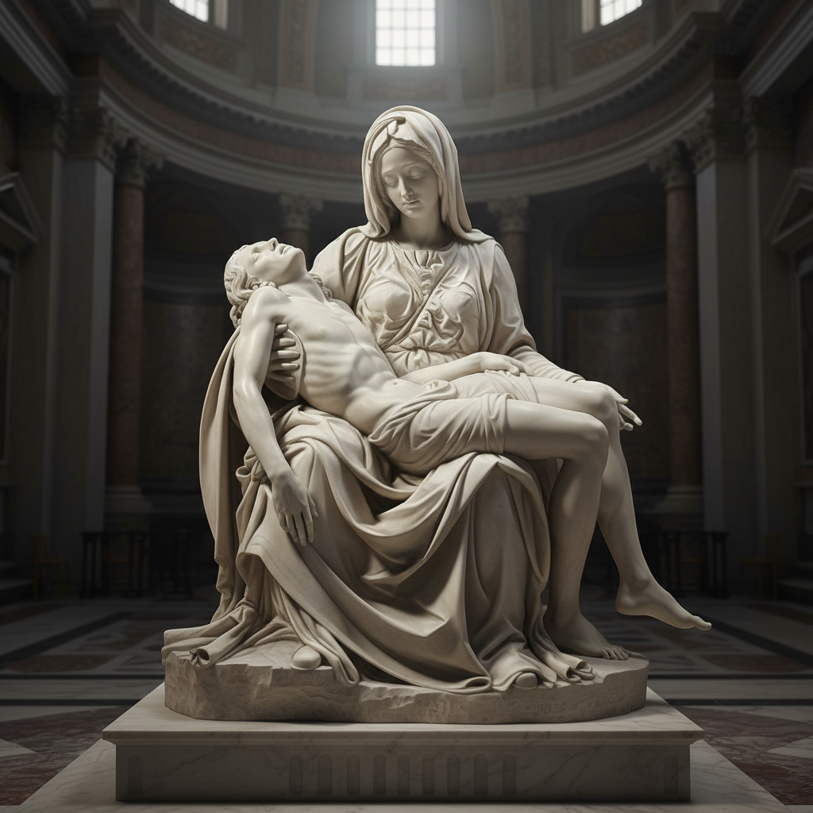

# Pietà Art 圣殇

> **时期：** 14世纪–至今  
> **关键词：** 圣母哀悼基督、悲悯、雕塑与绘画、宗教情感、人性表达

## 概述

Pietà（圣殇）描绘圣母玛利亚怀抱基督遗体的悲悯场景，是西方宗教艺术中最动人的母题之一。从中世纪德国的"悲伤圣母"木雕到米开朗基罗的大理石杰作，圣殇将神圣叙事浓缩为一个母亲失去孩子的普世悲痛——它超越了宗教，触及人类最深处的情感。

## 风格特征

- **双人构图**：母亲与孩子的亲密关系
- **悲悯表情**：克制而深沉的哀伤
- **身体语言**：怀抱、支撑、垂落的姿态
- **理想化处理**：痛苦中的美与尊严
- **三角构图**：稳定而庄严的几何结构

## 代表人物与作品

- 米开朗基罗《圣殇》（梵蒂冈）
- 乔瓦尼·贝利尼 多幅圣殇
- 威廉·阿道夫·布格罗《圣殇》
- 当代：Bill Viola 视频圣殇

## 概念图

