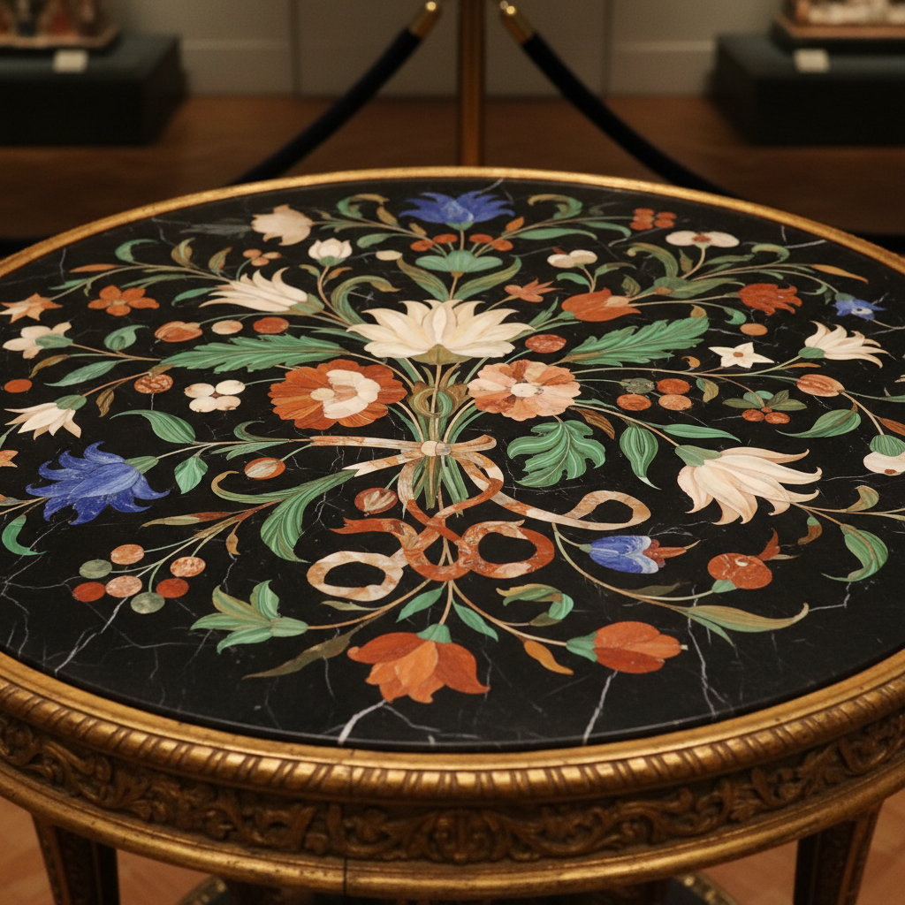

# Pietra Dura Art 硬石镶嵌艺术

> "Pietra dura is painting in stone — thin slices of semi-precious stones are cut with diamond saws, shaped to fit like jigsaw pieces, and inlaid into a marble ground to create images of flowers, birds, and landscapes with the color permanence of geology itself. Each petal is a wafer of jasper or agate, each leaf a sliver of malachite, assembled with jeweler's precision into pictures that will outlast any painting." — Unknown

## 概述

硬石镶嵌艺术（Pietra Dura Art）是一种使用切割成薄片的半宝石（如青金石、孔雀石、碧玉、玛瑙等）在大理石底板上拼嵌图案的装饰技法。Pietra dura（意大利语"硬石"）起源于佛罗伦萨，是文艺复兴和巴洛克时期最精美的装饰艺术之一，以其永恒的色彩和极高的工艺精度著称。

硬石镶嵌艺术的实践包括：1）设计——绘制精确的图案设计；2）石材选择——选择颜色和纹理合适的半宝石；3）切割——用金刚石锯将石材切成薄片；4）塑形——将石片精确塑形以拼合；5）镶嵌——将石片嵌入大理石底板的凹槽中；6）抛光——将表面抛光至光滑；7）当代硬石镶嵌——将传统技法与现代设计结合的创作。

## 核心特征

| 特征 | 描述 |
|------|------|
| 宝石 | 使用半宝石材料 |
| 镶嵌 | 精确的石片镶嵌 |
| 永恒 | 永恒不变的色彩 |
| 精密 | 极高的工艺精度 |
| 华丽 | 极其华丽的效果 |
| 佛罗伦萨 | 佛罗伦萨的传统 |

## 视觉特征

- **色彩**：宝石的天然色彩
- **光泽**：抛光的宝石光泽
- **精密**：精密的拼合接缝
- **自然**：自然主义的图案
- **华丽**：极其华丽的效果
- **永恒**：永恒不变的品质

## 代表作品

| 作品 | 艺术家/文化 | 年代 | 意义 |
|------|-------------|------|------|
| *Opificio delle Pietre Dure* | 意大利 | 1588年起 | 佛罗伦萨硬石工坊 |
| *Taj Mahal inlay* | 印度 | 17世纪 | 泰姬陵宝石镶嵌 |
| *Medici chapel floors* | 意大利 | 16-17世纪 | 美第奇礼拜堂地面 |
| *Mughal pietra dura* | 印度 | 16-18世纪 | 莫卧儿硬石镶嵌 |
| *Contemporary pietra dura* | 国际 | 当代 | 当代硬石镶嵌 |

## 历史时间线

| 时期 | 事件 |
|------|------|
| 古罗马 | 石材镶嵌的早期使用 |
| 16世纪 | 佛罗伦萨硬石镶嵌的发展 |
| 17世纪 | 莫卧儿帝国的硬石镶嵌 |
| 18-19世纪 | 欧洲各地的传播 |
| 当代 | 硬石镶嵌的持续实践 |

## 中国语境

硬石镶嵌在中国有对应的传统工艺。中国的百宝嵌（将各种宝石、象牙、珊瑚等镶嵌在漆器或木器上）——与pietra dura有相似的镶嵌理念。中国的玉石镶嵌和宝石镶嵌——在家具和装饰品中有悠久的传统。中国的大理石画（利用天然大理石纹理作为画面）——与pietra dura利用石材色彩的理念相通。中国当代的宝石加工产业——在全球硬石镶嵌材料供应中有重要地位。中国的工艺美术教育中，宝石镶嵌——在珠宝和装饰艺术课程中教授。印度的硬石镶嵌传统（如阿格拉的大理石镶嵌）——与中国有丝绸之路上的历史交流。

## AI生成概念图

## 与其他风格的关系

- **Scagliola** → 仿大理石灰泥
- **Mosaic** → 马赛克
- **Intarsia** → 木镶嵌
- **Jewelry** → 珠宝
- **Lapidary** → 宝石加工
- **Decorative Arts** → 装饰艺术

---

*浮光艺志 | Chronicle of Artistry*
