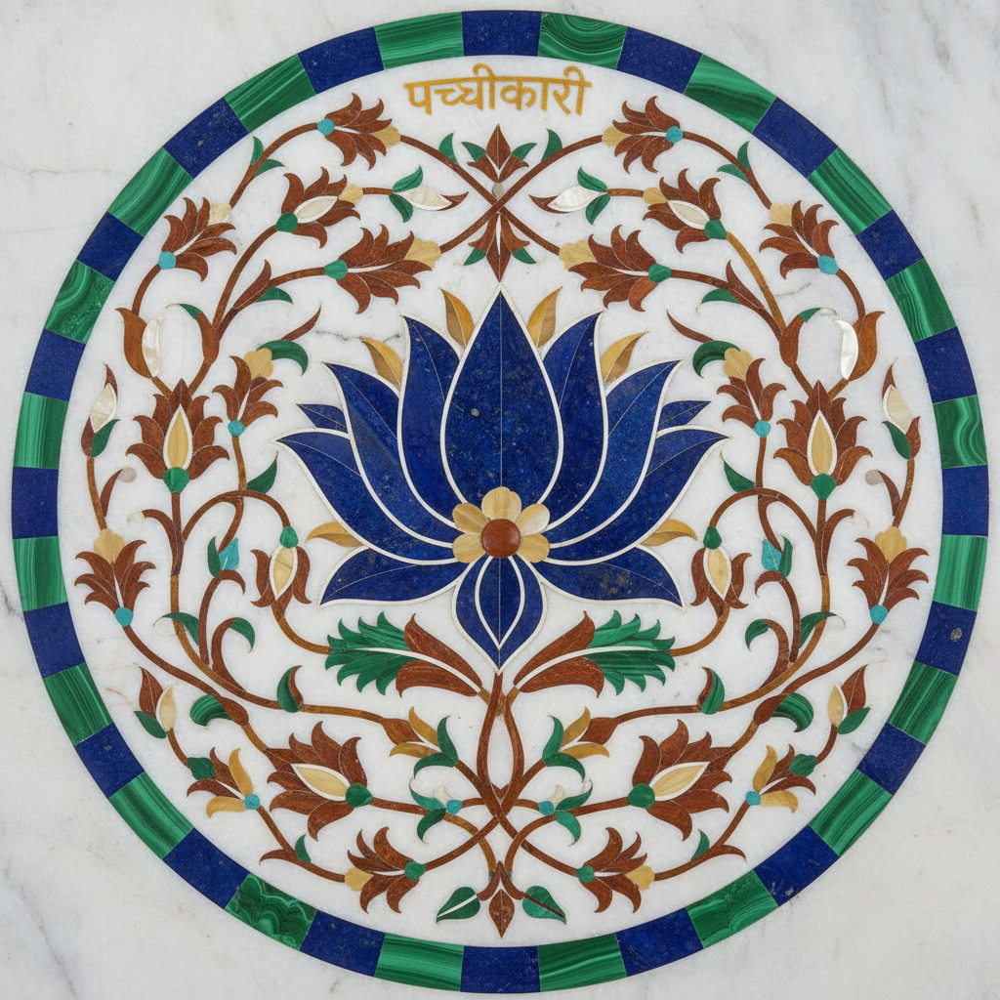

# Pietra Dura 硬石镶嵌

> "Pietra dura is painting with stone — each slice of mineral a brushstroke of geological time." — Unknown

## 概述

硬石镶嵌（Pietra Dura，意大利语"硬石"）是将各种半宝石和彩色石材精确切割后镶嵌在石板或家具表面，形成图画般效果的装饰工艺。利用不同矿石的天然色彩——青金石的蓝、孔雀石的绿、玛瑙的红、大理石的白——艺术家无需颜料就能"绘制"出花卉、鸟类、风景和几何图案。这种技法在佛罗伦萨的美第奇工坊和印度莫卧儿帝国（如泰姬陵）达到巅峰。

硬石镶嵌的哲学在于：永恒的色彩——矿石的颜色不会褪色，这是用地质时间书写的艺术。

## 核心特征

| 特征 | 描述 |
|------|------|
| 石材 | 使用半宝石和彩色石材 |
| 镶嵌 | 精确切割后镶嵌 |
| 天然色 | 利用矿石天然色彩 |
| 永恒 | 色彩永不褪色 |
| 精密 | 极其精密的切割 |
| 平面 | 打磨后的平滑表面 |

## 视觉特征

- **色彩**：矿石的天然鲜艳色彩
- **平滑**：打磨后的光滑表面
- **精密**：精确的石材拼接
- **图案**：花卉、鸟类等自然图案
- **光泽**：抛光石材的光泽
- **纹理**：矿石的天然纹理

## 代表作品

| 作品 | 艺术家 | 年代 | 意义 |
|------|--------|------|------|
| *Taj Mahal inlay* | 匿名 | 1632-53 | 泰姬陵的硬石镶嵌 |
| *Opificio delle Pietre Dure* | Medici workshop | 1588+ | 佛罗伦萨美第奇工坊 |
| *Florentine table tops* | Various | 16-18世纪 | 佛罗伦萨桌面 |
| *Mughal jewelry boxes* | 匿名 | 17世纪 | 莫卧儿珠宝盒 |
| *Agra marble inlay* | 匿名 | 当代 | 阿格拉传统工坊 |

## 历史时间线

| 时期 | 事件 |
|------|------|
| 古罗马 | Opus sectile——早期石材镶嵌 |
| 16世纪 | 佛罗伦萨硬石镶嵌的兴起 |
| 1588 | 美第奇建立Opificio工坊 |
| 17世纪 | 莫卧儿帝国的发展 |
| 1632-53 | 泰姬陵的建造 |
| 18-19世纪 | 欧洲的流行 |
| 当代 | 印度和意大利的传承 |

## 中国语境

中国的百宝嵌（又称"周制"）与硬石镶嵌有异曲同工之妙——将各种宝石、珊瑚、象牙、螺钿等材料镶嵌在漆器或木器表面。明代的周翥是百宝嵌的代表人物。此外，中国的大理石画（天然大理石截面的山水图案）也体现了类似的"以石为画"的美学。当代中国的石材镶嵌工艺在家具和建筑装饰中仍有应用。

## AI生成概念图

## 与其他风格的关系

- **Mosaic** → 马赛克的石材版本
- **Marquetry** → 木材镶嵌的石材对应
- **Intarsia** → 木质镶嵌画
- **Islamic Art** → 伊斯兰几何镶嵌
- **Jewelry** → 宝石镶嵌
- **Terrazzo** → 水磨石的相关技法

---

*浮光艺志 | Chronicle of Artistry*
