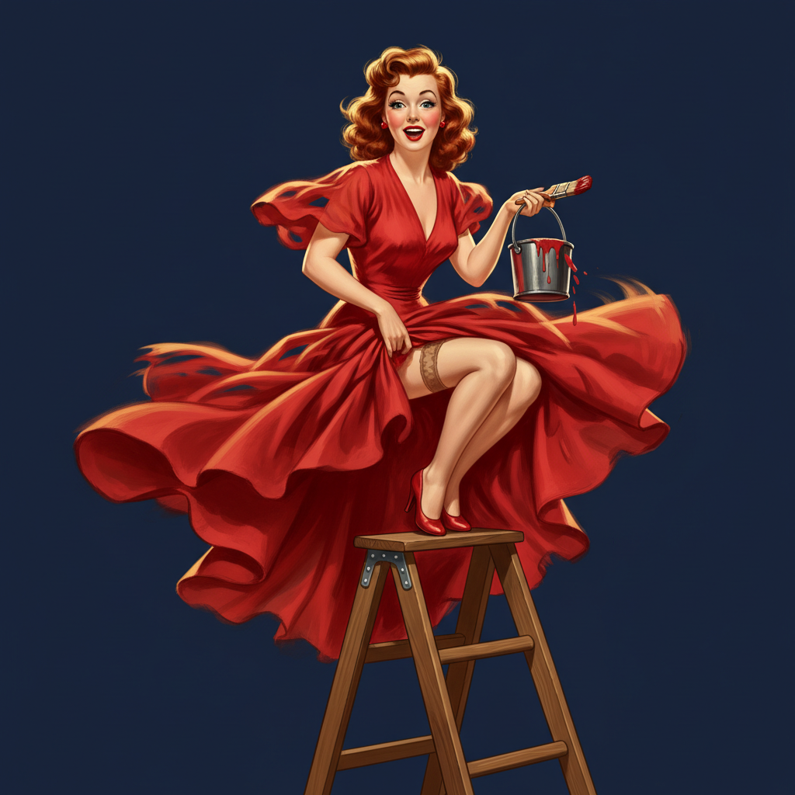

# Pin-up Art 海报女郎艺术



> **"完美的曲线、俏皮的微笑、'意外'的走光——战时士兵储物柜里的梦中情人。"**

## 概述

| 维度 | 描述 |
|------|------|
| 时期 | 1890s–1960s/影响至今 |
| 别名 | Pin-up, Cheesecake Art, Glamour Illustration |
| 核心色彩 | 肤色、红唇红、海军蓝、白色、金色 |
| 关键元素 | 理想化女性形象、俏皮姿态、"意外"暴露、精细喷枪渲染 |
| 代表人物 | Gil Elvgren, Alberto Vargas, George Petty, Olivia De Berardinis |
| 关联风格 | American Kitsch, Art Deco, Lowbrow Art, Rockabilly, Tattoo Art |

---

## 历史脉络

| 年份 | 事件 |
|------|------|
| 1890s | Charles Dana Gibson "Gibson Girl"——Pin-up前身 |
| 1920s | Art Deco Pin-up——Rolf Armstrong |
| 1940s | 二战——Pin-up黄金时代（Vargas Girls, Elvgren） |
| 1950s | Playboy创刊——Pin-up的商业巅峰 |
| 1960s | 性革命——传统Pin-up衰落 |
| 1990s | Pin-up复兴——Rockabilly+纹身文化 |
| 2020s | 当代Pin-up——多元化+女性赋权重新诠释 |

### 核心哲学

Pin-up Art的精神是**"理想化的魅力——介于'纯真'和'性感'之间的完美平衡"**：
- 俏皮 = 核心（"不是色情——是'哎呀被你看到了'"）
- 理想化 = 技艺（"比真人更完美——这就是插画的力量"）
- 叙事 = 幽默（"每张Pin-up都有一个'小故事'"）
- 技法 = 极致（"Elvgren的喷枪技术至今无人超越"）
- "Pin-up是'性感'被允许存在的最优雅的形式"

---

## 视觉语法

### 色彩系统

```
主色：
  肤色 (#FFDAB9) — 温暖、健康
  红唇红 (#FF0000) — 性感、经典
  海军蓝 (#000080) — 制服、对比
  白色 (#FFFFFF) — 纯真、内衣

辅色：
  金色 (#FFD700) — 头发、奢华
  粉色 (#FFB6C1) — 甜美、女性
  黑色 (#000000) — 丝袜、神秘

规则：
  - 肤色渲染是核心技术
  - 暖色调为主
  - 高光+阴影创造立体感
  - 背景简洁——聚焦人物

质感：
  喷枪 — 光滑、完美
  丝绸 — 面料质感
  皮肤 — 温暖、光泽
  头发 — 卷曲、光泽
```

### 标志性元素

| 类别 | 元素 |
|------|------|
| 姿态 | 俏皮、"意外"、回眸、翘腿 |
| 服装 | 泳装、内衣、制服、短裙 |
| 道具 | 风、狗、梯子（制造"意外"的工具） |
| 表情 | 惊讶、俏皮、微笑、无辜 |
| 技法 | 喷枪、油画、精细渲染 |
| 态度 | 俏皮、理想化、幽默、魅力 |

---

## 与千禧怀旧的关系

### Rockabilly复兴
- Pin-up美学 = Rockabilly文化的核心视觉
- 纹身中的Pin-up girl = 经典题材
- Dita Von Teese——当代Pin-up的活化身
- "Pin-up从'过时'变成了'经典'"

### 女性赋权的重新诠释
- 当代Pin-up: 多元体型、多元种族
- 女性艺术家重新定义Pin-up
- "Pin-up不再是'男性凝视'——是'自我欣赏'"
- 从"被看"到"选择被看"的转变

---

## 中国语境

- 中国复古文化中的Pin-up元素
- 中国插画师的当代Pin-up作品
- 与中国"月份牌"广告画的对比
- 中国纹身文化中的Pin-up题材

---

## 设计应用

| 场景 | 应用方式 |
|------|----------|
| 纹身 | 经典Pin-up girl+传统美式 |
| 品牌 | 复古+性感+俏皮+美式+怀旧 |
| 时尚 | Rockabilly+复古泳装+内衣 |
| 潮流 | 贴纸+海报+T恤+收藏 |

---

## 相关风格

← [American Kitsch 美国媚俗](american-kitsch.md) | [Art Deco 装饰艺术](art-deco.md) →

↑ [返回千禧怀旧目录](README.md) | [返回总目录](../README.md)
