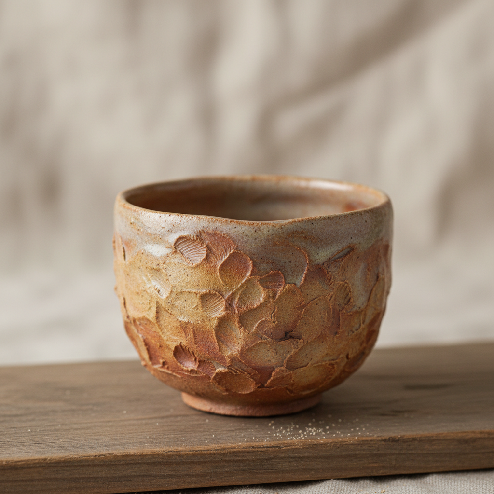

# Pinch Pot Art 捏塑艺术

> "Pinch pottery is the most intimate conversation between hand and clay — a ball of earth held in the palm, the thumb pressing into its center while the fingers rotate and thin the walls from inside out, no tools between skin and material, the vessel growing as an extension of the hand's own hollow, each pinch a decision about thickness and curve recorded forever in the fired form." — Unknown

## 概述

捏塑艺术（Pinch Pot Art）是一种用手指直接捏制粘土成型的最原始、最直接的陶瓷成型技法。捏塑从一团粘土开始，用拇指按入中心形成凹陷，然后用手指不断捏薄、旋转、扩展器壁，最终形成器物。捏塑是人与粘土之间最亲密的对话——没有任何工具介入，每一个指痕都是创作者意图的直接记录。

捏塑艺术的核心要素包括：1）手指成型——仅用手指捏制；2）无工具——不使用任何工具；3）直接性——手与粘土的直接接触；4）指痕保留——手指痕迹作为装饰；5）有机形态——自然的不规则形态；6）小型制作——通常为小型器物；7）冥想性——缓慢专注的制作过程。

## 核心特征

| 特征 | 描述 |
|------|------|
| 手指成型 | 仅用手指捏制成型 |
| 无工具 | 不借助任何工具 |
| 直接触感 | 手与粘土的直接对话 |
| 指痕装饰 | 手指痕迹成为纹理 |
| 有机形态 | 自然不规则的造型 |
| 冥想过程 | 缓慢专注的制作体验 |

## 视觉特征

- **指痕肌理**：清晰的手指捏制痕迹
- **不规则形态**：自然的有机造型
- **薄壁变化**：壁厚的自然变化
- **温暖触感**：手工温度的传递
- **小巧尺度**：通常为掌中尺寸
- **原始美感**：最原始的陶瓷美学

## 代表作品

| 作品 | 艺术家/文化 | 年代 | 意义 |
|------|-------------|------|------|
| *最早的陶器* | 史前人类 | 旧石器时代 | 人类最早的陶器 |
| *乐烧茶碗* | 乐家 | 桃山时代 | 日本捏塑茶碗 |
| *George Ohr作品* | George Ohr | 19世纪末 | 薄壁捏塑大师 |
| *Ruth Duckworth作品* | Ruth Duckworth | 20世纪 | 捏塑雕塑 |
| *当代捏塑* | 各地陶艺家 | 当代 | 捏塑的现代演绎 |

## 历史时间线

| 时期 | 事件 |
|------|------|
| 旧石器时代 | 最早的捏塑陶器 |
| 新石器时代 | 捏塑作为基本成型方法 |
| 桃山时代 | 日本乐烧茶碗的捏塑传统 |
| 20世纪 | 捏塑在现代陶艺中的艺术化 |
| 当代 | 捏塑作为冥想和治疗手段 |

## 中国语境

捏塑在中国有最古老的历史——中国最早的陶器就是用手捏制的。中国民间的泥塑传统——如天津泥人张、无锡惠山泥人——虽然不是容器制作，但体现了中国人用手捏制粘土的悠久传统。中国的紫砂壶制作中，壶嘴、壶把等部件也使用捏塑技法。在中国当代陶艺教育中，捏塑是最基础的入门课程——它让学生直接感受粘土的特性。近年来，捏塑作为一种减压和冥想活动在中国城市中流行，陶艺体验馆中捏塑是最受欢迎的项目之一。

## AI生成概念图

## 与其他风格的关系

- **Coil Building** → 盘筑
- **Raku** → 乐烧
- **Wabi-Sabi** → 侘寂美学
- **Meditation Art** → 冥想艺术
- **Primitive Pottery** → 原始陶器
- **Haptic Art** → 触觉艺术

---

*浮光艺志 | Chronicle of Artistry*
