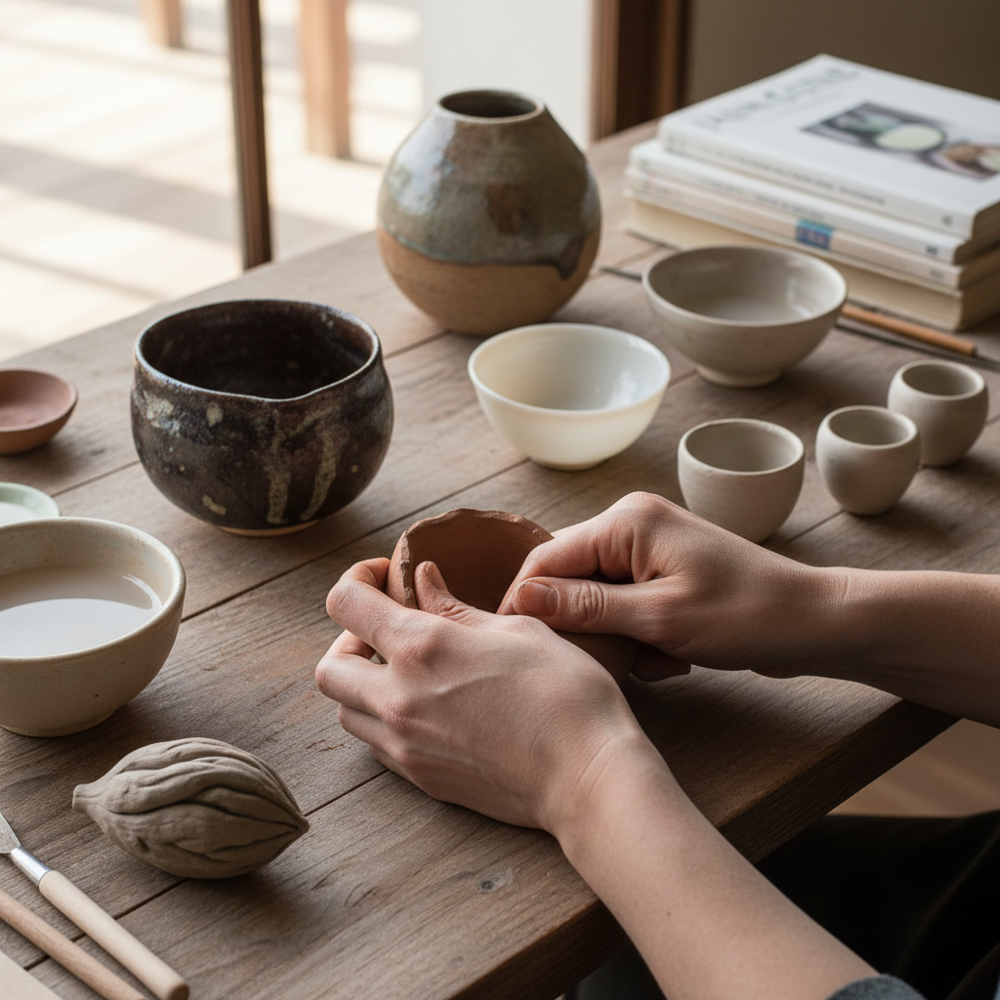

# Pinch Pottery 捏塑陶艺

> "Pinch pottery is the most intimate of all ceramic techniques — nothing stands between the maker and the clay but the pressure of thumb and fingers, shaping a vessel as naturally as cupping water in one's hands." — Unknown

## 概述

捏塑陶艺（Pinch Pottery）是最简单、最原始的陶器成型技法——将一团粘土握在手中，用拇指按入中心形成凹陷，然后用拇指和其他手指反复捏压、旋转，逐渐将粘土壁捏薄、扩大，形成碗状或杯状的器物。捏塑法不需要任何工具——完全依靠手指的压力和感觉来塑形。

捏塑法虽然简单，但能产生极其精美的作品——日本茶道中的一些最珍贵的茶碗就是用捏塑法制作的（如乐烧茶碗）。捏塑法的魅力在于其"直接性"和"亲密性"——每一个指印都留在器物上，记录了制作过程中手与泥的对话。捏塑法也是陶艺教育的起点——几乎所有学习陶艺的人都从捏塑开始。

## 核心特征

| 特征 | 描述 |
|------|------|
| 手指 | 完全用手指塑形 |
| 简单 | 最简单的技法 |
| 直接 | 最直接的接触 |
| 指印 | 留下手指印记 |
| 原始 | 最原始的成型方式 |
| 亲密 | 人与泥的亲密对话 |

## 视觉特征

- **指印**：可见的指印
- **有机**：有机的形态
- **不规则**：自然的不规则
- **温暖**：温暖的手工感
- **朴素**：朴素的美感
- **小巧**：通常较小巧

## 代表作品

| 作品 | 艺术家 | 年代 | 意义 |
|------|--------|------|------|
| *Raku tea bowls* | 乐家 | 16世纪起 | 日本乐烧茶碗 |
| *Prehistoric pinch pots* | 史前工匠 | 史前 | 最早的陶器 |
| *Contemporary pinch vessels* | Various | 当代 | 当代捏塑器皿 |
| *Pinch sculpture* | Various | 当代 | 捏塑雕塑 |
| *Wabi-sabi pinch bowls* | Various | 当代 | 侘寂风格捏塑碗 |

## 历史时间线

| 时期 | 事件 |
|------|------|
| 史前 | 人类最早的陶器制作 |
| 古代 | 全球各文化的捏塑传统 |
| 16世纪 | 日本乐烧茶碗的捏塑传统 |
| 20世纪 | 工作室陶艺中的捏塑复兴 |
| 当代 | 捏塑法在陶艺教育中的基础地位 |
| 当代 | 当代陶艺家的捏塑创新 |

## 中国语境

捏塑法在中国有极其悠久的历史——中国最早的陶器就是用捏塑法制作的。中国的陶艺教育中，捏塑法是最基础的入门技法。中国的陶艺体验课程和亲子活动中，捏塑法因其"零门槛、趣味性强"的特点而最受欢迎。中国的一些当代陶艺家使用捏塑法创作具有侘寂美学的作品。中国的紫砂壶制作中，一些小型壶也使用类似捏塑的手法。中国的民间泥塑传统（如天津泥人张）也与捏塑有关。

## AI生成概念图

## 与其他风格的关系

- **Coiling Pottery** → 盘筑陶艺
- **Slab Building** → 板筑陶艺
- **Raku** → 乐烧
- **Wabi-sabi** → 侘寂
- **Tea Ceremony** → 茶道
- **Hand Building** → 手工成型

---

*浮光艺志 | Chronicle of Artistry*
