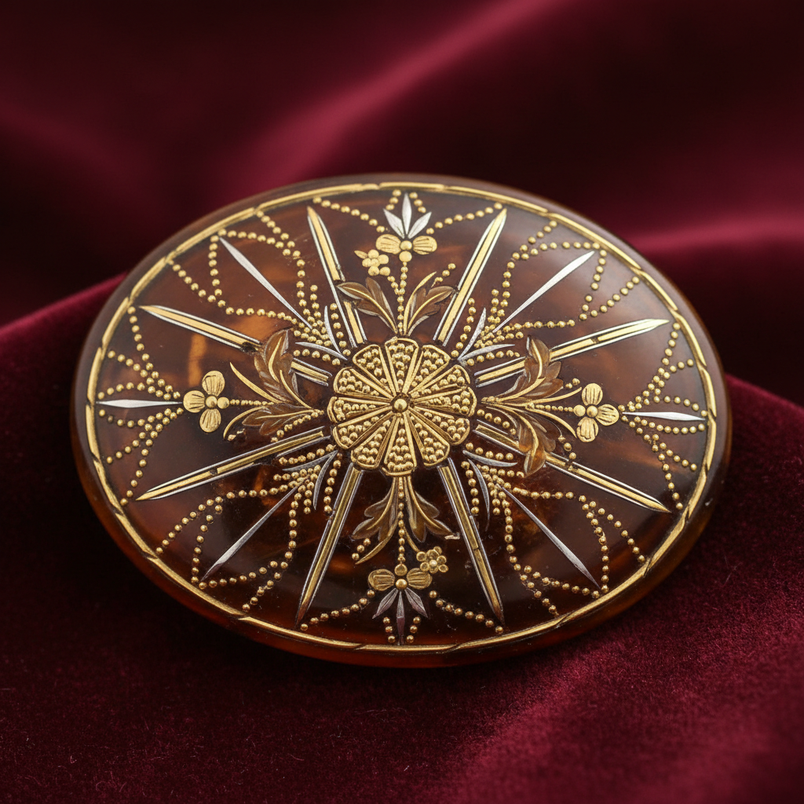

# Piqué Art 嵌金银龟甲艺术

> "Piqué is constellation work — tiny points and strips of gold or silver are inlaid into tortoiseshell or horn, creating patterns that sparkle like stars against a translucent amber sky. The metal is heated and pressed into the organic material while warm, bonding permanently as it cools. Each point of gold catches the light independently, making the surface shimmer with every movement." — Unknown

## 概述

嵌金银龟甲艺术（Piqué Art）是一种将微小的金银点或条嵌入龟甲（或牛角）表面的传统装饰工艺——利用龟甲加热后变软的特性，将金属嵌入其中，冷却后金属与龟甲永久结合。Piqué（法语"刺入"）分为两种主要形式：piqué point（点状嵌入）和piqué posé（条状嵌入），以其精致的星光效果和温暖的琥珀色调著称。

嵌金银龟甲艺术的实践包括：1）龟甲准备——将龟甲加热软化并压平；2）设计——在龟甲上标记图案位置；3）点嵌（Piqué Point）——嵌入微小的金银点；4）条嵌（Piqué Posé）——嵌入金银条和片；5）组合——点嵌和条嵌的组合使用；6）打磨——打磨表面至光滑；7）当代嵌金银——使用替代材料的当代创作。

## 核心特征

| 特征 | 描述 |
|------|------|
| 嵌入 | 金银嵌入有机材料 |
| 龟甲 | 传统使用龟甲 |
| 星光 | 金银点的星光效果 |
| 温暖 | 龟甲的温暖色调 |
| 精密 | 极其精密的工艺 |
| 珍稀 | 极其珍稀的技艺 |

## 视觉特征

- **星光**：金银点的闪烁效果
- **温暖**：龟甲的琥珀色温暖
- **透光**：龟甲的半透明质感
- **精密**：极其精密的嵌入
- **华丽**：华丽精致的整体感
- **对比**：金属与有机材料的对比

## 代表作品

| 作品 | 艺术家/文化 | 年代 | 意义 |
|------|-------------|------|------|
| *French piqué snuff boxes* | 法国 | 17-18世纪 | 法国鼻烟盒 |
| *English piqué jewelry* | 英国 | 18-19世纪 | 英国嵌金银珠宝 |
| *Italian piqué work* | 意大利 | 17世纪 | 意大利嵌金银工艺 |
| *Victorian piqué brooches* | 英国 | 19世纪 | 维多利亚时代胸针 |
| *Contemporary piqué* | 国际 | 当代 | 当代嵌金银工艺 |

## 历史时间线

| 时期 | 事件 |
|------|------|
| 16世纪 | 意大利嵌金银工艺的起源 |
| 17世纪 | 法国嵌金银工艺的发展 |
| 18-19世纪 | 英国嵌金银珠宝的黄金时代 |
| 20世纪 | 龟甲贸易禁令后的衰落 |
| 当代 | 使用替代材料的复兴 |

## 中国语境

嵌金银工艺在中国有类似的传统。中国传统的错金银工艺与piqué有相似之处——在青铜或铁器表面嵌入金银丝和片。中国的错金银技法可追溯到春秋战国时期——是中国古代金属装饰的重要技法。中国的百宝嵌工艺中也有在有机材料（如漆器）中嵌入金属的传统——与piqué的原理相近。中国当代的一些工艺师开始探索在牛角等合法材料中嵌入金属——延续这一精致的装饰传统。中国的文物收藏中，错金银器物是重要的收藏品类——展示了中国古代金属镶嵌的精湛水平。中国的工艺美术教育中，错金银作为传统金属装饰技法——在相关课程中有所教授。

## AI生成概念图

## 与其他风格的关系

- **Inlay** → 镶嵌工艺
- **Goldsmithing** → 金匠工艺
- **Jewelry** → 珠宝艺术
- **Damascene** → 大马士革镶嵌
- **Decorative Art** → 装饰艺术
- **Metalwork** → 金属工艺

---

*浮光艺志 | Chronicle of Artistry*
