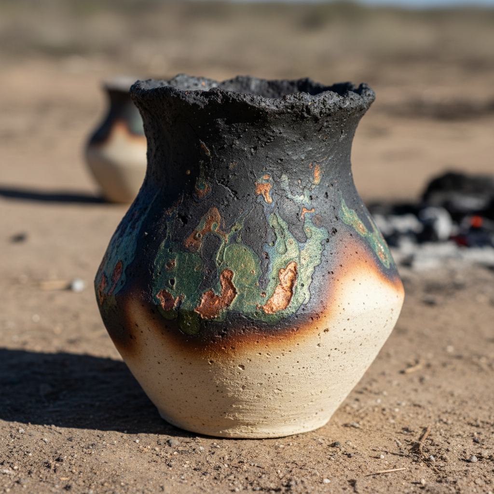

# Pit-Fired Art 坑烧艺术

> "Pit firing returns ceramics to its most primal state — earth, fire, and smoke in an open embrace." — Primitive firing tradition

## 概述

坑烧艺术（Pit-Fired Art）是一种在地面挖掘的坑中用木材、树叶、锯末等可燃物烧制陶器的原始烧成技术。坑烧是人类最古老的陶瓷烧成方式——早在窑炉发明之前，人类就在地面的坑中烧制陶器。这种方法产生的温度较低（通常600-900°C），但能在陶器表面创造出独特的烟熏效果和不可预测的色彩变化。

坑烧的魅力在于其不可控性——火焰、烟雾和灰烬与陶器表面的互动是随机的，每件作品都是独一无二的"火的绘画"。陶艺家可以通过放置铜线、盐、海藻、香蕉皮等材料来影响色彩效果——铜产生绿色和蓝色，盐产生橙色，有机物产生黑色烟熏效果。当代陶艺家将坑烧从原始技术提升为一种有意识的艺术表达方式——追求那种只有原始火焰才能创造的神秘美感。

坑烧艺术的核心要素包括：1）原始烧成——最古老的陶瓷烧成方式；2）烟熏效果——烟雾在表面留下的黑色痕迹；3）不可预测性——每次烧成结果的随机性；4）低温烧成——600-900°C的低温；5）化学着色——铜盐等材料的色彩效果；6）与大地连接——在地面坑中烧制的仪式感；7）当代艺术表达——从原始技术到艺术选择。

## 核心特征

| 特征 | 描述 |
|------|------|
| 原始烧成 | 最古老的陶瓷烧成方式 |
| 烟熏效果 | 烟雾留下黑色痕迹 |
| 不可预测性 | 每次烧成随机结果 |
| 低温烧成 | 600-900°C低温 |
| 化学着色 | 铜盐等材料色彩效果 |
| 大地连接 | 地面坑中烧制仪式感 |

## 视觉特征

- **烟熏黑色**：深沉的烟熏黑色区域
- **铜绿色彩**：铜线产生的绿色和蓝色
- **橙色闪光**：盐产生的橙色效果
- **渐变过渡**：从黑到白的自然渐变
- **表面肌理**：粗犷的原始质感
- **有机形态**：与自然形态呼应的造型

## 代表作品

| 作品 | 年代 | 意义 |
|------|------|------|
| *新石器时代坑烧陶* | 公元前数千年 | 人类最早的陶器 |
| *非洲传统坑烧* | 各时期 | 活态传统 |
| *美洲原住民坑烧* | 各时期 | 普韦布洛传统 |
| *玛丽亚·马丁内斯黑陶* | 20世纪 | 圣伊尔德丰索黑陶 |
| *当代坑烧艺术* | 21世纪 | 现代诠释 |
| *日本野烧* (Noyaki) | 各时期 | 日本原始烧成 |

## 历史时间线

| 时期 | 事件 |
|------|------|
| 公元前25000年 | 最早的陶器烧制证据 |
| 新石器时代 | 全球各地坑烧传统 |
| 各时期 | 非洲、美洲持续使用 |
| 20世纪初 | 玛丽亚·马丁内斯复兴黑陶 |
| 1960年代 | 当代陶艺家重新发现坑烧 |
| 当代 | 作为艺术表达方式流行 |

## 中国语境

坑烧与中国陶瓷的起源密切相关。中国最早的陶器——如河姆渡文化和仰韶文化的彩陶——很可能就是用类似坑烧的方式烧制的。仰韶文化的彩陶表面常见的黑色烟熏痕迹，正是坑烧或半开放式烧成的特征。中国新石器时代的黑陶（如龙山文化的蛋壳黑陶）也是通过控制烟熏气氛获得黑色效果的——这与当代坑烧艺术追求的烟熏美学有直接的技术联系。当代中国陶艺家也在探索坑烧——将这一最原始的烧成方式与当代艺术观念相结合，回归陶瓷艺术的本源。

## 概念图

## 与其他风格的关系

- **Wood-Fired** → 柴烧（进化形式）
- **Saggar-Fired** → 匣钵烧（控制变体）
- **Raku** → 乐烧（低温烧成）
- **Smoke-Fired** → 烟熏烧成
- **African Pottery** → 非洲陶器（活态传统）
- **Pueblo Pottery** → 普韦布洛陶器

---

*浮光艺志 | Chronicle of Artistry*
