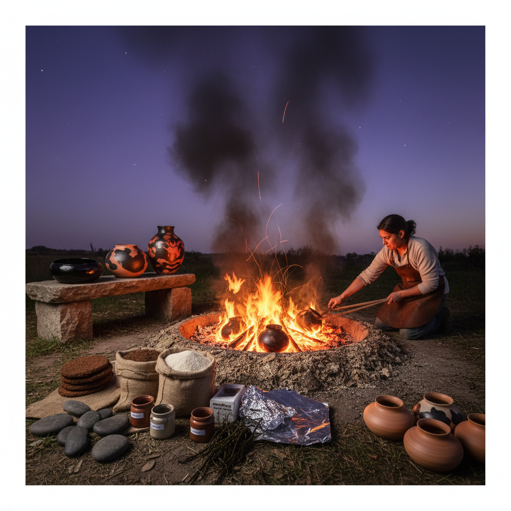

# Pit Firing Art 坑烧艺术

> "Pit firing is ceramics stripped to its essence — clay, fire, and earth. No kiln, no electricity, no gas lines; just a hole in the ground filled with combustible materials and pottery, set ablaze and left to the mercy of wind, flame, and chance. What emerges hours later, pulled from the ashes, bears the marks of its ordeal: smoke-blackened surfaces, flame-kissed blushes of orange and red, and ghostly white where the fire could not reach." — Unknown

## 概述

坑烧艺术（Pit Firing Art）是将陶器放入地面挖掘的坑中，用木材、树叶、锯末等可燃材料覆盖后点火烧制的原始陶瓷烧制技法——是人类最古老的陶器烧制方法，不需要任何窑炉设备。坑烧产生的效果完全取决于火焰、烟雾和可燃材料与陶器的接触方式，每件作品都是独一无二的。

坑烧艺术的实践包括：1）传统坑烧——最基本的地坑烧制；2）锯末烧——使用锯末缓慢碳化的烧制；3）彩色坑烧——添加金属盐类产生色彩；4）包裹烧——用铝箔包裹添加着色材料；5）桶烧——使用金属桶代替地坑的变体；6）当代坑烧——将原始技法与现代艺术结合的创作。

## 核心特征

| 特征 | 描述 |
|------|------|
| 原始 | 最原始的烧制方法 |
| 偶然 | 高度偶然的效果 |
| 简单 | 不需要窑炉设备 |
| 碳化 | 烟熏碳化的效果 |
| 低温 | 相对较低的温度 |
| 自然 | 与自然元素的互动 |

## 视觉特征

- **烟熏**：烟熏产生的黑色
- **火痕**：火焰留下的橙红色
- **渐变**：黑白之间的渐变
- **斑驳**：不规则的斑驳效果
- **质朴**：原始质朴的质感
- **偶然**：不可预测的图案

## 代表作品

| 作品 | 艺术家/文化 | 年代 | 意义 |
|------|-------------|------|------|
| *Pueblo pottery* | 美洲原住民 | 古代至今 | 普韦布洛坑烧 |
| *African pit-fired pottery* | 非洲 | 古代至今 | 非洲坑烧传统 |
| *Maria Martinez blackware* | Maria Martinez | 20世纪 | 黑陶坑烧大师 |
| *Japanese yakishime* | 日本 | 古代至今 | 日本无釉烧 |
| *Contemporary pit firing* | 当代 | 当代 | 当代坑烧创作 |

## 历史时间线

| 时期 | 事件 |
|------|------|
| 新石器时代 | 人类最早的坑烧陶器 |
| 古代 | 各文明的坑烧传统 |
| 中世纪 | 窑炉逐渐取代坑烧 |
| 20世纪 | 坑烧作为艺术手法的复兴 |
| 当代 | 坑烧的当代艺术实践 |

## 中国语境

坑烧艺术在中国有最悠久的历史——中国新石器时代的陶器（如仰韶文化、龙山文化）最初都是坑烧制作的。中国考古发现的最早陶器（约2万年前）可能就是坑烧的产物——这使中国成为世界上最早制作陶器的地区之一。中国的一些少数民族地区至今仍保留着坑烧传统——如云南的一些傣族和佤族村落仍使用露天堆烧的方法制作陶器。中国当代的陶艺家开始重新探索坑烧——将其作为回归陶瓷本源的艺术实践。中国的一些陶艺工作室和艺术院校开设坑烧体验课程——让学生体验最原始的陶瓷烧制方式。中国的陶瓷考古研究中，坑烧是理解早期陶器制作技术的重要课题。

## AI生成概念图

## 与其他风格的关系

- **Raku** → 乐烧艺术
- **Saggar Firing** → 匣钵烧艺术
- **Smoke Firing** → 熏烧艺术
- **Ceramics** → 陶瓷艺术
- **Primitive Art** → 原始艺术
- **Wood Firing** → 柴烧艺术

---

*浮光艺志 | Chronicle of Artistry*
