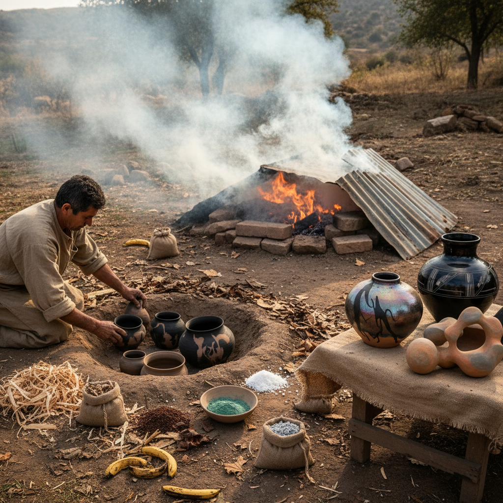

# Pit Firing 坑烧

> "Pit firing is the oldest conversation between clay and flame — no kiln walls, no temperature gauges, just earth, fire, and the unpredictable alchemy of smoke and mineral." — Unknown

## 概述

坑烧（Pit Firing）是人类最古老的陶器烧制方法之一——将干燥的泥坯放入地面挖出的坑中，用木材、树叶、锯末、动物粪便等可燃物覆盖，然后点火燃烧。坑烧的温度通常在600-900°C之间，低于现代窑炉的温度，因此烧出的陶器通常是低温陶（earthenware），质地较为疏松。

坑烧的魅力在于不可预测性——火焰的走向、烟气的流动、可燃物的分布都会在陶器表面留下独特的痕迹：烟熏的黑色、矿物盐的闪光、有机物燃烧的色斑。每一件坑烧作品都是独一无二的——艺术家可以通过放置位置、包裹材料和添加物来引导结果，但最终效果总有惊喜。

## 核心特征

| 特征 | 描述 |
|------|------|
| 原始 | 最原始的烧制方法 |
| 低温 | 600-900°C |
| 不可预测 | 结果不可完全控制 |
| 烟熏 | 烟气留下痕迹 |
| 自然 | 使用自然燃料 |
| 独特 | 每件作品独一无二 |

## 视觉特征

- **烟熏**：黑色的烟熏痕迹
- **色斑**：不规则的色斑
- **自然**：自然的色彩变化
- **质朴**：质朴的表面质感
- **闪光**：矿物盐的闪光
- **有机**：有机的图案

## 代表作品

| 作品 | 艺术家 | 年代 | 意义 |
|------|--------|------|------|
| *Prehistoric pottery* | 匿名 | 史前 | 最早的坑烧陶器 |
| *African pit-fired pottery* | 匿名 | 传统 | 非洲坑烧传统 |
| *Native American pottery* | Maria Martinez | 20世纪 | 美洲原住民坑烧 |
| *Contemporary pit firing* | Various | 当代 | 当代坑烧艺术 |
| *Saggar and pit hybrid* | Various | 当代 | 混合烧制技法 |

## 历史时间线

| 时期 | 事件 |
|------|------|
| 公元前20000年+ | 最早的陶器烧制 |
| 新石器时代 | 坑烧的普遍使用 |
| 古代 | 窑炉的发明逐渐取代坑烧 |
| 传统 | 非洲、美洲的坑烧传统延续 |
| 20世纪 | Maria Martinez的黑陶复兴 |
| 当代 | 当代陶艺家的坑烧实验 |

## 中国语境

坑烧在中国有着极其悠久的历史——中国最早的陶器（如仰韶文化、龙山文化的陶器）就是通过坑烧或类似的露天烧制方法制成的。中国的窑炉技术后来高度发展（龙窑、馒头窑等），坑烧逐渐被淘汰。但当代中国的一些陶艺家重新发现了坑烧的魅力——将其作为一种回归原始、拥抱偶然的创作方式。一些陶艺工作坊和艺术节会组织坑烧活动。中国的考古学研究中，对早期坑烧技术的研究也是重要课题。

## AI生成概念图

## 与其他风格的关系

- **Saggar Firing** → 匣钵烧
- **Raku** → 乐烧
- **Smoke Firing** → 熏烧
- **Ceramics** → 陶瓷
- **Primitive Pottery** → 原始陶器
- **Wood Firing** → 柴烧

---

*浮光艺志 | Chronicle of Artistry*
