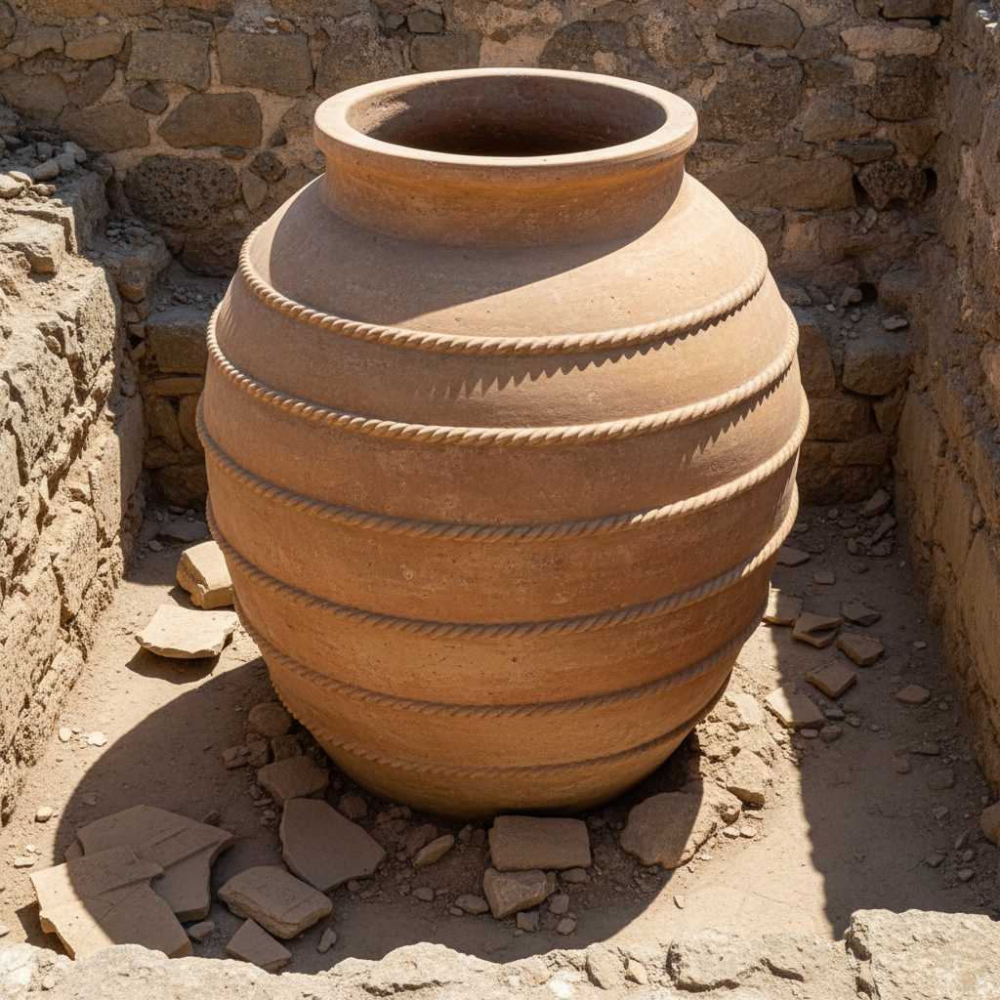

# Pithos Art 大陶缸艺术

> "The pithos is storage made monumental — a vessel so large it cannot be moved once filled, sunk into the earth of a storeroom floor like a root cellar made of clay, its massive walls thick enough to keep grain cool and oil fresh through Mediterranean summers, each one a feat of coil-building that pushes the limits of what unfired clay can support before it collapses under its own weight." — Unknown

## 概述

大陶缸艺术（Pithos Art）是以古代地中海世界的大型储存陶缸为代表的陶瓷器形艺术。Pithos（皮托斯）是古希腊和米诺斯文明中用于储存谷物、橄榄油和葡萄酒的巨型陶缸——高度可达两米，容量可达数百升。大陶缸的制作是古代陶瓷技术的极限挑战——需要用泥条盘筑法逐层建造，每层干燥后再加下一层，整个过程可能需要数周。

大陶缸艺术的核心要素包括：1）巨大尺度——超越常规的巨大体量；2）储存功能——储存谷物油酒；3）泥条盘筑——大型泥条盘筑技术；4）半埋地下——常半埋于地面；5）装饰浮雕——缸身的浮雕装饰；6）技术极限——陶瓷制作的极限；7）文明见证——古代文明的物证。

## 核心特征

| 特征 | 描述 |
|------|------|
| 巨大尺度 | 超越常规的体量 |
| 储存功能 | 储存谷物油酒 |
| 泥条盘筑 | 大型盘筑技术 |
| 半埋地下 | 常半埋于地面 |
| 浮雕装饰 | 缸身浮雕装饰 |
| 技术极限 | 陶瓷制作极限 |

## 视觉特征

- **巨大体量**：超越人体尺度的大小
- **宽口圆腹**：宽口圆腹的造型
- **厚实器壁**：厚实的陶壁
- **浮雕带饰**：水平浮雕装饰带
- **绳纹肌理**：泥条盘筑的痕迹
- **质朴粗犷**：粗犷质朴的美感

## 代表作品

| 作品 | 艺术家/文化 | 年代 | 意义 |
|------|-------------|------|------|
| *克诺索斯大陶缸* | 米诺斯 | 前2000年 | 米诺斯宫殿储存 |
| *希腊大陶缸* | 古希腊 | 各时期 | 希腊储存传统 |
| *罗马大陶缸* | 罗马 | 各时期 | 罗马储存传统 |
| *格鲁吉亚酒缸* | 格鲁吉亚 | 各时期 | 葡萄酒酿造传统 |
| *当代大陶缸* | 各地陶艺家 | 当代 | 当代的大型陶艺 |

## 历史时间线

| 时期 | 事件 |
|------|------|
| 前3000年 | 早期大型储存陶缸 |
| 前2000年 | 米诺斯宫殿大陶缸 |
| 古希腊 | 希腊城邦的储存系统 |
| 罗马 | 罗马帝国的大规模使用 |
| 当代 | 格鲁吉亚传统酒缸的复兴 |

## 中国语境

中国也有悠久的大型陶缸传统。中国的大缸用途广泛——储水、储粮、酿酒、腌制、养鱼等。中国故宫中的大铜缸（太平缸）虽然是金属制品，但其形制源自陶缸传统。中国传统的酱缸、酒缸、水缸是中国农业文明的重要器物——许多地区至今仍在使用大型陶缸酿造酱油、醋和酒。中国宜兴的大型紫砂缸是中国大型陶器的代表——用于储水和养鱼。中国当代陶艺家也在探索大型陶瓷的可能性——挑战泥条盘筑和拉坯的尺度极限。格鲁吉亚的Qvevri（大陶缸酿酒）传统已被列入联合国非物质文化遗产，这与中国的陶缸酿酒传统有异曲同工之妙。

## AI生成概念图

## 与其他风格的关系

- **Coil Building** → 泥条盘筑
- **Storage Vessel** → 储存器
- **Minoan Art** → 米诺斯艺术
- **Large-Scale Ceramics** → 大型陶瓷
- **Fermentation** → 发酵容器
- **Ancient Technology** → 古代技术

---

*浮光艺志 | Chronicle of Artistry*
