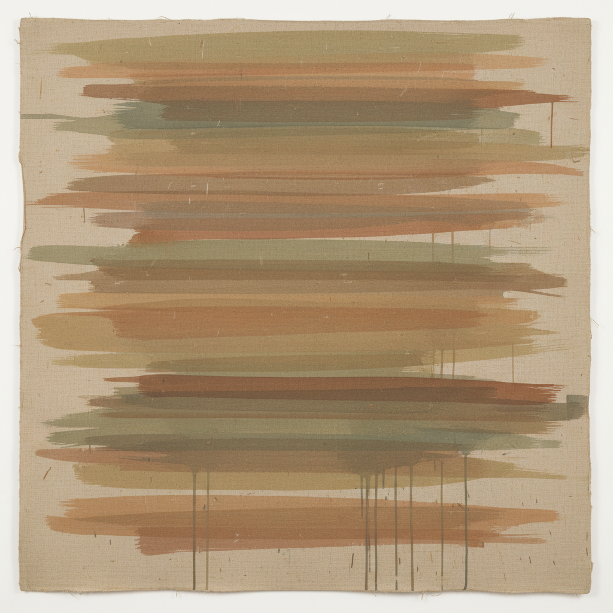

# Pittura Analitica 分析绘画

> **时期：** 1970年代  
> **关键词：** 意大利、绘画本体论、自我指涉、过程可见、反叙事

## 概述

Pittura Analitica（分析绘画）是1970年代意大利的绘画运动，与法国的Supports/Surfaces和美国的后极简主义并行。画家们将绘画还原为最基本的元素——画布、颜料、笔触、边框——让创作过程本身成为作品的主题。每一笔都在追问：绘画是什么？它由什么构成？它如何成为它自己？

## 风格特征

- **自我指涉**：绘画以自身为主题
- **过程可见**：创作步骤被保留和展示
- **材料意识**：画布纹理、颜料质地被强调
- **极简构图**：减少到最基本的视觉元素
- **反叙事**：拒绝外部参照和象征意义

## 代表人物与作品

- 乔治·格里法 重复笔触
- 里卡多·古阿尼尼 单色层叠
- 克劳迪奥·奥利维里 色彩分析
- 保罗·科特尼 画布结构

## 概念图

