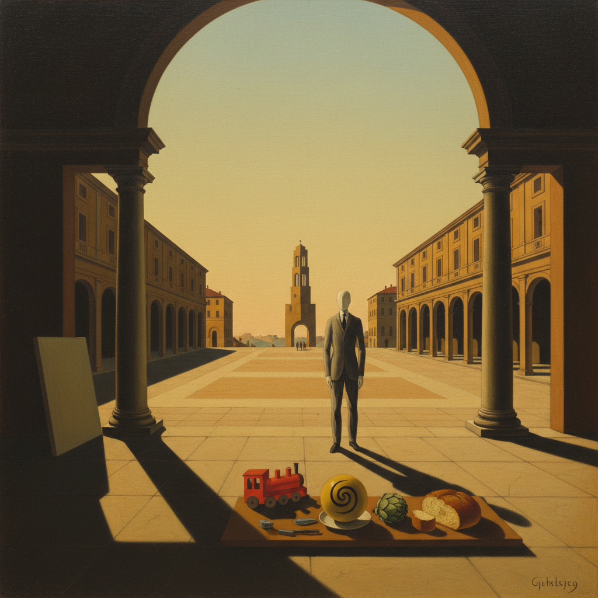

# Pittura Metafisica 形而上绘画

> **时期：** 1911年–1920年代  
> **关键词：** 空旷广场、长影子、人体模型、神秘静物、时间凝固

## 概述

Pittura Metafisica（形而上绘画）由乔治·德·基里科于1911年在意大利创立，描绘空旷的城市广场、拉长的影子、无面孔的人体模型和不合逻辑的静物组合。这些画面看似平静，却弥漫着无法言说的不安——仿佛时间停止了，现实背后隐藏着另一个更深层的秩序。它是超现实主义的直接先驱。

## 风格特征

- **空旷广场**：意大利式拱廊和塔楼的孤寂空间
- **长影子**：暗示不可见的光源和时间
- **人体模型**：无面孔的裁缝假人代替人物
- **不合逻辑**：物品的奇异并置
- **凝固时间**：永恒午后的静止感

## 代表人物与作品

- 乔治·德·基里科《一条街的忧郁与神秘》
- 卡洛·卡拉《醉酒的绅士》
- 乔治·莫兰迪 早期形而上静物
- 阿尔贝托·萨维尼奥 形而上戏剧

## 概念图

