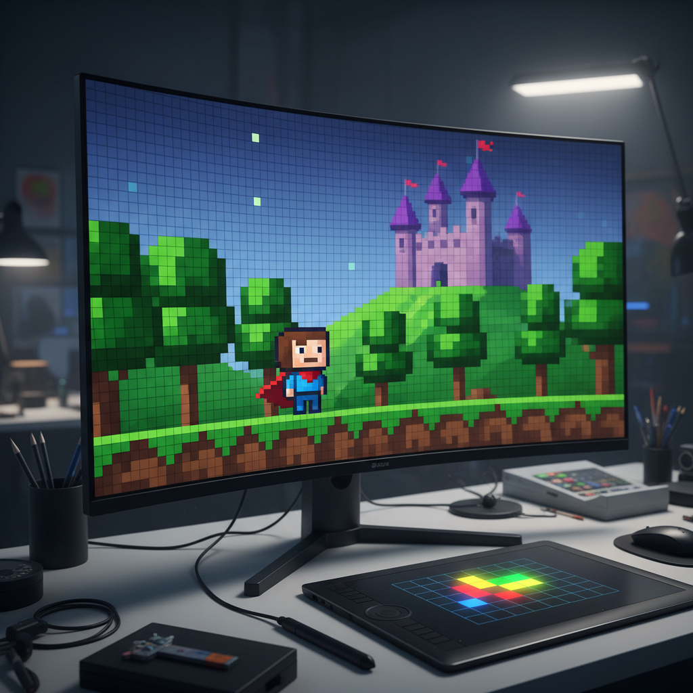
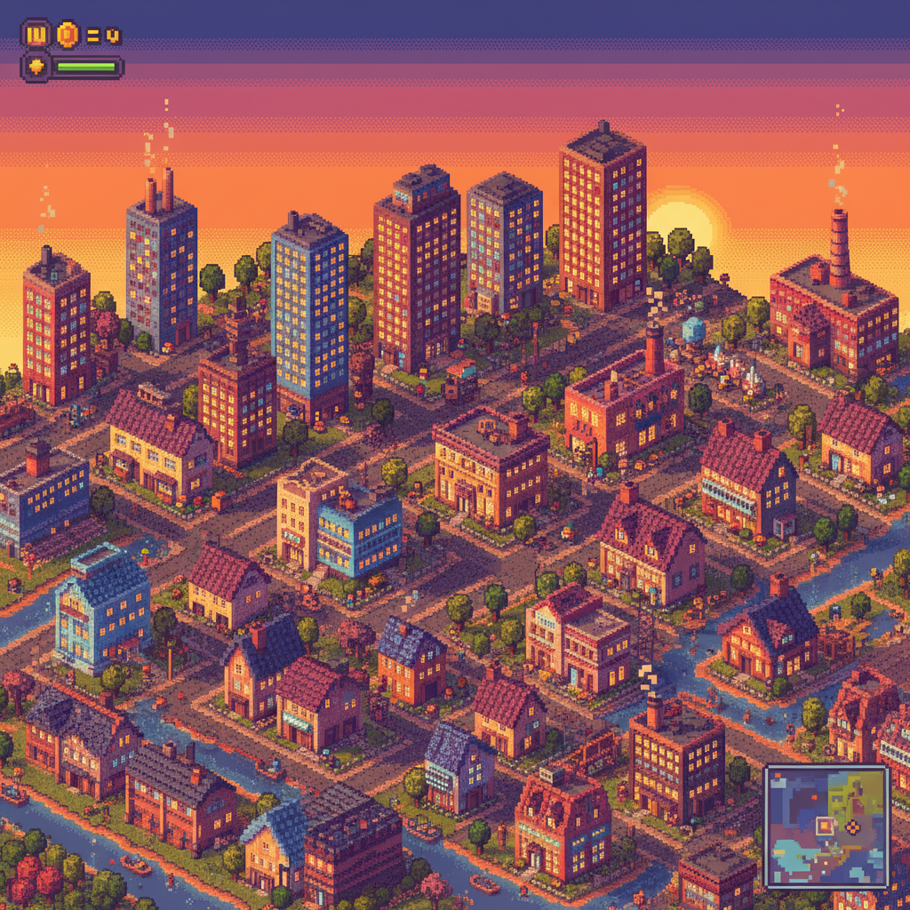

# Pixel Art（像素艺术）

> **别名**：Pixel Style, 8-Bit Art, 点阵画（ドット絵）, Sprite Art  
> **活跃年代**：1970s – 至今（持续演化）  
> **关键节点**：1970s 街机 → 1980s-90s 游戏黄金期 → 2010s 独立游戏复兴 → 2020s NFT/品牌应用

---

## 一句话定义

Pixel Art 是以**单个像素**为最小创作单位的数字图像艺术——从技术限制中诞生，在技术进步后成为一种**刻意的美学选择**，用方块和有限色彩创造出简约而富有表现力的视觉世界。

---

## 视觉语言

| 元素 | 描述 |
|------|------|
| 基本单位 | 可辨识的正方形像素颗粒 |
| 色彩 | 有限调色板（经典 8-bit 为 56 色，16-bit 为 256 色） |
| 抖动（Dithering） | 用像素交错排列模拟渐变和中间色 |
| 等距视角 | 45° 俯视角的"2.5D"场景（Isometric） |
| 动画 | 逐帧手绘，每帧独立绘制 |
| 字体 | 像素化位图字体 |

### 技术约束与表现力

像素艺术的表现力直接受硬件代际影响：

| 平台 | 分辨率 | 色彩数 | 精灵限制 | 代表作 |
|------|--------|--------|----------|--------|
| Atari 2600 | 160×192 | 128色（4色/行） | 2个精灵 | *Pitfall!* |
| FC/NES | 256×240 | 56色（25色/场景） | 64个精灵 | *Super Mario Bros.* |
| Game Boy | 160×144 | 4灰度 | 40个精灵 | *Pokémon Red/Blue* |
| SFC/SNES | 256×224 | 256色（32768可选） | 128个精灵 | *Chrono Trigger* |
| GBA | 240×160 | 32768色 | 128个精灵 | *Advance Wars* |
| 现代独立 | 自定义 | 无限制 | 无限制 | *Celeste*, *Dead Cells* |

每一代硬件的限制都催生了独特的视觉解决方案：
- NES 的 4 色精灵限制 → 任天堂用"帽子+胡子"解决了马里奥的面部细节问题
- Game Boy 的 4 灰度 → 开发者用抖动和轮廓线创造了惊人的深度感
- SNES 的 Mode 7 → 伪 3D 旋转效果（*F-Zero*、*Mario Kart*）

---

## 历史时间线

| 时期 | 事件 |
|------|------|
| 1972 | *Pong* 发布——最早的像素化游戏画面 |
| 1978 | *Space Invaders* 定义了"像素外星人"的经典形象 |
| 1980 | *Pac-Man* 证明简单像素角色可以拥有"性格" |
| 1981 | *Donkey Kong* 引入叙事性像素动画 |
| 1983-1985 | FC/NES 发售，家用像素艺术黄金期开始 |
| 1985 | *Super Mario Bros.* 建立了横版卷轴像素美学的标准 |
| 1986-1994 | 16-bit 时代：*Sonic*、*Street Fighter II*、*Final Fantasy VI* |
| 1995-2000 | 3D 图形兴起（PS1、N64），像素艺术退出主流游戏 |
| 1997 | **eBoy** 成立——"像素教父"团队，开创现代像素插画 |
| 2004 | *Cave Story*（洞窟物语）——独立像素游戏的先驱 |
| 2008 | *Braid* 发行，独立游戏复兴开始 |
| 2012 | *Minecraft* 全球爆发，像素/体素美学进入大众文化；*Fez* 发行 |
| 2013 | *Shovel Knight* Kickstarter 成功——"NES 风格"的现代诠释 |
| 2016 | *Stardew Valley* 证明像素游戏可以获得巨大商业成功 |
| 2017 | Reddit r/Place 集体像素创作活动（第一次） |
| 2018 | *Celeste* 获得 TGA 最佳独立游戏 |
| 2021 | CryptoPunks 以数百万美元成交，像素 NFT 热潮 |
| 2022 | Reddit r/Place 第二次活动，参与人数破纪录 |
| 2023 | LOEWE 像素化时装秀，像素进入高端时尚 |
| 2024+ | AI 像素艺术生成工具出现，引发"手工 vs 机器"争论 |

---

## 文化内核

### 限制即创造力

像素艺术的核心哲学是：**在极端限制中寻找最大表现力**。当你只有 16×16 像素来表现一个角色时，每一个像素的位置都至关重要。这种约束反而激发了极致的创造力和精确性。

经典案例：
- **马里奥的帽子**：因为 NES 无法在 16×16 内画出逼真的头发，宫本茂给角色加了帽子
- **马里奥的胡子**：因为无法画出嘴巴的动画，用胡子遮住了下半脸
- **马里奥的背带裤**：为了让手臂摆动可见，用不同颜色区分身体和手臂

每一个"设计决策"实际上都是对技术限制的创造性回应。

### 从技术限制到美学选择

像素艺术经历了一个关键转变：
- **1970s-1990s**：不得不用像素（技术限制）
- **2000s-至今**：选择用像素（美学偏好）

这个转变赋予了像素艺术新的文化含义——它不再是"落后"的标志，而是一种**刻意的复古选择**，表达对简约、手工感和游戏黄金时代的致敬。

2010 年代的独立游戏开发者选择像素风格的原因是多重的：
- **经济性**：小团队无法负担 3D 建模和动画的成本
- **表现力**：像素风格有独特的"温暖感"和"手工感"
- **怀旧**：唤起玩家的童年记忆
- **可读性**：在小屏幕上，像素角色反而比写实角色更清晰

### 民主化的艺术形式

像素艺术的入门门槛极低：
- 不需要绘画天赋（每个人都能画方块）
- 不需要昂贵工具（Aseprite $20，或免费的 Piskel/LibreSprite）
- 不需要大画布（32×32 就能创作完整角色）
- 不需要长时间学习（基本技巧几小时可掌握）

这使得它成为互联网上最活跃的业余创作社区之一。Reddit r/PixelArt 有超过 100 万订阅者。

### 集体创作：r/Place 现象

Reddit r/Place（2017、2022）是像素艺术作为**集体行为**的极致体现：
- 数百万用户在同一块画布上每 5 分钟放置一个像素
- 社区自发组织，协调创作大型图案
- 国家、品牌、亚文化之间的"领土争夺"
- 最终画布成为互联网文化的实时快照

r/Place 证明了像素艺术不仅是个人创作，也可以是**社会性的、政治性的、集体性的**。

---

## 子风格

| 子风格 | 特征 | 代表 |
|--------|------|------|
| **Classic 8-Bit** | FC/NES 时代，极简色彩，4色精灵 | *Super Mario Bros.*, *Mega Man* |
| **16-Bit** | SFC/SNES 时代，更丰富的色彩和细节 | *Chrono Trigger*, *EarthBound* |
| **Isometric Pixel** | 等距视角城市/场景 | eBoy Pixoramas, *SimCity 2000* |
| **Modern Pixel** | 高分辨率下的像素风格，不受硬件限制 | *Celeste*, *Dead Cells*, *Hyper Light Drifter* |
| **Pixel + 3D** | 像素角色在 3D 环境中（HD-2D） | *Octopath Traveler*, *Live A Live* |
| **Demake** | 将现代游戏"降级"为像素版本 | 粉丝创作的像素版 *Elden Ring* |
| **Pixel Animation** | 以动画/短片为目的的像素创作 | Waneella 的像素动画 GIF |
| **Voxel Art** | 像素的 3D 版本（体素） | *Minecraft*, *Teardown* |

---

## 技术与工具

### 创作工具演变

| 时代 | 工具 | 特点 |
|------|------|------|
| 1980s | 硬件级编辑器 | 直接操作显存 |
| 1990s | Deluxe Paint, Pro Motion | Amiga 平台专业工具 |
| 2000s | GraphicsGale, MS Paint | Windows 平台 |
| 2010s | **Aseprite** | 现代标准，支持动画和调色板管理 |
| 2020s | Piskel, Pixilart, LibreSprite | 免费/在线工具 |

### 核心技巧

- **Dithering（抖动）**：用两种颜色的像素交错排列模拟第三种颜色
- **Anti-aliasing（手动抗锯齿）**：在边缘添加中间色像素使轮廓平滑
- **Sub-pixel animation**：通过改变像素颜色而非位置来暗示运动
- **Cluster（色块）**：避免孤立像素，保持色块的连贯性
- **Hue shifting**：阴影不只是变暗，而是向冷色偏移

---

## 与千禧怀旧的关系

像素艺术在千禧怀旧语境中扮演特殊角色：
- 它是 **80/90 后童年记忆的直接载体**（红白机、Game Boy）
- 它通过 **Minecraft** 成为 00/10 后的共同语言
- 它在 **NFT 热潮** 中获得了前所未有的经济价值
- 它在 **品牌设计** 中成为"复古但时髦"的信号
- 它是少数**跨越所有世代**的怀旧美学——每一代人都有自己的像素记忆

---

## 中国语境

### 红白机一代（80后）
- 小霸王学习机 = 中国的 NES
- *魂斗罗*、*超级马里奥*、*坦克大战* 是集体记忆
- 像素 = 童年 = 电视机前的周末

### 网吧一代（90后）
- Flash 像素小游戏
- QQ 秀的像素化头像
- 4399/7k7k 小游戏网站

### 当代
- 《元气骑士》等国产像素游戏
- 像素风格在潮牌设计中的应用
- B站像素艺术创作社区

---

## 重要创作者与社区

| 名称 | 贡献 |
|------|------|
| **eBoy**（1997-） | 像素教父，复杂城市全景图（Pixoramas） |
| **Susan Kare** | Macintosh 图标设计师，像素 UI 先驱 |
| **涩谷员子（Kazuko Shibuya）** | Final Fantasy I-VI 点阵图大师 |
| **Waneella** | 现代像素动画 GIF 创作者，城市夜景系列 |
| **Pixel Art Park** | 日本像素艺术展览活动（2015-） |
| **r/PixelArt** | Reddit 最大像素艺术社区（100万+订阅） |
| **Lospec** | 像素艺术调色板和教程资源站 |
| **Pedro Medeiros (saint11)** | 像素动画教程系列创作者 |

---

## 争议

### "像素是懒惰的选择？"

一种常见批评认为独立游戏选择像素风格是"偷懒"——避免了 3D 建模的工作量。但这忽略了：
- 优秀的像素艺术需要极高的技巧和耐心
- 逐帧动画的工作量并不比 3D 动画少
- 像素风格是一种**设计决策**，不是能力不足的表现

### NFT 与像素艺术的矛盾

CryptoPunks 等像素 NFT 项目引发了社区分裂：
- 支持者：像素艺术终于获得了经济认可
- 反对者：投机行为扭曲了像素艺术的社区精神
- 许多像素艺术家拒绝参与 NFT，认为它违背了像素艺术"民主化"的核心价值

### AI 生成的威胁

2023 年以来，AI 工具可以快速生成"像素风格"图片，这引发了：
- "手工像素"vs"AI 像素"的真实性争论
- 像素艺术社区对 AI 生成内容的抵制
- 对"每个像素都是手动放置的"这一核心价值的重新强调

---

## 代表性视觉参考

- eBoy Pixoramas 城市全景
- *Celeste*、*Stardew Valley*、*Hyper Light Drifter* 游戏画面
- CryptoPunks NFT 系列
- LOEWE 2023 像素化时装
- Waneella 城市夜景动画 GIF
- Reddit r/Place 2022 最终画布

---

## 延伸阅读

- [Aesthetics Wiki - 8-Bit](https://aesthetics.fandom.com/wiki/8-Bit)
- *Pixel Art for Game Developers*（Daniel Silber）
- 《像素百景：现代像素艺术世界》（画刊社，2019）
- [Lospec Pixel Art Tutorials](https://lospec.com/pixel-art-tutorials)
- [saint11 Pixel Art Tutorials](https://saint11.org/blog/pixel-art-tutorials/)
- 本项目相关：[Webcore](webcore.md) | [Vaporwave](vaporwave.md) | [Cassette Futurism](cassette-futurism.md) | [Kidcore](kidcore.md)
