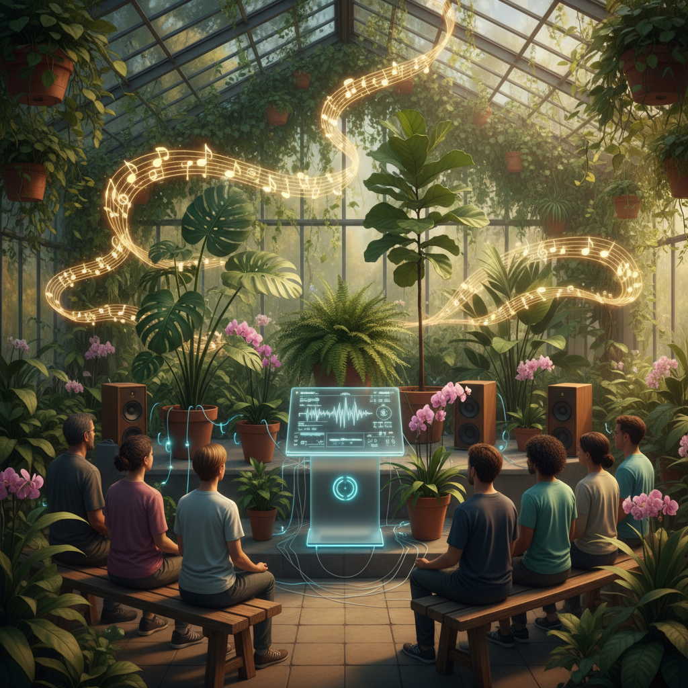

# Plant Music Art 植物音乐艺术

> "Plant music art reveals that the green world is not silent — that every leaf is a solar panel generating electricity, every root is a sensor detecting chemistry, every stem is a conductor carrying signals, and that when we translate these signals into sound, we discover that plants have been composing music all along, responding to light and dark, to touch and temperature, to the presence of other beings, in rhythms and melodies that are alien yet hauntingly beautiful." — Unknown

## 概述

植物音乐艺术（Plant Music Art）是将植物的生物电信号转化为音乐的艺术实践。植物虽然没有神经系统，但它们产生可测量的电信号——对光照、温度、触摸、水分和其他环境因素做出电反应。通过将这些微弱的电信号放大并映射到音乐参数，植物可以"演奏"音乐。

植物音乐艺术的实践包括：1）植物电信号的实时音乐化——将植物的生物电活动实时转化为旋律和和声；2）植物互动音乐——让观众通过触摸植物来改变音乐；3）植物合奏——多株植物同时"演奏"，形成合奏；4）植物与人类音乐家的合作——植物的信号与人类音乐家的演奏结合；5）植物声景——将整个花园或森林的植物信号转化为沉浸式声景。

## 核心特征

| 特征 | 描述 |
|------|------|
| 植物 | 植物作为音乐家 |
| 电信号 | 生物电信号 |
| 实时 | 实时转化 |
| 互动 | 人与植物互动 |
| 环境 | 环境响应 |
| 生命 | 生命的音乐 |

## 视觉特征

- **电极**：连接植物的小电极
- **绿色**：植物的绿色
- **设备**：转化设备和扬声器
- **花园**：音乐花园
- **光线**：自然光线
- **连接**：植物与技术的连接

## 代表作品

| 作品 | 艺术家 | 年代 | 意义 |
|------|--------|------|------|
| *Music of the Plants* | Damanhur community | 1970年代 | 植物音乐先驱 |
| *PlantWave device* | Data Garden | 2010年代 | 植物音乐设备 |
| *Botanical concerts* | Various | 2010年代 | 植物音乐会 |
| *Forest symphonies* | Various | 2020年代 | 森林交响曲 |
| *Interactive plant music* | Various | 当代 | 互动植物音乐 |

## 历史时间线

| 时期 | 事件 |
|------|------|
| 1966 | Cleve Backster的植物感知实验 |
| 1970年代 | Damanhur社区的植物音乐 |
| 2010年代 | PlantWave等商业设备 |
| 2020年代 | 植物音乐的流行化 |
| 当代 | AI增强的植物音乐 |

## 中国语境

植物音乐艺术在中国有独特的文化基础。中国传统文化中有丰富的"植物灵性"观念——从"岁寒三友"（松竹梅）的人格化，到"花语"传统，到道教中植物的灵性地位。中国传统音乐中也有大量以植物为灵感的作品——如古琴曲《梅花三弄》、《平沙落雁》等。中国当代的一些艺术家在探索植物音乐：将中国传统药用植物的电信号转化为音乐、在中国传统园林中创建植物音乐装置、以及将茶道与植物音乐结合——让茶树"演奏"音乐伴随品茶体验。中国丰富的植物多样性为植物音乐提供了无穷的"音乐家"。

## AI生成概念图

## 与其他风格的关系

- **Biosonification Art** → 生物声化艺术
- **Sound Art** → 声音艺术
- **Bio Art** → 生物艺术
- **Interactive Art** → 互动艺术
- **Garden Art** → 园林艺术
- **Eco-Art** → 生态艺术

---

*浮光艺志 | Chronicle of Artistry*
