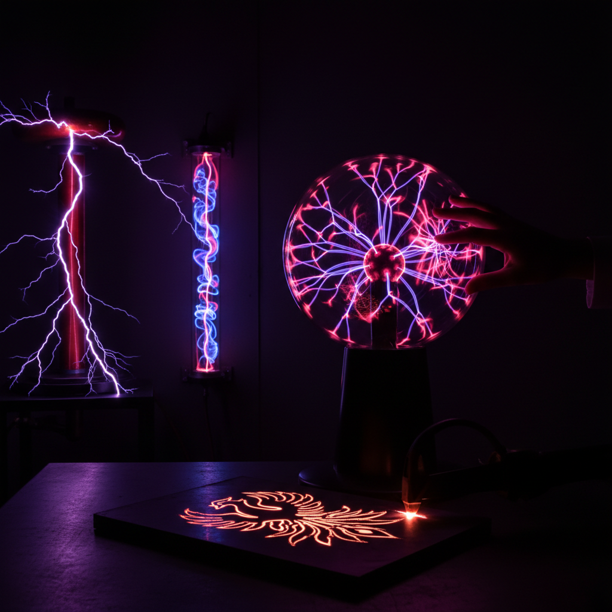

# Plasma Art 等离子艺术

> "Plasma is the fourth state of matter — gas heated until its atoms shed their electrons, becoming a soup of charged particles that glows with an inner fire. Lightning is plasma, the sun is plasma, the aurora is plasma. When artists harness this state of matter, they work with the same force that powers stars, contained in glass vessels or arcing between electrodes in controlled displays of raw energy made visible." — Unknown

## 概述

等离子艺术（Plasma Art）是利用等离子体（电离气体）的发光特性进行艺术创作的实践——通过在密封玻璃容器中的气体施加高压电场，使气体电离并发出彩色光芒，创造出动态的、响应触摸的发光艺术品。等离子艺术将物理学的壮观现象转化为可触摸的艺术体验。

等离子艺术的实践包括：1）等离子球——经典的球形等离子装置；2）等离子管——管状的等离子发光装置；3）等离子雕塑——将等离子元素融入雕塑造型；4）等离子装置——大型等离子空间装置；5）特斯拉线圈艺术——用特斯拉线圈创造的电弧表演；6）等离子切割艺术——用等离子切割机创造的金属艺术；7）互动等离子——响应触摸和声音的等离子装置。

## 核心特征

| 特征 | 描述 |
|------|------|
| 电离 | 气体电离发光 |
| 动态 | 不断运动的光丝 |
| 互动 | 响应触摸 |
| 科技 | 高科技媒介 |
| 能量 | 原始能量的可视化 |
| 神秘 | 神秘的视觉效果 |

## 视觉特征

- **光丝**：从中心向外的光丝
- **紫色**：典型的紫色和蓝色
- **动态**：不断运动和分叉
- **发光**：强烈的自发光
- **电弧**：闪电般的电弧
- **玻璃**：透明玻璃容器

## 代表作品

| 作品 | 艺术家 | 年代 | 意义 |
|------|--------|------|------|
| *Plasma globe* | Nikola Tesla/Bill Parker | 1894/1970s | 等离子球的发明 |
| *Tesla coil performances* | Various | 当代 | 特斯拉线圈表演 |
| *Plasma sculptures* | Various | 当代 | 等离子雕塑 |
| *Interactive plasma* | Various | 当代 | 互动等离子装置 |
| *Plasma cut art* | Various | 当代 | 等离子切割艺术 |

## 历史时间线

| 时期 | 事件 |
|------|------|
| 1894 | 特斯拉发明早期等离子装置 |
| 1970年代 | Bill Parker发明现代等离子球 |
| 1980年代 | 等离子球的商业化 |
| 2000年代 | 等离子艺术的发展 |
| 当代 | 大型等离子装置和特斯拉线圈表演 |

## 中国语境

等离子艺术在中国有独特的发展。中国是世界上最大的等离子球和等离子装饰品生产国——中国制造的等离子产品出口到全世界。中国的科技馆和科普展览中，等离子装置是最受欢迎的互动展品之一——触摸等离子球让参观者直观感受电离气体的奇妙。中国的一些当代艺术家和科技艺术团队在探索等离子艺术——用特斯拉线圈创造壮观的电弧表演、将等离子元素融入大型装置艺术。中国的特斯拉线圈爱好者社区非常活跃——他们制作的音乐特斯拉线圈（能用电弧"演奏"音乐）在网络上广受关注。中国的等离子切割技术也被一些金属艺术家用于创作。

## AI生成概念图

## 与其他风格的关系

- **Light Art** → 光艺术
- **Kinetic Art** → 动态艺术
- **Science Art** → 科学艺术
- **Interactive Art** → 互动艺术
- **Electrical Art** → 电气艺术
- **Installation Art** → 装置艺术

---

*浮光艺志 | Chronicle of Artistry*
