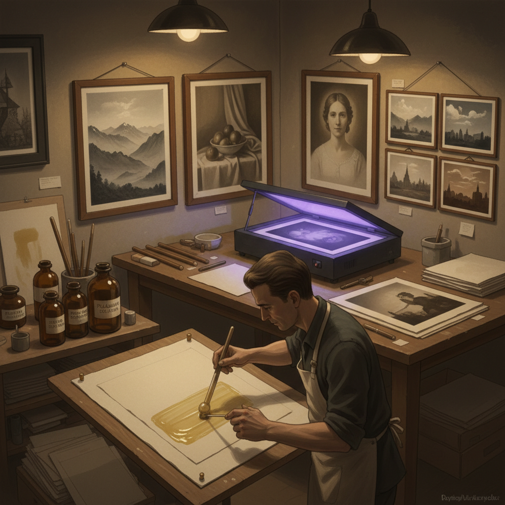

# Platinum Palladium Printing 铂钯印刷

> "Platinum printing is photography distilled to its purest essence — iron salts reduced by light, then replaced by noble metals that sink into the paper fibers themselves, producing images of infinite subtlety and permanence, each print a whisper of silver-grey tones that will endure as long as the paper that holds them." — Unknown

## 概述

铂钯印刷（Platinum Palladium Printing，也称Platinotype/Palladiotype）是一种使用铂金属和/或钯金属盐作为感光材料的摄影印刷工艺。铂钯印刷由William Willis在1873年发明，被广泛认为是最美丽和最永久的摄影印刷工艺之一——铂和钯是极其稳定的贵金属，不会氧化或褪色，理论上可以永久保存。

铂钯印刷的过程：将铁盐（草酸铁）和铂/钯盐的混合溶液涂在高质量的纯棉纸上，干燥后通过负片接触曝光（紫外线）。曝光使铁盐还原，还原的铁盐再将铂/钯盐还原为金属铂/钯微粒，沉积在纸纤维中。用稀盐酸清洗掉未反应的铁盐，留下纯铂/钯金属图像。铂钯印刷品的色调极其柔和、细腻，具有独特的"嵌入纸纤维"的质感。

## 核心特征

| 特征 | 描述 |
|------|------|
| 贵金属 | 使用铂/钯金属 |
| 永久 | 极其永久的保存 |
| 接触 | 接触印刷方式 |
| 纸纤维 | 金属嵌入纸纤维 |
| 柔和 | 极其柔和的色调 |
| 手工 | 完全手工涂布 |

## 视觉特征

- **柔和**：极其柔和的色调
- **细腻**：细腻的色调过渡
- **哑光**：哑光的表面质感
- **深度**：丰富的暗部细节
- **温暖**：温暖的灰色调
- **纸感**：与纸张融为一体

## 代表作品

| 作品 | 艺术家 | 年代 | 意义 |
|------|--------|------|------|
| *Platinum prints* | Frederick Evans | 1900s | 画意摄影铂金印刷 |
| *Platinum portraits* | Edward Weston | 1920s | 现代摄影铂金印刷 |
| *Palladium prints* | Irving Penn | 1960s起 | 当代铂钯印刷 |
| *Contemporary Pt/Pd prints* | Various | 当代 | 当代铂钯印刷 |
| *Large format Pt/Pd* | Various | 当代 | 大画幅铂钯印刷 |

## 历史时间线

| 时期 | 事件 |
|------|------|
| 1873年 | William Willis发明铂金印刷 |
| 1880-1930年代 | 铂金印刷的黄金时代 |
| 一战后 | 铂金价格飙升导致衰落 |
| 1970年代 | 铂钯印刷的艺术复兴 |
| 当代 | 铂钯印刷的持续发展 |

## 中国语境

铂钯印刷在中国的摄影艺术和收藏领域有逐步的发展。中国的一些高端摄影工作室和替代摄影艺术家实践铂钯印刷。中国的摄影收藏市场中，铂钯印刷品因其永久性和稀有性而具有较高的收藏价值。中国的摄影艺术院校在替代摄影课程中介绍铂钯印刷技法。中国的一些风景摄影师使用铂钯印刷来表现中国山水的意境。

## AI生成概念图

## 与其他风格的关系

- **Carbon Printing** → 碳素印刷
- **Gum Bichromate** → 重铬酸胶印
- **Cyanotype** → 氰版印刷
- **Salt Printing** → 盐纸印刷
- **Alternative Photography** → 替代摄影
- **Fine Art Photography** → 艺术摄影

---

*浮光艺志 | Chronicle of Artistry*
